# Benchmarking the Benchmarks: A Systematic Survey of Datasets for Hallucination Detection in Large Language Models

**关键词：** Large Language Models, Hallucination Detection, Dataset Survey, Benchmark Evaluation, Natural Language Processing

## Abstract
The proliferation of Large Language Models (LLMs) has revolutionized numerous applications, yet their propensity to generate hallucinatory content—information that is factually incorrect or unfaithful to provided sources—remains a critical barrier to their reliable deployment. Addressing this challenge necessitates robust methods for hallucination detection, which in turn depend on high-quality, comprehensive benchmark datasets for training and evaluation. This survey presents a systematic review and analysis of the evolving landscape of datasets for LLM hallucination detection. We have curated and examined 81 prominent datasets, organizing them into a novel four-tiered taxonomy: (1) **Fact Verification Datasets**, which assess the model's ability to discern truthfulness in statements; (2) **Question Answering (QA) Datasets**, designed to evaluate factual accuracy in generated answers across various reasoning types; (3) **Multimodal Hallucination Detection Datasets**, which address hallucinations in vision-language tasks; and (4) **Specialized Hallucination Benchmarks**, targeting nuanced aspects like intent faithfulness and role-playing consistency. Our analysis reveals several key trends: a significant shift from general-purpose fact-checking towards domain-specific (e.g., medical, legal) and task-specific (e.g., code summarization, multimodal reasoning) evaluations; an increasing complexity in dataset design to probe sophisticated reasoning abilities such as multi-hop and commonsense inference; and a growing emphasis on dynamic, in-the-wild benchmarks that better reflect real-world user interactions. Despite this progress, the field faces persistent challenges, including the high cost of manual annotation, potential dataset biases, and the limited generalizability of evaluation results. Future research should focus on developing more scalable and automated dataset creation methods, expanding coverage to low-resource languages, and creating dynamic, interactive benchmarks to foster the development of more trustworthy and reliable LLMs.

## 1. Introduction

Large Language Models (LLMs) have demonstrated remarkable capabilities in a wide array of natural language processing tasks, including text generation, summarization, and question answering, marking a significant milestone in artificial intelligence. However, a pivotal challenge that curtails their reliability and widespread adoption is their propensity to "hallucinate"---generating content that is factually incorrect, nonsensical, or unfaithful to the provided source context (Ji et al., 2023). These hallucinations can range from subtle inaccuracies to completely fabricated information, severely undermining the trustworthiness of LLMs. In high-stakes domains such as medicine, law, and finance, such fabrications can lead to detrimental consequences. Consequently, the development of robust hallucination detection technologies has become a critical research frontier. This field of study aims to create methods for automatically identifying, quantifying, and ultimately mitigating fallacious outputs, thereby enhancing the safety, factuality, and practical utility of LLM-powered systems.

The empirical foundation for advancing hallucination detection rests on the availability of diverse, high-quality, and challenging benchmark datasets. These datasets are indispensable; they provide the training data for supervised detection models, offer a standardized framework for evaluating and comparing different methodologies, and crucially, help diagnose the specific weaknesses and failure modes of state-of-the-art LLMs. In recent years, the research community has witnessed a rapid proliferation of datasets tailored for hallucination detection. However, this rapid growth has led to a fragmented landscape, making it difficult for researchers to navigate the available resources, understand their respective strengths and limitations, and select the most appropriate benchmarks for their work. A systematic survey is therefore essential to consolidate the progress in this area, provide a structured and comprehensive overview of the existing datasets, and chart a clear path for future research and development.

Our analysis of the landscape reveals several prominent trends in the evolution of hallucination detection datasets. Firstly, there is a clear trend towards **diversification and specialization**. Early benchmarks often focused on general-domain factuality, but the field has expanded to include domain-specific datasets for medicine (e.g., `MedHALT`, `MedHallu-ZH`), law (`LegalBench`), and software engineering (`Hallucination dataset for code summarization`), reflecting a move to tackle challenges in real-world, high-stakes applications. Secondly, we observe a significant **deepening of complexity**. Datasets have evolved from simple binary fact verification to more nuanced evaluation paradigms that test sophisticated reasoning abilities. This includes benchmarks for multi-hop question answering (`HotpotQA`, `2WikiMultihopQA`), commonsense reasoning (`StrategyQA`), and the evaluation of long-form generation (`LongFact`). Specialized benchmarks have also emerged to probe more subtle forms of hallucination, such as intent hallucination (`FAITHQA`) and interaction fidelity in role-playing scenarios (`SHARP`). Thirdly, a major frontier is the trend of **cross-modal fusion**. With the rise of Multimodal Large Language Models (MLLMs), new benchmarks like `MHALO`, `POPE`, and `CHAIR` have been developed to evaluate hallucinations that bridge vision and language, such as fabricating objects in an image description or misstating the spatial relationships between them.

This survey provides a systematic and structured overview of the key datasets in LLM hallucination detection. To facilitate a clear understanding, we have organized the datasets into a comprehensive taxonomy. The remainder of this paper is structured as follows:
*   **Section 2** reviews **Fact Verification Datasets**, which form the bedrock of hallucination evaluation. We further divide this category into general-purpose and domain-specific benchmarks.
*   **Section 3** delves into **Question Answering Datasets**, a critical modality for probing LLM knowledge. This section is organized by the complexity of the reasoning skills required, covering open-domain, multi-hop, and commonsense reasoning QA.
*   **Section 4** explores the burgeoning area of **Multimodal Hallucination Detection Datasets**, focusing on benchmarks designed to identify object, relation, and other fine-grained hallucinations in vision-language tasks.
*   **Section 5** examines **Specialized Hallucination Benchmarks** that target unique and nuanced facets of hallucination, including intent-level discrepancies, uncertainty identification, and role-playing fidelity.
*   Finally, **Section 6** will conclude the survey by summarizing our findings, discussing persistent challenges in dataset creation and evaluation, and outlining promising directions for future research in the vital area of LLM hallucination detection.

## 2. A Taxonomy of LLM Hallucination Detection Datasets

The proliferation of Large Language Models (LLMs) has underscored the critical challenge of "hallucination"—the generation of content that is nonsensical, factually incorrect, or unfaithful to a provided source. To systematically study, detect, and mitigate this phenomenon, the research community has developed a diverse array of datasets and benchmarks. This survey introduces a classification system for these resources, organizing them into a coherent taxonomy to guide researchers in selecting appropriate tools for their specific goals.

We propose a taxonomy structured around four primary categories, reflecting the core challenges in hallucination research: **Fact Verification Datasets**, which test a model's ability to discern truth from falsehood in declarative statements; **Question Answering Datasets**, which evaluate the factuality of model-generated answers, a common failure point for hallucinations; **Multimodal Hallucination Detection Datasets**, which address the unique challenges of hallucinations involving non-textual data like images; and **Specialized Hallucination Benchmarks**, which target niche but critical aspects of hallucination such as intent misinterpretation, uncertainty, and role-playing fidelity. Each main category is further divided into subcategories to provide a more granular view of the available resources. This classification highlights the evolution of the field from general fact-checking to nuanced, domain-specific, and interactive evaluations, offering a comprehensive map of the current landscape.

### 2.1. Taxonomy Visualization

The following diagram illustrates the hierarchical structure of the key datasets in the LLM hallucination detection field.

```mermaid
graph TD
    T["Large Language Model Hallucination Detection Datasets Classification System"] --> C1["Fact Verification Datasets"];
    T --> C2["Question Answering Datasets"];
    T --> C3["Multimodal Hallucination Detection Datasets"];
    T --> C4["Specialized Hallucination Benchmarks"];

    C1 --> SC1_1["General Fact Verification"];
    C1 --> SC1_2["Domain-Specific Fact Verification"];
    
    SC1_1 --> D_TrueFalse["True-False Dataset"];
    SC1_1 --> D_LogicStruct["LogicStruct"];
    SC1_1 --> D_HELM["HELM"];
    SC1_1 --> D_MedHALT["MedHALT"];
    SC1_1 --> D_LegalBench["LegalBench"];
    SC1_1 --> D_XSum["XSum"];
    SC1_1 --> D_HaluEval_FV["HaluEval"];

    SC1_2 --> D_CodeSumm["Hallucination dataset for code summarization"];
    SC1_2 --> D_MedHalluZH["MedHallu-ZH"];
    SC1_2 --> D_MedHalluEN["MedHallu-EN"];
    SC1_2 --> D_WikiBio["WikiBio"];
    SC1_2 --> D_FHSumBench["FHSumBench"];
    SC1_2 --> D_MXSum["M-XSum"];
    SC1_2 --> D_XEnt["XEnt"];
    SC1_2 --> D_FactCollect["FactCollect"];
    SC1_2 --> D_HHEM["HHEM"];
    SC1_2 --> D_ANAH2["ANAH 2.0 (w/ reference)"];
    SC1_2 --> D_FaithEval["FaithEval"];
    SC1_2 --> D_FACTBENCH["FACTBENCH"];

    C2 --> SC2_1["Open-Domain QA"];
    C2 --> SC2_2["Multi-Hop QA"];
    C2 --> SC2_3["Commonsense Reasoning QA"];

    SC2_1 --> D_TruthfulQA["TruthfulQA"];
    SC2_1 --> D_TriviaQA["TriviaQA"];
    SC2_1 --> D_NQ["NQ"];
    SC2_1 --> D_SciQA["SciQA"];
    SC2_1 --> D_PopQA["PopQA"];
    SC2_1 --> D_TVQA["TriviaQA (TVQA)"];
    SC2_1 --> D_SciQ["SciQ"];
    SC2_1 --> D_NQOpen["NQ-Open"];
    SC2_1 --> D_LSQA["LSQA"];
    SC2_1 --> D_SQUADv1["SQUAD v1.1"];
    SC2_1 --> D_NaturalQuestions["Natural Questions"];
    
    SC2_2 --> D_2WikiMultihopQA["2WikiMultihopQA"];
    SC2_2 --> D_HotpotQA_MH["HotpotQA"];
    SC2_2 --> D_MuSiQue["MuSiQue"];

    SC2_3 --> D_StrategyQA["StrategyQA"];
    SC2_3 --> D_ASQA["ASQA"];
    SC2_3 --> D_ParaRel["ParaRel"];
    SC2_3 --> D_MMLU["MMLU"];
    SC2_3 --> D_HaluEval_QA["HaluEval"];
    SC2_3 --> D_CoCoNot["CoCoNot"];
    SC2_3 --> D_Bios["Bios"];
    SC2_3 --> D_LongFact["LongFact"];
    SC2_3 --> D_WildHallu["WildHallu"];

    C3 --> SC3_1["Object Hallucination Detection"];
    C3 --> SC3_2["Relation Hallucination Detection"];
    C3 --> SC3_3["Fine-Grained Hallucination Detection"];

    SC3_1 --> D_CHAIR["CHAIR"];
    SC3_1 --> D_POPE["POPE"];
    SC3_1 --> D_LLaVABench["LLaVA-Bench (In-the-Wild)"];
    SC3_1 --> D_MSCOCO["MSCOCO"];
    SC3_1 --> D_COCO["COCO"];

    SC3_2 --> D_RelHallu["Relation Hallucination Dataset"];
    SC3_2 --> D_VisGenome["Visual Genome"];

    SC3_3 --> D_MHALO["MHALO"];
    SC3_3 --> D_NATURE["NATURE"];
    SC3_3 --> D_REASONING["REASONING"];
    SC3_3 --> D_MC["MC"];
    SC3_3 --> D_RLHFV["RLHF-V"];
    SC3_3 --> D_MHalDetect["M-HalDetect"];
    SC3_3 --> D_Geo170K["Geo170K"];
    SC3_3 --> D_MathV360K["MathV360K"];

    C4 --> SC4_1["Intent Hallucination Benchmarks"];
    C4 --> SC4_2["Uncertainty Identification Benchmarks"];
    C4 --> SC4_3["Role-Playing Interaction Benchmarks"];
    
    SC4_1 --> D_FAITHQA["FAITHQA"];

    SC4_2 --> D_ConfuseBench["ConfuseBench"];
    SC4_2 --> D_HotpotQA_UI["HotpotQA"];
    SC4_2 --> D_AmbigQA["AmbigQA"];
    SC4_2 --> D_ExpertQA["ExpertQA"];
    SC4_2 --> D_TechQA["TechQA"];
    SC4_2 --> D_ToolBench["ToolBench"];

    SC4_3 --> D_SHARP["SHARP"];
    SC4_3 --> D_ConceptNet["ConceptNet-5.5"];
    SC4_3 --> D_HPD["HPD"];
    SC4_3 --> D_SocialBench["SocialBench"];
```

### 2.2. Dataset Analysis

The following table provides a comprehensive analysis of the key datasets within our proposed taxonomy. It details each dataset's core features, tasks, evaluation metrics, and the primary challenges or research questions it aims to address.

**Multi-level Classification and In-depth Analysis of Key Datasets in llms hallucination detection Field**

| Main Category | Subcategory | Dataset Name | Core Features & Tasks | Common Evaluation Metrics | Main Challenges & Research Focus |
| :--- | :--- | :--- | :--- | :--- | :--- |
| **Fact Verification Datasets** | **General Fact Verification** | True-False Dataset | Contains sub-datasets on various topics (companies, cities, etc.) with balanced true/false statements. Task: Binary classification. | AUC-ROC, accuracy | Evaluating baseline factual accuracy across diverse topics and simple textual structures. Focus on developing robust classification methods. |
| | | LogicStruct | Comprises 24 sub-datasets covering 6 topics and 4 different grammatical structures (e.g., negations, conjunctions). Task: Classification. | accuracy | Testing model robustness to complex grammatical and logical structures in fact verification. |
| | | HELM | Consists of LLM outputs from 50,000 Wikipedia articles, manually annotated for factuality. Task: Hallucination detection. | EigenScore, FactScore, HaluEval | Evaluating and improving factuality in long-form generation on a large scale. Research focus on training methods like Sensitivity Dropout (SenD). |
| | | MedHALT | A medical dataset with 2,000 data points simulating real-world medical entrance exam questions. Task: Hallucination detection. | EigenScore | Assessing and mitigating hallucinations in the high-stakes medical domain. |
| | | LegalBench | A dataset designed for legal reasoning tasks. Task: Legal reasoning, Hallucination detection. | EigenScore | Evaluating factual and reasoning accuracy in the specialized legal domain. |
| | | XSum | A dataset for abstractive summarization. Used to evaluate if generated summaries contain fabricated information. Task: Summarization, Fact verification. | Rouge, FactScore | Detecting extrinsic hallucinations (information not present in the source document) in summarization tasks. |
| | | HaluEval | A collection of generated and human-annotated samples for evaluating hallucination in question answering and fact verification contexts. Task: Classification, QA. | AUC-ROC, accuracy | Providing a general-purpose benchmark for both question-answering and statement-verification based hallucination detection. |
| | **Domain-Specific Fact Verification** | Hallucination dataset for code summarization | Annotated code snippets and summaries to check factual correctness of generated summaries. Task: Classification. | F1 score | Detecting hallucinations specific to code, such as incorrect entity descriptions or functionality. |
| | | MedHallu-ZH & MedHallu-EN | Medical QA datasets in Chinese and English for detecting hallucinations in long-form medical answers. Task: Classification. | F1, AUC | Addressing the challenge of factual accuracy in long, complex responses within the medical domain. |
| | | WikiBio | A biography dataset used to detect hallucinations in long-form generated biographical content. Task: Classification. | F1, AUC | Ensuring faithfulness to source infoboxes when generating biographical text. |
| | | FHSumBench | Distinguishes between factual and non-factual hallucinations in summarization by injecting controlled information. Task: Classification. | precision, recall, F1-score | Evaluating LLMs' ability to assess mixed-context hallucinations, where summaries contain both correct and incorrect information. |
| | | M-XSum | A summarization dataset with a high proportion (92%) of non-factual hallucinations. Task: Classification. | precision, recall, F1-score | Benchmarking model performance in scenarios dominated by non-factual hallucinations. |
| | | FACTBENCH | A dynamic benchmark with prompts from real-world user interactions to test factuality. Task: Factuality evaluation. | hallucination score, factual precision | Identifying real-world prompts that trigger hallucinations and tracking model factuality over time. |
| **Question Answering Datasets** | **Open-Domain QA** | TruthfulQA | Designed to measure a model's truthfulness in generating answers to questions where humans might provide false answers due to misconceptions. Task: QA. | AUC-ROC, Truthfulness | Moving beyond simple fact retrieval to test imitation of common human falsehoods vs. generating factually correct answers. |
| | | TriviaQA | A large-scale dataset of trivia questions and answers. Task: QA. | AUC-ROC, Exact Match (EM), F1 | Evaluating a model's ability to retrieve and synthesize factual knowledge from a large corpus or its internal parameters. |
| | | NQ (Natural Questions) | Questions from real Google search queries and their corresponding answers found in Wikipedia. Task: QA. | AUC-ROC, EM, F1 | Assessing performance on realistic, user-generated questions that may require reading an entire document to answer. |
| | | PopQA | Open-domain QA focused on popular entities, designed to test knowledge retrieval. Task: Open-domain QA. | EM, F1 | Evaluating RAG systems on their ability to retrieve correct supporting evidence for popular, frequently updated topics. |
| | | SQuADv2 | Reading comprehension dataset where some questions are unanswerable based on the provided text. Task: QA. | FactScore, EM, F1 | Testing a model's ability to abstain from answering when the context does not contain the necessary information, a key skill for avoiding hallucination. |
| | | ASQA | Ambiguous QA dataset where questions can have multiple valid interpretations and long-form answers. Task: QA. | accuracy, F1-score | Evaluating a model's ability to identify knowledge gaps and provide comprehensive answers for ambiguous questions. |
| | **Multi-Hop QA** | 2WikiMultihopQA | Requires connecting information across multiple Wikipedia documents to answer a question. Task: Multi-hop QA. | EM, F1 | Testing complex reasoning and information synthesis capabilities over multiple sources. |
| | | HotpotQA | A multi-hop QA dataset that requires finding and reasoning over multiple supporting documents to answer. Task: Multi-hop QA. | EM, F1 | Evaluating the ability to perform multi-step reasoning and provide explainable answers with supporting facts. |
| | | MuSiQue | Requires multi-hop reasoning with a larger number of hops (up to 4) and more complex reasoning strategies. Task: Multi-hop QA. | EM, F1 | Pushing the boundaries of complex, multi-step reasoning in question answering. |
| | **Commonsense Reasoning QA** | StrategyQA | Requires a model to infer the implicit reasoning steps behind a "yes/no" question. Task: Commonsense Reasoning. | EM | Assessing a model's ability to perform implicit, multi-step reasoning using commonsense knowledge. |
| | | MMLU | A massive multitask test covering 57 subjects to measure knowledge acquired during training. Task: Multitask QA. | accuracy | Evaluating zero-shot and few-shot performance across a wide range of subjects, testing for broad factual knowledge and reasoning. |
| | | LongFact / Bios / WildHallu | Long-form QA datasets focused on generating biographies or answers about entities with varying popularity. Task: Long-form QA. | Factual Accuracy (FA), Uncertain Accuracy (UA) | Evaluating and improving factual accuracy in long-form generation, especially for less-known entities, and enabling models to express uncertainty. |
| **Multimodal Hallucination Datasets** | **Object Hallucination Detection** | CHAIR | Evaluates object hallucination in image captions by measuring the proportion of objects in a caption that are not in the image. Task: Evaluation Metric. | CHAIR_S, CHAIR_I | Quantifying the presence of non-existent objects in image captions. |
| | | POPE | A yes/no question-answering benchmark to probe for object-level hallucinations in Vision-Language Models. Task: Evaluation. | Accuracy, Precision, Recall, F1 | A direct and simple method for probing whether a model hallucinates the existence of specific objects. |
| | | LLaVA-Bench (In-the-Wild) | A benchmark with diverse images and complex questions to evaluate MLLMs in real-world scenarios. Task: Evaluation. | Accuracy, Detailedness, Naturalness | Assessing MLLM performance and hallucination on challenging, unconstrained visual question answering tasks. |
| | **Relation Hallucination Detection** | Relation Hallucination Dataset | A dataset with questions about spatial and action relationships between objects in an image. Task: Classification. | Accuracy, F1 Score | Detecting hallucinations of relationships (e.g., spatial, action-based) between correctly identified objects. |
| | **Fine-Grained Hallucination Detection** | MHALO | A comprehensive benchmark for token-level Fine-grained Hallucination Detection (FHD), covering 12 hallucination types. Task: Fine-grained Hallucination Detection. | F1_IoU, F1_M | Providing a granular, token-level evaluation of MLLM hallucinations across both perception (e.g., object, color) and reasoning (e.g., math, logic). |
| **Specialized Hallucination Benchmarks** | **Intent Hallucination Benchmarks** | FAITHQA | Evaluates if LLMs adhere to all constraints and components of a user's query, targeting omission and misinterpretation. Task: Generation, RAG. | CONSTRAINT SCORE, Perfect rate | Moving beyond factual correctness to evaluate whether a model's output aligns with the user's full intent. |
| | **Uncertainty Identification Benchmarks** | ConfuseBench | Measures an LLM's ability to identify different types of uncertainty (e.g., document scarcity, query ambiguity). Task: Uncertainty identification. | Answer Quality (AQ), Uncertainty Classification Accuracy (UCA) | Evaluating whether models can not only abstain but also identify the source of their uncertainty to provide more helpful responses. |
| | **Role-Playing Interaction Benchmarks** | SHARP | Measures character relationship fidelity in role-playing LLMs by using counterfactual statements to test for sycophancy and consistency. Task: Role Interaction QA. | Sycophancy Rate (SR), Character Relationship Fidelity (CRF) | Evaluating interactive and social hallucinations, where a model fails to maintain a consistent persona or relationship dynamics. |

## 3. In-depth Analysis of Dataset Categories

The landscape of hallucination detection in Large Language Models (LLMs) is rapidly evolving, driven by the development of sophisticated datasets and benchmarks. To systematically understand this domain, we classify these resources into four primary categories: Fact Verification Datasets, Question Answering Datasets, Multimodal Hallucination Detection Datasets, and Specialized Hallucination Benchmarks. This section provides an in-depth analysis of each category, examining its core purpose, key datasets, technical trends, and prevailing challenges.

### 3.1 Fact Verification Datasets

Fact verification datasets represent the foundational pillar in the study of LLM hallucinations. Their primary function is to assess an LLM's ability to discern factual statements from non-factual ones in a controlled, often binary, classification setting. This is crucial because it isolates the core task of truthfulness assessment from the complexities of natural language generation, providing a clear and quantifiable measure of a model's factual grounding. These datasets are typically curated to cover a wide array of domains and are instrumental in both benchmarking existing models and developing new hallucination mitigation techniques. The field is broadly divided into two streams: general fact verification, which tests a model's broad world knowledge, and domain-specific fact verification, which evaluates factual accuracy in high-stakes areas like medicine, law, and software engineering, where the cost of hallucination is significantly higher. The development in this area trends towards creating more nuanced datasets that not only test static facts but also logical consistency, contextual correctness, and the ability to handle information from diverse sources, reflecting the multifaceted nature of real-world factual challenges.

The depth and breadth of fact verification datasets are best understood through a case analysis of prominent examples. In general fact verification, datasets like the **True-False Dataset** (Azaria and Mitchell, 2023) provide a direct and effective evaluation framework. It comprises multiple sub-datasets on topics like companies, cities, and inventions, each containing a balanced set of approximately 500-560 true and false statements. This structure allows for robust evaluation using metrics like AUC-ROC, where recent methods such as HD-NDEs have demonstrated significant improvements of up to 14%. Pushing the boundary of complexity, **LogicStruct** (Bürger et al., 2024) moves beyond simple atomic facts to test logical and grammatical understanding. It is composed of 24 sub-datasets that systematically vary both topic (e.g., 'animal_class', 'inventors') and grammatical structure (affirmative, negated, conjunctions, disjunctions). The relatively modest performance of models on this benchmark, with PRISM-SAPLMA achieving only 0.7074 accuracy on LLaMA2-13B-Chat, underscores the difficulty LLMs face with logical compositionality, a frequent source of subtle hallucinations. On a much larger scale, **HELM** (Su et al., 2024) utilizes 50,000 Wikipedia articles to create a massive corpus of human-annotated LLM outputs, serving as a comprehensive benchmark for training and evaluating hallucination-aware models like SenD. The move towards evaluating summaries and mixed-context scenarios is another critical frontier. **FHSumBench** is a purpose-built dataset for this, created from **XEnt** and **FactCollect**, to specifically assess how well LLMs can distinguish between factual and non-factual hallucinations within a single summary. Its 1,336 samples are designed to be challenging, with the top-performing Qwen2.5-14B only reaching an F1-score of 0.4733, highlighting the acute difficulty of this task. Similarly, **FACTBENCH** introduces a dynamic evaluation paradigm by sourcing 1,000 prompts from real-world user interactions (**LMSYS-Chat-1M**), pushing evaluation beyond static datasets to reflect in-the-wild challenges.

Domain-specific fact verification datasets address the critical need for factual accuracy in specialized fields. In medicine, where misinformation can have life-or-death consequences, datasets like **MedHallu-ZH** and **MedHallu-EN** provide benchmarks for long-form medical content. The success of methods like SelfElicit, which improves AUC by over 5% on these datasets, demonstrates the value of domain-specific evaluation. Similarly, **MedHALT** (Pal et al., 2023) simulates medical entrance exams with 2,000 data points to probe deep medical knowledge. In software engineering, the **Hallucination dataset for code summarization** (derived from CodeXGLUE) provides 9,933 entity-level annotated samples from 411 code summaries. The 73% F1 score achieved by the ETF framework on this dataset indicates that while progress has been made, accurately grounding summaries in source code remains an open challenge. The legal domain is addressed by **LegalBench** (Guha et al., 2023), which assesses legal reasoning and factual accuracy, a domain where precision is paramount. This specialization highlights a key trend: as LLMs are integrated into professional workflows, the demand for high-fidelity, domain-specific benchmarks will only increase. These datasets are not just evaluative; they are formative, guiding the development of models that are not only broadly knowledgeable but also reliably accurate in specific, critical contexts. The core challenge remains the laborious and expert-driven nature of creating these datasets, ensuring both diversity and the avoidance of subtle biases in statement selection.

| Dataset          | Focus                                                                | Scale                                           | Key Metrics          |
| ---------------- | -------------------------------------------------------------------- | ----------------------------------------------- | -------------------- |
| **True-False**   | General factual statements across multiple topics.                   | ~2,600 statements                               | Accuracy, AUC-ROC    |
| **LogicStruct**  | Factual statements with varying logical and grammatical structures.  | 24 sub-datasets                                 | Accuracy             |
| **HELM**         | Hallucination detection based on LLM outputs for Wikipedia articles. | 50,000 articles                                 | FactScore, HaluEval  |
| **FHSumBench**   | Differentiating factual vs. non-factual hallucinations in summaries. | 1,336 samples                                   | F1-score, Precision  |
| **MedHallu-ZH/EN** | Hallucination in long-form medical QA content.                     | Not specified                                   | F1, AUC              |
| **FACTBENCH**    | Dynamic evaluation of factuality using real-world user prompts.      | 1,000 prompts                                   | Factual Precision    |

### 3.2 Question Answering Datasets

Question Answering (QA) datasets are a cornerstone for evaluating LLM hallucinations, as they mirror a primary use case for these models: information retrieval and synthesis in response to user queries. Unlike fact verification, which often deals with declarative statements, QA tasks are inherently interactive and generative, creating a fertile ground for hallucinations to manifest. Models may fail by retrieving incorrect information, misinterpreting the question's intent, fabricating answers when knowledge is absent, or failing to synthesize information correctly from multiple sources. The importance of these datasets lies in their ability to assess the end-to-end reliability of an LLM in a practical setting. This category is diverse, encompassing several subcategories that test different facets of model capability and proneness to hallucination. **Open-Domain QA** datasets test a model's ability to answer questions using a vast, unstructured knowledge base, often its own internal parameters. **Multi-Hop QA** datasets elevate this challenge by requiring models to connect multiple pieces of information to formulate an answer, testing their reasoning abilities. Finally, **Commonsense Reasoning QA** datasets probe a model's grasp of the implicit, unstated knowledge that underpins human understanding, a frequent source of nonsensical or factually ungrounded responses.

The evolution of QA datasets reflects a clear trajectory towards increasing complexity to better probe the limits of LLMs. In Open-Domain QA, early benchmarks like **TruthfulQA** (Lin et al., 2022), with its 1,000 adversarial questions designed to elicit imitative falsehoods, and **TriviaQA** (Joshi et al., 2017), remain critical for assessing foundational factual knowledge. Performance on these datasets, often measured by AUC-ROC or Exact Match (EM), serves as a baseline for new hallucination detection methods. The field has since expanded to more specialized domains, such as with **SciQA** (Auer et al., 2023), which contains 2,565 question-answer pairs from scientific research graphs, and **SciQ**, which requires professional scientific knowledge. The performance of alignment techniques like UALIGN, which achieves a truthfulness score of 48.00 on SciQ with Llama-3-8B, shows that domain-specific factuality remains a significant hurdle. Datasets like **PopQA** further test knowledge about popular entities, where a model like DRAG achieves a 38.60 EM score. The challenge of multi-hop reasoning is explicitly targeted by datasets like **HotpotQA** (Yang et al., 2018) and **2WikiMultihopQA** (Ho et al., 2020). These datasets require models to find and integrate information from multiple documents. The performance of the DRAG framework, achieving an EM of 30.80 on HotpotQA and 28.80 on 2WikiMultihopQA, highlights the difficulty of multi-step reasoning, as these scores are considerably lower than those on single-hop tasks. **MuSiQue** (Trivedi et al., 2022) further complicates this by requiring even more reasoning steps, pushing models to their logical limits.

A significant trend in QA-based hallucination detection is the shift towards evaluating not just factual correctness but also a model's self-awareness and reasoning process. Commonsense reasoning datasets are pivotal here. **StrategyQA** (Geva et al., 2021) requires models to explain their reasoning, providing deeper insight into their thought processes. A more advanced approach is seen in the **ASQA** dataset (Stelmakh et al., 2022), which is constructed with 3,320 "known" and 3,320 "unknown" questions. Its purpose is to evaluate whether a model can recognize its own knowledge gaps and abstain from answering rather than hallucinating. The US-Tuning method's ability to improve accuracy on unknown questions by 34.7% demonstrates the potential of training models to be more "epistemically humble." This concept is also central to datasets designed for long-form generation, such as **Bios**, **LongFact**, and **WildHallu**. These benchmarks evaluate a model's ability to generate lengthy, factually accurate text while appropriately expressing uncertainty, with methods like LoGU improving factual accuracy on Bios from 51.9% to 71.4% for Llama3. Datasets like **NonExistentRefusal** directly test the refusal capability by prompting for information about non-existent entities, where Llama-3.1-405B-Instruct achieves an impressive low false acceptance rate of 11.48%. The core challenge in this category is creating questions that are genuinely novel and cannot be answered through simple retrieval or pattern matching of training data. The future lies in developing more datasets like ASQA and LongFact that evaluate the *process* of answering—including uncertainty estimation, knowledge retrieval, and logical reasoning—rather than just the final generated text.

| Dataset          | Focus                                                               | Scale                                       | Key Metrics                   |
| ---------------- | ------------------------------------------------------------------- | ------------------------------------------- | ----------------------------- |
| **TruthfulQA**   | Adversarial questions designed to trigger imitative falsehoods.     | 1,000 samples                               | AUC-ROC, Truthfulness         |
| **HotpotQA**     | Multi-hop QA requiring reasoning over multiple documents.           | 500 examples tested in some studies       | Exact Match (EM), F1          |
| **StrategyQA**   | Commonsense reasoning QA requiring multi-step reasoning.            | 500 examples tested in some studies       | Exact Match (EM)              |
| **ASQA**         | Differentiating known vs. unknown questions to test knowledge gaps. | 6,640 questions (known/unknown)             | Accuracy, F1                  |
| **LongFact**     | Long-form QA to evaluate factual accuracy and uncertainty.          | 1,140 questions                             | Factual Accuracy, #Incorrect  |
| **WildHallu**    | Long-form QA based on real-world user-chatbot interactions.         | 7,917 entities                              | Factual Accuracy, UA          |

### 3.3 Multimodal Hallucination Detection Datasets

The advent of Multimodal Large Language Models (MLLMs) has introduced new dimensions to the hallucination problem, necessitating the creation of specialized multimodal datasets. Multimodal hallucinations occur when a model generates textual content that is inconsistent with or unsupported by the accompanying visual input. This can manifest as fabricating the existence of objects (**object hallucination**), mischaracterizing relationships between objects (**relation hallucination**), or misinterpreting attributes, activities, or contexts depicted in an image. The importance of these datasets is paramount, as MLLMs are increasingly deployed in applications like visual assistants, image-to-code generation, and medical imaging analysis, where a disconnect between vision and language can lead to erroneous and harmful outcomes. This category is rapidly advancing, with research efforts focused on creating comprehensive benchmarks that can systematically evaluate different types of multimodal failures. The main subcategories include **Object Hallucination Detection**, which focuses on the presence or absence of entities; **Relation Hallucination Detection**, which examines the connections between them; and **Fine-Grained Hallucination Detection**, which provides a holistic, token-level evaluation across a wide spectrum of potential errors.

Initial efforts in this domain concentrated on the most conspicuous type of error: object hallucination. The **POPE** benchmark (Li et al., 2023) offers a straightforward yet effective methodology. It uses 500 images from the **MSCOCO** dataset and poses binary (yes/no) questions about the presence of specific objects (e.g., "Is there a car in the image?"). This setup allows for clear evaluation using metrics like Accuracy and F1 score, providing a clean signal of a model's ability to ground its responses in visual reality. The **CHAIR** metric (Rohrbach et al., 2018) takes a different approach by analyzing generated captions. It calculates the proportion of objects mentioned in a caption that are not actually present in the image (CHAIR_I for per-instance and CHAIR_S for per-sentence). Methods like VHR have shown the ability to reduce CHAIR scores significantly, demonstrating progress in mitigating this issue. For a more holistic evaluation, **LLaVA-Bench (In-the-Wild)** provides a challenging set of 24 diverse images and 60 complex questions, assessing models on tasks ranging from simple QA to complex reasoning in real-world scenarios. These datasets, while foundational, primarily address the "what" of visual perception but often miss the "how" and "why."

Recognizing this limitation, researchers have developed datasets to probe more subtle and complex forms of hallucination. The **Relation Hallucination Dataset** is a prime example, designed to assess spatial and action relationships. Constructed from the richly annotated **Visual Genome** (Krishna et al., 2017), it contains 2,400 image-question-answer triplets that ask about relationships (e.g., "Is the person standing on the table?"). The significant performance jump when using visual evidence prompting—from 63.6% to 75.7% accuracy for Qwen-VL-Chat—highlights that while models struggle with relational understanding, targeted prompting can effectively mitigate these hallucinations. The pinnacle of current multimodal evaluation is represented by fine-grained benchmarks like **MHALO** (MHALO: Evaluating MLLMs as Fine-grained Hallucination Detectors). MHALO is a comprehensive benchmark featuring 2,155 instances with token-level annotations covering 12 distinct hallucination types, spanning both perception (e.g., object, attribute) and reasoning (e.g., logical, mathematical). It is meticulously constructed from multiple sources, including existing datasets like **M-HalDetect** and perturbed solutions from reasoning datasets like **Geo170K** and **MathV360K**. The results on MHALO are sobering: even a state-of-the-art model like GPT-4O achieves an average F1_IoU of only 40.59%. This demonstrates that current MLLMs are far from reliable fine-grained hallucination detectors. The fact that a specialized model, HALODET-4B, can outperform existing models by a 13% absolute margin underscores the value of such a benchmark in driving targeted architectural and training improvements. The core challenge in this category is the immense cost and difficulty of creating accurate, consistent, and fine-grained annotations across modalities. The trend is clearly a move from coarse, object-level checks to nuanced, token-level analysis of the interplay between vision and language, pushing the field towards models that don't just see but truly understand.

| Dataset                           | Focus                                                                    | Scale                               | Key Metrics                   |
| --------------------------------- | ------------------------------------------------------------------------ | ----------------------------------- | ----------------------------- |
| **POPE**                          | Object hallucination detection via binary QA.                            | 500 images from MSCOCO              | Accuracy, F1, Precision       |
| **CHAIR**                         | Quantifying hallucinated objects in generated image captions.            | 500 images from COCO                | CHAIR_S, CHAIR_I              |
| **Relation Hallucination Dataset**  | Detecting hallucinations of spatial and action relations.                | 2,400 image-QA pairs                | Accuracy, F1 Score            |
| **MHALO**                         | Comprehensive, token-level fine-grained hallucination detection.         | 2,155 instances, 12 types           | F1_IoU, F1_M                  |
| **LLaVA-Bench (In-the-Wild)**     | Evaluating MLLM performance on diverse and challenging real-world tasks. | 24 images, 60 questions             | Accuracy, Detailedness        |

### 3.4 Specialized Hallucination Benchmarks

While fact verification and QA datasets assess the accuracy of an LLM's output, Specialized Hallucination Benchmarks delve deeper into the *mechanisms* and *behaviors* that lead to these failures. These benchmarks are designed to probe specific, often subtle, cognitive-like flaws in LLMs, such as misinterpreting user intent, failing to recognize uncertainty, or breaking character fidelity in role-playing scenarios. Their importance lies in moving the field beyond simply labeling outputs as "hallucinated" or "factual" towards a more nuanced understanding of *why* and *how* hallucinations occur. This enables the development of more targeted and robust mitigation strategies. This category is characterized by its innovative and tailored evaluation methodologies, often involving dynamic interactions or complex generative tasks. Key subcategories include **Intent Hallucination Benchmarks**, which focus on the model's alignment with user instructions; **Uncertainty Identification Benchmarks**, which test a model's epistemic self-awareness; and **Role-Playing Interaction Benchmarks**, which evaluate social and relational consistency in simulated interactions.

A prime example of a comprehensive specialized benchmark is **HALOGEN** (HALoGEN: Fantastic LLM Hallucinations and Where to Find Them). HALOGEN is a massive-scale endeavor, comprising over 10,000 prompts and 150,000 model generations across nine challenging domains, from scientific attribution to code generation. It uses high-precision automatic verifiers to calculate a "hallucination score," providing a granular view of model factuality. Its stark finding—that even top-tier models exhibit hallucination rates as high as 86% in certain domains—provided a wake-up call to the community about the pervasiveness of the problem beyond simple QA. To evaluate a more specific cognitive failure, **FAITHQA** (Beyond Facts: Evaluating Intent Hallucination in Large Language Models) was developed to assess "intent hallucination." This occurs when a model ignores or misinterprets constraints in a user's prompt. With 20,068 carefully constructed queries, FAITHQA reveals that as query complexity increases, models often shed constraints to provide a fluent-sounding but incorrect answer. This highlights a critical tension between helpfulness and faithfulness, showing that simply making models larger or more knowledgeable does not solve the problem of them failing to follow instructions precisely.

Another critical frontier is assessing how LLMs handle uncertainty, a direct precursor to hallucination. The **ConfuseBench** (Do not Abstain! Identify and Solve the Uncertainty) benchmark is designed specifically for this. Constructed from 650 cases derived from datasets like **HotpotQA** and **AmbigQA**, it evaluates a model's ability to not only recognize that it is uncertain but to correctly identify the *source* of its uncertainty (e.g., document scarcity, query ambiguity, or limited capability). The performance of even GPT-4o, which only classifies the uncertainty source correctly in about 50% of cases, reveals a profound lack of metacognitive ability in current LLMs. This is a crucial area, as a model that knows *why* it is uncertain can take more effective corrective actions. Perhaps the most novel area is the evaluation of interactive and social hallucinations. The **SHARP** benchmark (SHARP: Unlocking Interactive Hallucination via Stance Transfer in Role-Playing LLMs) provides a groundbreaking methodology for this. It leverages a commonsense knowledge graph (**ConceptNet-5.5**) to generate counterfactual claims and then simulates multi-role interactions to measure **Character Relationship Fidelity (CRF)**. By evaluating metrics like Sycophancy Rate and Adversary Rate across more than 48,000 interactions, SHARP can quantify how well a model maintains a consistent persona and understands social dynamics, a task where hallucinations can manifest as out-of-character or relationally inconsistent behavior. The primary challenge for specialized benchmarks is one of design and scalability; creating these intricate, often interactive, evaluation suites is highly complex. The undeniable trend is a shift away from static, output-based metrics towards dynamic, process-oriented, and interactive evaluations that probe the deeper cognitive architecture of LLMs.

| Dataset          | Focus                                                              | Scale                                           | Key Metrics                  |
| ---------------- | ------------------------------------------------------------------ | ----------------------------------------------- | ---------------------------- |
| **HALOGEN**      | Comprehensive generative hallucination across nine domains.        | ~150,000 generations from 10,923 prompts        | Hallucination Score, Utility |
| **FAITHQA**      | Intent hallucination (omission/misinterpretation of constraints).  | 20,068 queries                                  | Constraint Score, Perfect Rate |
| **ConfuseBench** | Identifying the source of model uncertainty.                       | 650 cases                                       | Uncertainty Classif. Accuracy|
| **SHARP**        | Character relationship fidelity in role-playing interactions.      | 48,000+ interactions                            | Character Relationship Fidel.|
| **FactScore**    | Measuring factual accuracy in long-form biography generation.      | 682 entities                                    | FactScore                    |

## 4. Comparative Analysis and Development Trends

The proliferation of datasets for Large Language Model (LLM) hallucination detection necessitates a systematic analysis to understand their respective strengths, limitations, and the overarching trajectory of the field. This section provides a comparative analysis of key dataset categories, outlines the primary development trends, and discusses the core challenges that these datasets aim to address.

### 4.1 Comparative Analysis of Dataset Categories

To navigate the diverse landscape of hallucination benchmarks, we categorize them into four primary types: Fact Verification Datasets, Question Answering (QA) Datasets, Multimodal Hallucination Datasets, and Specialized Hallucination Benchmarks. Each category serves a distinct purpose in evaluating and mitigating LLM hallucinations. A comparative overview is presented in Table 1.

| Category                               | Advantages                                                                                                                | Limitations                                                                                                                 | Applicable Scenarios                                                                                                             |
| :------------------------------------- | :------------------------------------------------------------------------------------------------------------------------ | :-------------------------------------------------------------------------------------------------------------------------- | :------------------------------------------------------------------------------------------------------------------------------- |
| **Fact Verification Datasets**         | - Provides a controlled, structured environment. - Clear, often binary (true/false) labels simplify evaluation and training. - Effective for benchmarking baseline factuality and training detection classifiers. | - May oversimplify the problem; not representative of complex, contextual hallucinations. - Prone to dataset artifacts and biases. - Limited in assessing hallucinations in generative or conversational tasks. | - Foundational research on factuality. - Training and evaluating binary hallucination classifiers. - Benchmarking model improvements on core factual knowledge. |
| **Question Answering (QA) Datasets**   | - More aligned with practical LLM applications (e.g., RAG). - Can evaluate complex reasoning and knowledge retrieval. - Diverse question types (multi-hop, commonsense) test different aspects of hallucination. | - Hallucinations can be conflated with reasoning errors, making them difficult to isolate. - Annotation can be complex and subjective. - Performance is dependent on the quality of the knowledge source. | - Evaluating the reliability of RAG systems. - Assessing model performance on knowledge-intensive tasks. - Benchmarking reasoning capabilities in open-domain and specialized contexts. |
| **Multimodal Hallucination Datasets** | - Addresses the growing importance of Multimodal LLMs (MLLMs). - Captures hallucinations unique to vision-language tasks (e.g., non-existent objects, incorrect relations). - Enables fine-grained, token-level analysis of vision-language alignment. | - Highly complex and resource-intensive to create and annotate. - Evaluation metrics and methodologies are still evolving. - A relatively new area with fewer established benchmarks compared to text-only datasets. | - Evaluating and debugging vision-language models. - Detecting object, attribute, and relation hallucinations in image captioning and Visual QA. - Researching the "modal gap" between perception and language generation. |
| **Specialized Hallucination Benchmarks** | - Targets specific, nuanced types of hallucination (e.g., intent, sycophancy). - Employs novel, often interactive, evaluation paradigms. - Pushes the research frontier beyond simple factual incorrectness. | - Narrow scope may limit the generalizability of findings. - Often requires complex or model-as-a-judge evaluation setups. - Results can be sensitive to the specific prompt or interaction design. | - Investigating advanced hallucination phenomena like intent deviation or social bias. - Evaluating model uncertainty, refusal behavior, and character fidelity in role-playing. - Stress-testing models under adversarial or ambiguous conditions. |

 

**Table 1:** Comparative analysis of key dataset categories for LLM hallucination detection.

The choice of dataset category is intrinsically linked to the research objective. Fact Verification datasets, such as **`True-False Dataset`** and **`LogicStruct`**, offer a controlled environment ideal for developing and testing foundational detection mechanisms. Their clear-cut, binary nature facilitates the training of classifiers and provides a standardized measure of a model's basic factuality. However, this simplicity is also their primary limitation, as they often fail to capture the subtle, context-dependent hallucinations that manifest in real-world generative tasks.

Question Answering datasets, including classics like **`TriviaQA`** and complex reasoning benchmarks like **`HotpotQA`**, represent a significant step towards practical relevance. They evaluate a model's ability to not only recall information but also to reason and synthesize it, a process where hallucinations frequently arise. These datasets are crucial for assessing the end-to-end performance of systems like Retrieval-Augmented Generation (RAG). Their main challenge lies in disentangling reasoning failures from factual hallucinations, as an incorrect answer could stem from either.

The emergence of Multimodal LLMs has spurred the creation of dedicated datasets like **`MHALO`** and **`POPE`**, which address hallucinations unique to vision-language tasks. These benchmarks are vital for ensuring that MLLMs can faithfully describe visual inputs without inventing objects, attributes, or relationships. The complexity of multimodal annotation and the nascent state of evaluation metrics make this a challenging but critical frontier.

Finally, Specialized Hallucination Benchmarks such as **`FAITHQA`** (for intent hallucination) and **`SHARP`** (for interactive role-playing) push the boundaries of what we consider a "hallucination." Instead of just checking facts, they probe a model's adherence to user intent, its ability to handle ambiguity, and its fidelity in complex social simulations. While these benchmarks are often narrow in scope, they illuminate the more sophisticated failure modes of advanced LLMs, paving the way for more robust and aligned models in the future. Together, these categories form a comprehensive toolkit, allowing researchers to probe LLM hallucinations from fundamental fact-checking to nuanced, multimodal, and interactive failures.

### 4.2 Development Trends in Hallucination Datasets

The evolution of hallucination detection datasets reflects the rapid advancements and growing complexity of LLMs. We identify five major development trends that are shaping the landscape.

**1. Shift Towards Fine-Grained and Granular Evaluation:** Early benchmarks often relied on response-level labels (e.g., the entire answer is true or false). The field is decisively moving towards more granular annotations that can pinpoint the exact source of a hallucination. This fine-grained approach is crucial for both detailed analysis and developing targeted mitigation strategies. For instance, the **`MHALO`** benchmark is designed for token-level "Fine-grained Hallucination Detection (FHD)," allowing for precise localization of errors. Similarly, the **`Hallucination dataset for code summarization`** provides entity-level annotations, verifying specific named entities within a code summary. The **`FactScore`** benchmark, used in datasets like **`LongWiki`**, employs a decomposition engine to break down long-form generations into atomic facts, each of which is independently verified, offering a much more nuanced evaluation than a single holistic score.

**2. Increasing Domain Specificity and Real-World Relevance:** As LLMs are deployed in high-stakes environments, there is a growing demand for datasets that reflect the challenges of specific domains. We see a proliferation of benchmarks tailored for fields where factual accuracy is paramount. Examples include **`MedHallu-ZH/EN`** and **`MedHALT`** for the medical domain, **`LegalBench`** for law, and **`SciQA`** for scientific research. Beyond domain specificity, there is a strong trend towards capturing "in-the-wild" user interactions. Benchmarks like **`FACTBENCH`** and **`WildHallu`** are constructed from large-scale logs of user-chatbot conversations (e.g., `LMSYS-Chat-1M`), providing a more realistic testbed for evaluating hallucinations that occur in practice, rather than in contrived academic settings.

**3. Focus on Complex Reasoning and Logical Consistency:** Detecting hallucinations requires more than simple fact-checking; it requires evaluating the logical coherence of a model's output. Consequently, new datasets are designed to test complex reasoning abilities. Multi-hop QA datasets like **`HotpotQA`** and **`2WikiMultihopQA`** force models to synthesize information from multiple sources, a common point of failure. The **`LogicStruct`** dataset goes a step further by systematically testing performance across different logical structures, including negations, conjunctions, and disjunctions. This trend acknowledges that many hallucinations are not just factual errors but failures in the reasoning process itself.

**4. Expansion into Multimodality:** With the rise of MLLMs, a significant frontier for hallucination research is the interplay between different modalities, primarily vision and language. A new wave of datasets has emerged to specifically evaluate multimodal hallucinations. Benchmarks like **`CHAIR`** and **`POPE`** focus on object-level hallucinations, checking whether a model describes objects that are not present in an image. The **`Relation Hallucination Dataset`** takes this further by evaluating hallucinations of spatial and action relationships between objects. The most comprehensive among these is **`MHALO`**, which covers 12 distinct hallucination types across both perception and reasoning, setting a new standard for rigorously evaluating the faithfulness of MLLMs.

**5. Probing Nuanced and Interactive Hallucinations:** The definition of hallucination is expanding beyond factual incorrectness to include more subtle failures of alignment. Specialized benchmarks are being developed to probe these nuanced issues. **`FAITHQA`** introduces the concept of "intent hallucination," where a model fails to adhere to the constraints of a user's query. **`ConfuseBench`** evaluates a model's ability to recognize and express uncertainty, viewing the failure to abstain as a precursor to hallucination. Furthermore, **`SHARP`** pioneers the evaluation of interactive hallucinations in role-playing scenarios, measuring "Character Relationship Fidelity" and sycophancy. These benchmarks are crucial for developing models that are not only factually correct but also cooperative, self-aware, and socially intelligent.

### 4.3 Core Challenges in Hallucination Detection

Despite progress, the detection and mitigation of LLM hallucinations face several fundamental challenges. The datasets surveyed here not only serve as evaluation tools but also highlight these persistent difficulties.

**1. Incompleteness and Ambiguity of Evidence:** A primary challenge is that hallucinations often arise when a model operates with incomplete evidence, either from a provided context or its own parametric knowledge. The core task is not just to be factual but to recognize the limits of one's knowledge. Datasets designed to probe this "known unknowns" problem reveal significant weaknesses in current models. For example, **`ConfuseBench`** evaluates how models handle uncertainty from sources like document scarcity and query ambiguity, finding that even a top model like GPT-4o "struggle[s] to identify the sources of uncertainty, ... successfully classifying about 50% of cases." The **`NonExistentRefusal`** benchmark explicitly tests this by querying for non-existent entities; a model like Llama-3.1-405B-Instruct still exhibits a "false acceptance rate" of 11.48%, indicating a tendency to invent information rather than admit ignorance. This shows that teaching models to abstain gracefully remains a major hurdle.

**2. The Modal Gap in Vision-Language Models:** In MLLMs, a "modal gap" between visual perception and language generation is a frequent source of hallucinations. A model might correctly perceive visual elements but fail to describe them accurately, or conversely, generate text that has no basis in the visual input. The performance on multimodal benchmarks starkly illustrates this challenge. On **`MHALO`**, the leading GPT-4O model achieved an average F1\_IoU of only 40.59%, highlighting a significant deficit in fine-grained alignment between visual features and generated tokens. Similarly, the **`Relation Hallucination Dataset`** was created specifically because models "produce non-existent relation descriptions." The fact that accuracy on this dataset jumps from 63.62% to 75.68% for Qwen-VL-Chat with explicit "visual evidence prompting" demonstrates that bridging this modal gap is a non-trivial problem requiring targeted intervention.

**3. Distinguishing Intrinsic vs. Extrinsic and Factual vs. Non-Factual Hallucinations:** A particularly thorny challenge is differentiating between various types of hallucinations. An *intrinsic* hallucination contradicts the provided source text, while an *extrinsic* one contradicts real-world knowledge. A further distinction exists between *factual* hallucinations (which are verifiable but incorrect) and *non-factual* ones (plausible but ungrounded fabrications). Real-world outputs often contain a mix of these, making detection difficult. The **`FHSumBench`** benchmark, designed for "mixed-context hallucination," demonstrates this difficulty; the top-performing model only achieves an F1-score of 0.4733. Datasets used within the **`HalluLens`** benchmark, such as **`ANAH 2.0`** (for accurate sources) and **`FaithEval`** (for noisy sources), further underscore this complexity. The dramatic performance drop on **`FaithEval`** shows that models are easily confused when source context conflicts with world knowledge, a scenario that is common in real-world information ecosystems. This ambiguity in error typology remains a significant barrier to building robust and universally reliable detection systems.

## 5. Conclusion and Outlook

This paper has presented a comprehensive survey of the rapidly expanding landscape of datasets for Large Language Model (LLM) hallucination detection. Through a systematic analysis of 81 distinct datasets, we have introduced a novel four-category classification system designed to structure and navigate this domain. Our taxonomy—comprising **Fact Verification Datasets**, **Question Answering Datasets**, **Multimodal Hallucination Detection Datasets**, and **Specialized Hallucination Benchmarks**—serves as a core contribution, providing researchers and practitioners with a clear framework for understanding the strengths, limitations, and interconnections of existing resources. By categorizing datasets based on their primary evaluation task, content domain, and methodological approach, this work illuminates key research trends, highlights significant progress, and identifies persistent gaps in the field.

Despite the proliferation of benchmarks, our analysis reveals several recurring challenges that impede progress. First, **dataset diversity and bias** remain a primary concern; many benchmarks are limited in topical scope or linguistic complexity, and may contain subtle biases that enable models to achieve high performance without genuine factuality. Second, the **scalability and quality of annotations** are significant bottlenecks, particularly for fine-grained, multimodal, or long-form content, where manual verification is both labor-intensive and subjective. Third, the **static nature of most benchmarks** fails to capture the dynamic evolution of LLMs and the adversarial nature of real-world interactions, leading to the risk of models "overfitting" to specific evaluation sets. Finally, ensuring the **generalizability of findings** across different tasks, domains, and model architectures continues to be a formidable obstacle.

Looking forward, the pursuit of trustworthy and reliable LLMs requires a concerted effort to address these challenges. We propose the following key directions for future research in hallucination detection datasets and evaluation methodologies:

1.  **Developing Dynamic and Adversarial Benchmarks:** The field must move beyond static test sets. Future work should focus on creating dynamic benchmarks that evolve over time, perhaps by integrating real-world user queries and feedback loops, as seen in nascent efforts like FactBench. Furthermore, building frameworks for adversarial data generation is crucial. Such systems could automatically create challenging and nuanced prompts that expose subtle model failures, testing the robustness of detection and mitigation techniques far more rigorously than fixed datasets.

2.  **Building Interpretability-Aware Evaluation Frameworks:** Current evaluations predominantly focus on *what* a model hallucinates, not *why*. A critical future direction is the development of datasets designed to facilitate interpretability. This involves creating annotations that link a hallucinated output to specific internal model states, conflicting evidence in the context, or gaps in parametric knowledge. Such datasets would be invaluable for developing and validating methods that not only detect hallucinations but also provide causal explanations, paving the way for more targeted mitigation strategies.

3.  **Prioritizing High-Stakes Domains with Granular Error Taxonomies:** While general-domain benchmarks are useful, the societal impact of hallucinations is most acute in high-risk domains like medicine, law, and finance. Future research must prioritize the creation of sophisticated, domain-specific datasets. Crucially, these benchmarks should move beyond simple binary (hallucination/not) or fact-level labels. They should incorporate granular, risk-aware error taxonomies that classify hallucinations based on their real-world severity and type (e.g., distinguishing an incorrect drug dosage from a misstated historical fact). This would enable a more responsible and context-aware evaluation of LLM deployments.

4.  **Exploring Cross-Task and Cross-Modality Generalization:** To foster the development of more robust and universal hallucination mitigation techniques, future benchmarks should be explicitly designed to measure generalization. This includes creating paired datasets that test whether a model's factuality in one task (e.g., question answering) transfers to another (e.g., summarization). Similarly, for multimodal models, benchmarks are needed to systematically evaluate how hallucinations in one modality (e.g., misinterpreting an image) propagate and manifest in another (e.g., generating a factually incorrect text description). Such resources will be essential for building truly versatile and reliable AI systems.

In conclusion, while the field has made substantial strides in creating resources to measure LLM hallucinations, the journey towards truly dependable models is ongoing. By addressing the outlined challenges and pursuing these forward-looking research directions, the community can accelerate the development of the next generation of LLMs that are not only powerful but also verifiably truthful.

