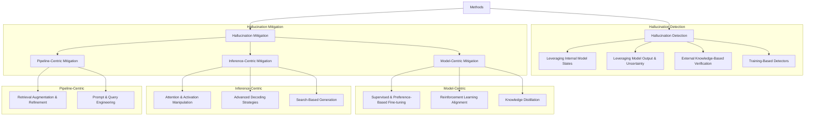

# Methodology for Hallucination in Large Language Models

This section provides a comprehensive overview of the methods developed to address hallucinations in Large Language Models (LLMs). The methodologies are systematically organized into two primary categories: **Hallucination Detection** and **Hallucination Mitigation**. This division reflects the logical workflow of first identifying the problem and then resolving it. Hallucination Detection focuses on techniques that identify, measure, and quantify factual inconsistencies in model outputs. In contrast, Hallucination Mitigation encompasses a broad range of strategies aimed at preventing, reducing, or correcting hallucinations during the model's training, inference, or as part of a larger generation pipeline.

To help the reader navigate the diverse landscape of methods, we have organized them into a clear taxonomy. The following diagram visually maps out all the categories and sub-categories that will be discussed in detail. This taxonomy forms the structural basis for this entire section and will serve as a roadmap for the reader.

Following this structure, the subsequent subsections will delve into each category. We will not only describe the core ideas of the constituent methods but also provide comparative analyses, discuss their respective advantages and limitations, and, where appropriate, use tables to summarize key differences. This approach ensures a rich and analytical overview rather than a simple enumeration of techniques, offering deeper insights into the current state of the art.

## Hallucination Detection: Identifying and Quantifying Factual Inconsistencies

This subsection introduces the first major challenge in addressing hallucinations: their detection. The primary goal of these methods is to answer the fundamental question: 'Is the generated text factual and consistent?' Accurate detection is a critical prerequisite for mitigation, a necessary component for model evaluation, and a cornerstone for building trustworthy AI systems. The approaches covered here vary significantly in their underlying principles, ranging from the deep introspection of a model's internal mechanisms to the pragmatic cross-verification of its claims with the external world.

We will detail four distinct categories of detection methods. The exploration begins with techniques that probe the model's internal states, which operate on the hypothesis that hallucinations leave a distinct neural signature. Subsequently, we examine methods that analyze the model's output and associated uncertainty, a versatile approach often applicable even to black-box models. Following this, we shift our focus to methods that ground the model's claims in external knowledge sources for verification, emphasizing empirical truth. Finally, we discuss approaches that train a dedicated, specialized model for the detection task itself. This organizational structure reflects a spectrum of verification signals, from purely model-internal to entirely model-external.

### Leveraging Internal Model States

The fundamental hypothesis underpinning this category is that the internal dynamics of an LLM differ when it is generating factual content versus when it is hallucinating. These methods aim to capture this difference by tapping into signals from hidden states, activations, or attention patterns to construct a detector. The primary advantage of this "white-box" approach is its self-contained nature; it does not require external API calls or knowledge bases, making it potentially very efficient. However, its most significant limitation is the requisite access to the model's internal workings, which renders these techniques unsuitable for proprietary, closed-source models accessed via APIs.

Within this category, methods explore different facets of the model's internal state. For instance, **HD-NDEs** conceptualizes the sequence of hidden states during generation as a dynamic system. By modeling this generation trajectory with Neural Differential Equations (Neural DEs), it captures the full temporal dynamics of the model's "thought process" to assess the truthfulness of the final output. This approach assumes that the path to a factual statement is fundamentally different from the path to a hallucination. In contrast, **PRISM** operates on the principle that the internal structures related to factuality can be faint or inconsistent across different domains. Instead of just observing these structures, PRISM actively manipulates them by using carefully crafted prompts to amplify the truthfulness signal, making it more salient and easier for a detector to identify consistently.

A comparative analysis reveals a trade-off between modeling depth and practical application. While both leverage internal states, **HD-NDEs** focuses on modeling the *temporal dynamics* of the generation process, offering a deep, analytical view of how a conclusion is reached. However, this comes at the cost of a significant training overhead. **PRISM**, on the other hand, focuses on manipulating the *structural representation* of truthfulness within the model at a given moment. It is potentially more efficient and aims to enhance the cross-domain generalization of detectors, but its performance is intrinsically tied to the quality and generalizability of its prompt templates. In summary, HD-NDEs is suited for a deep, fine-grained analysis of a specific model's generative dynamics, while PRISM serves as a powerful tool for boosting the robustness of internal-state detectors across diverse contexts.

### Leveraging Model Output and Uncertainty Quantification

This category encompasses a set of techniques that operate by analyzing the final output of the model, a characteristic that makes many of them applicable to "black-box" models accessible only through APIs. The core idea unifying these methods is the observation that hallucinations are often associated with model uncertainty. This uncertainty can be measured in several ways: by evaluating the semantic consistency across multiple generated answers to the same prompt, by prompting the model to self-reflect and critique its own statements, or by analyzing the linguistic markers of confidence it produces in its response.

Methods focused on quantifying uncertainty from multiple generations offer a robust way to gauge a model's conviction. Standard semantic entropy, however, can be brittle. To address this, **SNNE (Semantic Nearest Neighbor Entropy)** refines the concept by not just looking at the overall diversity of responses, but by considering both intra-cluster and inter-cluster similarities among them. This provides a more nuanced measure of uncertainty that is less susceptible to outliers. While powerful, these multi-sample methods can be computationally expensive. An alternative is to improve the quality of uncertainty scores from a single generation. **CUE (Corrector for Uncertainty Estimation)** pioneers this direction by training a lightweight 'corrector' model. This corrector learns to adjust and harmonize the raw uncertainty scores from a target LLM, making them more reliable indicators of factuality without requiring multiple expensive generation calls at inference time.

Beyond statistical uncertainty, some methods empower the model to use its own reasoning capabilities for detection. **SelfElicit** stands out with its sophisticated, introspective process. For a given long-form output, it first extracts key statements, organizes them into a knowledge hypergraph, and then iteratively prompts the model to reflect on each statement's factuality. This process allows the model to resolve internal inconsistencies and leverage its own intrinsic knowledge to identify fabrications. This deep, reflective approach contrasts with methods that analyze more superficial signals in the text. For example, both **MarCon** and another notable study on **epistemic modality** investigate whether an LLM's use of confidence-bearing phrases (e.g., "I am certain..." versus "It seems that...") reliably correlates with its actual accuracy. Their findings are insightful: while a correlation exists, it is often unstable and does not generalize well across different domains, suggesting that linguistic confidence can be a weak and sometimes misleading signal.

To synthesize this diverse set of approaches, the following table provides a comparative summary, highlighting their key characteristics and helping to position them within the broader detection landscape.

| Method | Core Signal | Input Requirement | Black-Box Applicable? | Key Strength |
| :--- | :--- | :--- | :--- | :--- |
| **SNNE** | Semantic Inconsistency | Multiple Generations | Yes | Robust uncertainty quantification by analyzing inter/intra-cluster similarity. |
| **CUE** | Corrected Probability | Single Generation (for inference) | Yes (with trained corrector) | Harmonizes and improves raw uncertainty scores from a target LLM. |
| **SelfElicit** | Self-Reflection / Consistency | Single Long-Form Generation | Yes | Deep, iterative self-critique for detecting hallucinations in long-form text. |
| **MarCon / Epistemic Study** | Linguistic Markers | Single Generation | Yes | Simple and direct, but signal reliability is limited and domain-dependent. |

### External Knowledge-Based Verification

Methods in this category adopt a "trust, but verify" philosophy. Instead of relying solely on the model's internal signals or the coherence of its output, they cross-reference the generated claims against external, authoritative knowledge sources. These sources can range from the vast expanse of the web to structured knowledge bases or domain-specific documents, such as source code. This approach offers a strong and direct grounding in real-world facts, making it a gold standard for factuality. However, its efficacy is fundamentally constrained by the quality, coverage, and timeliness of the external knowledge source, as well as the effectiveness of the retrieval and information-matching process.

The application of this principle varies depending on the target domain and the nature of the hallucinations being addressed. For instance, the **ETF (Entity Tracing Framework)** is highly specialized for the domain of code summarization. It performs a meticulous two-step verification: first, it checks for *extrinsic hallucinations* by verifying that every entity (e.g., a function or variable) mentioned in the summary actually exists in the source code. Then, it checks for *intrinsic hallucinations* by verifying that the described intent or behavior of each valid entity is correct according to the code. This provides a granular, interpretable form of verification. In contrast, **VERIFY** is a more general-purpose framework designed for open-domain question answering. Its pipeline first decomposes a model's response into a set of atomic, verifiable claims. It then generates web search queries to find evidence for each claim and classifies it as supported, unsupported, or, crucially, undecidable.

The trade-offs between these approaches highlight the classic tension between specialization and generalization. ETF provides highly interpretable, fine-grained feedback within its specific domain (code) but its reliance on language-specific parsers limits its applicability. VERIFY is far more broadly applicable to open-domain text, but its performance is contingent on the quality of web search results, which can be noisy and conflicting. The inclusion of an "undecidable" label is a key feature of VERIFY, acknowledging the practical reality that not all claims can be definitively proven or disproven with available evidence. Ultimately, external verification methods are essential for high-stakes applications where factual accuracy is paramount, but their successful implementation demands a robust and reliable verification pipeline.

### Training-Based Detectors

As an alternative to detection strategies that rely on heuristics, uncertainty, or external APIs, this category embraces a supervised learning paradigm. The core approach is to train a separate, dedicated model—a hallucination detector—to perform the classification task. This detector is fine-tuned on a labeled dataset containing both factual and hallucinatory examples, learning to distinguish between them. The underlying rationale is that a specialized model can learn far more complex and nuanced patterns of hallucination than predefined rules or simple uncertainty metrics might capture, effectively treating hallucination detection as a sophisticated Natural Language Inference (NLI) problem.

A representative and advanced method in this category is **RATE-FT**. Its key innovation lies in moving beyond simple label-based fine-tuning. It augments the training process with two additional components: rationales (human-readable explanations for why a piece of text is or isn't a hallucination) and an auxiliary question-answering task. This multi-task learning setup compels the detector to develop a deeper semantic understanding of the underlying facts rather than just memorizing surface-level patterns. By learning to generate explanations and answer relevant questions, the model enhances its accuracy and, crucially, its ability to generalize to new, unseen examples, which is particularly important for evaluating long-form text.

The primary advantage of this approach is its potential for high accuracy and strong generalization, as demonstrated by RATE-FT. Once the detector is trained, it is also highly efficient at inference time, as it performs a single forward pass without needing multiple generations, external tool usage, or access to the original model's internals. The main limitation, however, is a significant one: the dependency on a high-quality, large-scale, labeled training dataset. Creating such a dataset is an expensive and time-consuming process that requires careful human annotation. Furthermore, like any supervised model, the detector's performance is intrinsically tied to the domains and types of hallucinations represented in its training data, and it may struggle with out-of-distribution examples.

## Hallucination Mitigation: Strategies for Generating More Factual Content

Having explored how to identify hallucinations, we now shift our focus to actively preventing or reducing them. This subsection covers the diverse strategies developed to make LLMs more truthful. Mitigation is not a one-size-fits-all problem; solutions can be applied at different points in the model lifecycle. Some methods intervene during training, fundamentally altering the model's parameters to build in factuality from the ground up. Others operate at inference time, guiding the generation process on-the-fly without changing the model itself. A third class of methods treats the LLM as a component within a larger pipeline, augmenting it with external tools to enhance its reliability.

To navigate this complex landscape, we organize our discussion into a three-part structure based on the point of intervention. First, we will examine **Model-Centric Mitigation**, which involves modifying the model's parameters through various training and fine-tuning techniques to make it inherently more factual. Second, we will cover **Inference-Centric Mitigation**, a collection of training-free techniques that alter the decoding process to suppress hallucinations as text is being generated. Third, we will explore **Pipeline-Centric Mitigation**, which wraps the LLM in a larger system, for instance, by improving its input through retrieval augmentation or by adding pre-processing checks. This taxonomy provides a structured framework for understanding the vast array of mitigation techniques.

### Model-Centric Mitigation: Modifying the Model via Training and Fine-tuning

The methods in this category share a common goal: to bake factuality directly into the model's weights, thereby creating a model that is intrinsically less prone to hallucination. This is a fundamental approach that aims to fix the problem at its source. The strategies to achieve this are varied, but they typically involve carefully curating the data the model learns from, using preference optimization techniques like Direct Preference Optimization (DPO) to explicitly teach the model what constitutes a "good" (i.e., factual) response, or applying reinforcement learning with a reward signal that is finely tuned to promote factuality. The key advantage of these methods is that the improvements are persistent and integrated into the model itself. However, the cost of training or fine-tuning large models can be substantial, making these interventions a significant undertaking.

To provide a clear overview, we will structure our discussion into three sub-categories that represent the primary mechanisms for model-centric mitigation: Supervised and Preference-Based Fine-tuning, Reinforcement Learning Alignment, and Knowledge Distillation.

#### Supervised and Preference-Based Fine-tuning

This section covers methods that leverage supervised fine-tuning (SFT) or preference-based optimization with a specific focus on enhancing factuality. The core idea is that by carefully selecting, creating, or weighting training data that exemplifies factuality (and, conversely, non-factuality), the model can learn to favor truthful and well-grounded outputs. This moves beyond generic instruction tuning to a more targeted alignment with truth.

The methods here can be grouped by their primary strategy. Some focus on the quality and selection of training data. **NOVA**, for example, introduces a filtering mechanism that probes a model's familiarity with the content of instruction-tuning data, discarding examples that the model is likely to "memorize" poorly and thus hallucinate on. Similarly, **US-Tuning** employs a sophisticated two-stage process: it first makes the model *uncertainty-aware* by teaching it to recognize questions it cannot answer, and then makes it *sensitivity-aware* to ensure it still follows instructions correctly. Other methods focus on altering the training objective itself. **SenD (Sensitivity Dropout)** takes a novel approach by identifying and deterministically dropping embedding indices that show high variability during training, which helps to stabilize the learning of factual associations. A third group of methods leverages explicit preference pairs. **HDPO** directly targets multimodal hallucinations by constructing preference data (i.e., pairs of good and bad responses) that specifically address different failure modes, like insufficient visual grounding or conflicts between modalities. **LoGU** also uses preference pairs, but with the unique goal of teaching the model how to express uncertainty accurately in long-form text, using a clever decomposition-recomposition framework to create data that teaches the model when and how to say "I don't know" or qualify its statements. Together, these methods demonstrate the diverse levers available within the fine-tuning paradigm to instill factuality.

#### Reinforcement Learning Alignment

Reinforcement Learning (RL) offers a more dynamic approach to alignment compared to the static datasets used in SFT or DPO. In the RL paradigm, the model actively explores the generation space and receives feedback in the form of a reward for its outputs. This allows it to learn a more nuanced policy for what constitutes a factual and helpful response, moving beyond simply mimicking examples. The key challenge, and where these methods innovate, lies in the design of the reward signal.

The methods in this category are best contrasted by how they design this crucial reward signal. **RLFH (Reinforcement Learning for Hallucination)** proposes a novel self-alignment loop where the policy model itself acts as the judge. It learns to decompose its own response into atomic facts, verify them against a knowledge source, and then use this verification to generate fine-grained, token-level rewards for itself. This creates a powerful, self-correcting feedback mechanism. **UALIGN** takes a different path by focusing on the model's internal sense of knowledge. It uses uncertainty estimates (like confidence scores) as an explicit input feature for both the policy and the reward model, directly teaching the model to align its behavior with its own knowledge boundaries—to be confident when it's right and hesitant when it's not. Finally, **InteractDPO**, while technically using a DPO-style on-policy objective, addresses a problem that is RL-like in spirit. It focuses on teaching the model to generate better clarification questions when it faces uncertainty, thereby improving the factuality of its subsequent response by actively seeking more information. This highlights a shift from just rewarding correct final answers to rewarding good interactive behavior.

#### Knowledge Distillation

Knowledge distillation presents a pragmatic solution to deploy factual models efficiently. The central goal is to transfer the superior factual knowledge and reasoning capabilities from a large, powerful "teacher" LLM to a smaller, more computationally efficient "student" Small Language Model (SLM). This approach is particularly valuable for creating models that can run on-premise or on resource-constrained devices without sacrificing too much of the factual reliability of their larger counterparts.

The sole method in this category, **DRAG (Distilling RAG)**, exemplifies a sophisticated approach to this challenge that goes far beyond simple input-output mimicry. DRAG recognizes that for a student model to be truly factual, it needs to learn the underlying evidence and reasoning, not just the teacher's final answer. To achieve this, it uses the teacher model to first generate not only a response but also the retrieved evidence and a knowledge graph that supports it. This structured knowledge is then used to ground the student model's training. By distilling the evidence and graph, DRAG ensures that the student model learns the "why" behind the facts, not just the "what." The main benefits are clear: improved efficiency and the potential for enhanced privacy with on-premise SLMs. The primary challenge, as with all distillation, is the potential for loss of nuanced knowledge during the transfer from the more capable teacher.

### Inference-Centric Mitigation: Training-Free Intervention at Generation Time

This category comprises a family of agile, "plug-and-play" techniques designed to mitigate hallucinations without altering the model's underlying weights. These methods intervene directly in the generation or decoding process itself. Their primary advantages are significant: they are training-free, meaning they can be applied to any pre-trained model; they can often be used with black-box models where only output probabilities are accessible; and they can be easily toggled on or off as needed. These characteristics make them highly practical for immediate deployment.

The approaches covered below are diverse, intervening at different points in a single forward pass. We will outline three distinct strategies: those that directly manipulate the model's internal activations or attention patterns to steer its computation; those that employ advanced decoding algorithms to make more intelligent choices about the next token to generate; and those that use search algorithms to explore multiple potential generation paths before committing to a final answer.

#### Attention and Activation Manipulation

These methods perform a form of targeted "surgery" on the model's internal computations during a single inference pass. The core idea is that by identifying and modifying specific components—such as attention heads or activation vectors—that are responsible for factual reasoning (or a lack thereof), they can steer the model towards a more truthful output in real time. This is a delicate balancing act, as the intervention must be precise enough to correct hallucinations without disrupting the model's general language capabilities.

The methods can be grouped by their intervention target. Some focus on manipulating attention heads. **VHR (Vision-aware Head Reinforcement)**, designed for Large Vision-Language Models (LVLMs), identifies and amplifies the signal from attention heads that are most sensitive to visual input, forcing the model to "look" more carefully at the image. Similarly, **CLAIM** operates on attention but in a multilingual context, aligning the cross-modal attention patterns for a non-English query with the typically more robust patterns of an English one to reduce hallucinations. Other methods intervene directly on the activation space. **ASD (Activation Steering Decoding)** identifies a "hallucination direction" within the activation space by contrasting truthful and untruthful generation pairs, and then subtracts this vector from the activations during decoding to steer the model away from hallucinating. A third, more complex approach is exemplified by **HICD**, which uses a clever contrastive mechanism. It first identifies attention heads that induce hallucinations, uses them to intentionally generate a "bad" output, and then contrasts this with the normal output to amplify factuality. Comparing these, we see different mechanisms at play: VHR and CLAIM use amplification, ASD uses steering, and HICD uses a sophisticated induce-and-contrast strategy, all targeting different internal components to achieve a similar goal.

#### Advanced Decoding Strategies

These methods focus on the final, crucial stage of generation: the decoding algorithm that selects the next token from the probability distribution predicted by the model. Instead of relying on standard greedy search or nucleus sampling, which can sometimes favor plausible but factually incorrect sequences, they employ more sophisticated logic to guide this choice towards factuality and faithfulness to a given context.

Some of these strategies dynamically adjust decoding parameters or probabilities based on the model's state. **DFD (Dynamic Focus Decoding)**, for instance, postulates that the model should be more "focused" (i.e., use a lower temperature) during knowledge-intensive generation steps. It detects these steps by measuring distributional differences across layers and adaptively tightens the decoding focus. In the context of open-book QA, **DAGCD (Dynamic Attention-Guided Context Decoding)** ensures the model remains faithful to the provided text by identifying which context tokens the model is paying attention to and dynamically amplifying their probabilities in the output distribution. **Detect-then-Calibrate** works as a two-step process: it first uses entropy as a signal to detect a likely hallucination in progress, and only then intervenes by calibrating the output probabilities using information from intermediate hidden states.

Other methods use contrastive or mixture-based approaches. **CoDA (Contrastive Decoding to Amplify Overshadowed Knowledge)** addresses the specific problem where common knowledge (e.g., "Paris is in France") overshadows a more specific, correct fact in the prompt (e.g., "Paris, Texas"). It uses a contrastive technique to amplify the overshadowed knowledge and suppress the dominant, incorrect prior. For LVLMs, **Mixture of Decoding (MoD)** offers an adaptive strategy. It first checks if the model's attention is correctly focused on the relevant parts of the image and, based on this check, dynamically switches between a complementary decoding strategy (to fill in details) and a contrastive one (to correct errors), thereby producing the best possible output.

#### Search-Based Generation

This approach can be conceptualized as a form of "slow thinking" for LLMs. Instead of committing to a single generation path token-by-token in a "fast thinking" or greedy manner, these methods explore multiple potential sequences using search algorithms. This exploration allows for lookahead, evaluation, and revision, guided by an objective function that prioritizes factuality. The primary trade-off is a significant increase in computational cost and latency in exchange for a potentially much higher quality and more reliable output.

The two main methods in this area offer a contrast between broad exploration and targeted revision. **HaluSearch** frames the entire generation process as a tree search problem, employing Monte Carlo Tree Search (MCTS) to explore different branches of possible text. A self-evaluation reward model, trained to assess factuality, guides the search towards the most promising and factually sound path, effectively allowing the model to "reason out" the best answer. In contrast, **Monitoring Decoding (MD)** is a more targeted and efficient approach. It uses a "monitor" function to flag suspicious or potentially hallucinated tokens *during* a standard generation process. Only when a token is flagged does it trigger a limited, tree-based revision mechanism to resample and correct just that problematic part of the sequence. This contrasts the broad, exploratory nature of HaluSearch with the targeted, revisionist approach of MD, offering a balance between computational cost and corrective power.

### Pipeline-Centric Mitigation: Enhancing Generation through External Components

These methods approach hallucination mitigation from a systems-level perspective, treating the LLM as a powerful but fallible component within a larger, more robust architecture. Instead of modifying the model's internal weights or its real-time decoding process, they focus on improving the inputs given to the model (pre-processing) or augmenting its generation process with external tools and post-processing steps. This approach is highly modular, often easier to implement than retraining a model, and is particularly effective for incorporating timely, external knowledge that the model's parametric memory may lack.

We will explore two primary strategies within this pipeline-centric paradigm: methods that enhance Retrieval-Augmented Generation (RAG) to provide better, more reliable context, and methods that use sophisticated prompt and query engineering to either guide the model towards a factual answer or screen for problematic inputs before they can cause a hallucination.

#### Retrieval Augmentation and Refinement

While standard Retrieval-Augmented Generation (RAG) is a powerful technique for grounding LLMs in external knowledge, it is not a panacea. A naive RAG system can still hallucinate if the retrieved information is irrelevant, conflicting, insufficient, or if the model fails to faithfully adhere to it. The methods in this section aim to create a more intelligent RAG system that addresses these failure points.

Two distinct approaches to improving RAG highlight different priorities. **Debate-Augmented RAG (DRAG)** focuses on maximizing the *quality* and *robustness* of the RAG process by introducing a multi-agent debate mechanism. In a first debate, multiple agents collaborate to refine and expand search queries to ensure the retrieved context is comprehensive and relevant. In a second debate, the agents analyze this context to generate a final response, challenging each other's reasoning to arrive at a more factually consistent and well-reasoned answer. This adversarial setup makes the system more resilient to flawed retrievals. In contrast, the **Adaptive Retrieval** framework focuses on the *efficiency* of RAG. It argues that retrieval is not always necessary, especially if the model's internal knowledge is already sufficient and accurate for a given query. It leverages uncertainty estimation to decide *when* it is necessary to perform a costly retrieval call. By only retrieving when the model is uncertain, it avoids unnecessary computation and latency, creating a more efficient and responsive system. Comparing them, DRAG is a "maximalist" approach focused on quality, while Adaptive Retrieval is a "minimalist" approach focused on necessity and efficiency.

#### Prompt and Query Engineering

This approach uses the model's input—the prompt or query—as the primary lever for mitigation. The intervention happens before the LLM begins its core generation process. This can be done by carefully structuring the prompt to provide strong factual grounding, or by implementing a "gatekeeper" mechanism that vets user queries to identify those likely to induce a hallucination. This is a non-invasive and highly controllable form of mitigation.

The two methods here exemplify the contrast between guiding the model and guarding it. **Visual Evidence Prompting**, designed for LVLMs, acts as a "guide." Instead of asking the LVLM to interpret a raw image, this method first uses smaller, specialized vision models (e.g., object detectors) to extract structured visual evidence (a list of objects, their attributes, and relationships). This structured text is then injected directly into the prompt for the LVLM, effectively grounding its subsequent textual response in the verified visual reality of the image and enriching the input. In stark contrast, the **Lightweight Query Checkpoint (LQC)** acts as a "gatekeeper." It is a small, efficient classifier that analyzes an incoming user query *before* it is sent to the main LLM. Its sole purpose is to predict if the query is ambiguous, underspecified, or otherwise likely to induce a hallucination. If the query is flagged, the system can respond by asking for clarification or proceed with a high-factuality generation mode, thereby preventing the LLM from producing a faulty answer in the first place. One method enriches the prompt to ensure a good answer, while the other filters the query to prevent a bad one.