# 背景

## 1.1 幻觉检测的定义与范围

**大型语言模型（LLMs）中的幻觉检测** 是指系统性地识别由LLMs生成的事实错误或无意义输出的任务，而无需依赖外部证据 [Li et al., 2024; Zhang et al., 2024]。这项任务对于确保LLM生成内容的可靠性和可信度至关重要，特别是在医疗、法律咨询和教育等高风险领域 [Li et al., 2024; Xue et al., 2024]。与依赖外部知识库或数据库的传统事实核查方法不同，幻觉检测侧重于对模型行为的内在分析——利用内部状态、不确定性估计和令牌生成的动态建模来实时识别不一致之处 [Li et al., 2024; He et al., 2024]。该任务涉及评估短文本和长文本响应，区分事实性幻觉（关于世界知识的错误主张）和非事实性幻觉（输入上下文的误述）[Hao et al., 2024; Yang et al., 2024]。

最近在幻觉检测方面的进展引入了多种方法，包括使用神经微分方程建模潜在状态动力学 [Li et al., 2024]、用于跨域泛化的提示引导内部状态分析 [Zhang et al., 2024]，以及代码摘要任务中的实体追踪框架 [Maharaj et al., 2024]。这些方法强调需要可解释且可扩展的解决方案，可以集成到现有的LLM管道中，而无需进行广泛的重新训练或外部验证系统。此外，研究还探索了不确定性感知指令调优以提高模型自我评估能力，使LLMs能够识别自身的知识边界并拒绝无法回答的问题 [Li et al., 2024; Wen et al., 2024]。通过结合这些技术，幻觉检测旨在增强LLMs的鲁棒性，同时保持其在生成自然语言响应时的流畅性和一致性。

### 与其他相关任务的区别

尽管幻觉检测与事实核查、置信度校准和检索增强生成（RAG）等任务有相似之处，但它在本质上不同于外部验证，而是专注于模型内部的评估 [Geng et al., 2024; Li et al., 2024]。事实核查通常依赖外部知识源来验证主张，这使其在静态信息方面有效，但由于计算开销和依赖最新数据库的需求，在实时部署中并不实际 [Hu et al., 2024; Galimzianova et al., 2024]。置信度校准通过调整概率得分来解决模型过度自信问题，但除非配合适当的验证机制，否则它并不能直接识别出幻觉内容 [Li et al., 2024; Ravichander et al., 2025]。检索增强生成通过将响应基于检索到的文档来减少幻觉，但这引入了新的挑战，如错误检索传播和增加的延迟 [Hu et al., 2024; Galimzianova et al., 2024]。

相比之下，幻觉检测独立于外部知识，而是专注于通过内部指标（如注意力模式、不确定性估计和潜空间轨迹）来分析模型生成的内容 [Li et al., 2024; He et al., 2024]。例如，视觉感知头分歧（VHD）方法分析多头注意力机制，以检测视觉输入和文本输出之间的差异，提供一种无需训练的解决方案，增强对齐而不需微调 [He et al., 2024]。同样，SelfElicit 利用迭代自引和知识超图来评估长文本的语义连续性，减少对外部事实核查的依赖，同时提高检测准确性 [Yang et al., 2024]。这些区别突出了幻觉检测的独特价值，作为现有缓解策略的补充层，提供更直接和高效的方式来识别不可靠的输出。

### 幻觉检测的基本技术

幻觉检测领域利用了一系列基本技术，每种技术都在模型内省和错误识别中贡献了独特的能力。这些技术包括用于连续轨迹建模的神经微分方程、用于视觉-语言对齐的注意力机制分析、用于自我评估的不确定性估计，以及用于增强可解释性的结构化提示技术。以下表格总结了关键的技术组件及其在幻觉检测中的应用：

| **技术**       | **关键组件/技术**                           | **在幻觉检测中的应用**                                       |
| -------------- | ------------------------------------------- | ------------------------------------------------------------ |
| 神经微分方程   | 神经ODEs, 神经CDEs, 神经SDEs, 伴随方法      | 在令牌生成过程中建模潜态演化，以检测真实性评估中的异常 [Li et al., 2024] |
| 注意力机制分析 | 多头注意力, VHD 指标, 视觉感知头强化        | 量化LVLMs中对视觉环境的敏感性，通过增强对齐减轻幻觉 [He et al., 2024] |
| 不确定性估计   | 置信度评分, 语义熵, 光谱分析                | 启用知识边界的自我评估，允许模型拒绝无法回答的问题 [Li et al., 2024; Wen et al., 2024] |
| 提示工程       | 提示引导的内部状态, 自我引出, 知识超图      | 增强内部表示中的真实性结构，改进跨领域的幻觉检测 [Zhang et al., 2024; Yang et al., 2024] |
| 实体追踪框架   | 静态程序分析, 代码摘要中的NER, 实体意图匹配 | 通过将实体映射到源代码逻辑来检测代码摘要中的幻觉 [Maharaj et al., 2024] |
| 强化学习       | PPO优化, 令牌级奖励, 自监督反馈             | 通过在线学习使模型输出与内部知识边界对齐 [Wen et al., 2024]  |
| 对比解码       | Logit调整, 基于证据的提示, 动态检索精炼     | 通过强调生成过程中的可验证信息减少幻觉 [Hu et al., 2024]     |

这些技术共同使得幻觉检测系统能够在多样化的模态和应用领域中高效运行。通过整合连续轨迹建模、不确定性感知推理和基于注意力的对齐机制，幻觉检测为增强LLM的可靠性提供了全面的框架，而不损害性能。接下来的部分将深入探讨特定的方法、基准测试工作和未来方向，这一迅速发展的领域将迎来更多创新。

## 1.2 历史背景和技术演进

幻觉检测和缓解在大型语言模型（LLMs）和大型视觉-语言模型（LVLMs）中的演变可以大致分为三个主要阶段，每个阶段都标志着方法论和理论理解的重大转变：

### 早期基础：不确定性建模和基本分类（2023年底至2024年初）

这一初始阶段通过不确定性估计和监督分类奠定了幻觉检测的基础。方法如UALIGN和CUE强调了量化和协调不确定性信号以表示知识边界的重要性。CUE提出了轻量级修正器以改善校准，而UALIGN则使用不确定性来训练事实对齐的奖励模型。平行努力如US-Tuning则关注于区分已知和未知查询，准备模型以负责任的方式表达不确定性。这些方法通常将幻觉视为可以通过特征阈值或校准分数检测的离散输出。

在此期间，研究人员主要依靠统计措施和置信度评分来评估模型的可靠性。诸如语义熵和光谱分析之类的技术被引入以捕捉模型预测中的隐含知识缺口 [Li et al., 2024; Wen et al., 2024]。然而，早期的检测系统往往缺乏细粒度的可解释性，使得难以区分不同类型的幻觉或提供模型改进的可行反馈。尽管存在这些局限性，不确定性建模的基础工作为后来更复杂的检测策略奠定了关键原则。

### 技术多样化和框架创新（2024年中期至后期）

从2024年中期开始，该领域通过整合内部状态、结构、检索和自我评估的创新框架实现了多样化发展。HD-NDEs引入了使用神经微分方程（ODEs/CDEs/SDEs）动态建模潜在表示进行分类的方法。PRISM使用提示引导的内部状态增强了跨域泛化能力。ETF通过追踪代码与LLM输出之间的语义实体，开创了代码摘要中的幻觉检测。SelfElicit通过自反性知识提取和超图连续性建模启用了长形式幻觉检测。SenD（敏感性丢弃）从训练动态的角度接近幻觉减少，通过消除敏感嵌入变量稳定模型信心。

这一阶段还见证了向新模态的扩展。MHALO和VHR探索了LVLMs中的细粒度幻觉检测，采用了诸如视觉感知头强化和基准开发（例如HALODET-4B）等方法。与此同时，DRAG和InteractDPO通过显式建模不确定性和对抗辩论推进了检索增强生成。这些创新表明，幻觉检测可以通过多种互补路径有效解决，包括结构分析、动态建模和交互式细化。因此，检测准确性显著提高，研究人员开始开发基准来评估系统在不同领域的表现。

### 整合、多模态评估和基准测试（2024年末至2025年）

当前阶段强调生态系统整合和评估现实性。像HALOGEN、FAITHQA、HalluLens和FHSumBench这样的基准将幻觉类型分类到各个领域、模态和意图中。这些资源促进了统一的分类法，区分了内在和外在幻觉，并考虑了主观误解。RLFH应用令牌级奖励建模分解事实反馈并通过强化学习优化。LoGU通过直接偏好优化（DPO）对齐明确的不确定性表达解决了长形式生成中的幻觉问题。FactBench和VERIFY引入了基于网络证据的动态评估流水线。对于交互设置，SHARP通过模拟辩论中的立场转移检查了基于角色的幻觉。

这一阶段强调了从单一检测到具有更大透明度、多模态保真度和细粒度错误理解的系统级缓解策略的转变。研究人员现在专注于将幻觉检测整合到更广泛的AI工作流程中，确保模型不仅检测错误，还能相应地调整响应。诸如LOGU之类的技术鼓励模型在其输出中明确表达不确定性，从而提高人机交互和决策的可靠性。此外，像SHARP这样的框架突出了在对话环境中检测幻觉的重要性，其中社会动态可能影响响应的准确性。

### 时间线可视化

以下是使用Mermaid格式的时间线，展示了LLMs和LVLMs中幻觉检测的发展进程：

此时间线突出了幻觉检测研究的关键里程碑，展示了该领域如何从基本的不确定性建模发展到复杂的多模态评估和基准测试。每个阶段代表了构建更可靠和值得信赖的AI系统的重要一步，这些系统能够在现实世界应用中检测和缓解幻觉。

## 1.3 幻觉检测的意义和实际影响

幻觉检测在大型语言模型（LLMs）中的重要性是人工智能进步的关键前沿，对多个领域有着深远的影响。随着LLMs越来越多地集成到医疗、法律分析、教育和科学研究等高风险应用中，确保其可靠性至关重要。幻觉——LLMs在没有外部验证的情况下生成的事实错误或虚构内容——在现实场景中部署时可能会带来重大风险，误导决策、违反法规，甚至对个人造成伤害 [Li et al., 2024]。开发稳健的幻觉检测机制不仅提高了模型的可信度，还促进了在关键任务环境中的安全部署。

### 增强AI系统的信任和可靠性

有效的幻觉检测最直接和深刻的影响之一在于加强人们对AI系统的信任。用户在与LLMs互动时，往往假设输出是事实准确的，尤其是当回应看起来连贯且结构良好时。然而，许多研究表明，即使是最先进的模型也经常生成误导性或完全虚构的信息 [Ravichander et al., 2025]。这一问题在需要精确事实知识的领域尤为突出，如医学诊断、法律推理和金融预测。例如，如果一个LLM生成错误的医疗建议或误解法律条文，后果可能是严重的 [Hao et al., 2024]。通过实施先进的幻觉检测技术，如HD-NDEs [Li et al., 2024]、PRISM [Zhang et al., 2024]和UALIGN [Xue et al., 2024]，开发者可以显著降低有害虚假信息的风险。这些方法利用神经微分方程、提示引导的内部状态和不确定性感知对齐来系统评估真实性，从而提高模型的可靠性和用户信心。

此外，幻觉检测有助于更广泛的模型校准和自我评估工作。诸如CUE（不确定性估计修正器）[Li et al., 2024]和US-Tuning [Li et al., 2024]等技术旨在完善LLMs对其预测的信心表达，确保不确定性与实际准确性相一致。当模型能够准确指出其缺乏足够知识或遇到模糊查询时，用户可以更好地根据AI生成的内容做出明智的决策。这种能力在学术研究、政策制定和企业决策支持系统等领域尤为重要，因为在这些领域中，过度自信可能导致错误的结论。

### 推动科学发现和知识管理

在科学研究和知识密集型领域，幻觉检测在维护自动化知识合成的完整性方面起着至关重要的作用。LLMs越来越多地被用来分析大量文献、从数据集中提取见解并协助假设生成。然而，如果这些模型在摘要或解释过程中引入不准确性，下游分析可能会传播错误，导致得出错误的结论 [Fatahi Bayat et al., 2024]。例如，生物医学研究严重依赖准确的文献综述来识别治疗候选物或理解疾病机制。如果一个LLM错误地总结了临床试验结果或将发现归因于不同的研究，可能会误导研究人员并延缓科学进展。

为了解决这一挑战，诸如ETF（实体追踪框架）[Maharaj et al., 2024]和SelfElicit [Yang et al., 2024]等框架提供了验证长文本事实一致性的结构化方法。ETF利用静态程序分析和LLM-based验证来追踪代码摘要中的实体，确保描述与源代码逻辑一致。同样，SelfElicit采用迭代自我评估和知识超图来检测扩展叙述中的不一致之处。这些方法使AI生成内容的验证更加严格，支持其在科研工作中不可或缺的应用。

此外，幻觉检测与增强知识检索和整合的努力相结合。检索增强生成（RAG）系统依赖外部知识源来提高事实准确性，但仍易受“幻觉上的幻觉”现象的影响——即错误的检索误导生成过程 [Hu et al., 2024]。诸如DRAG（辩论增强RAG）之类的框架通过纳入多代理辩论机制来细化检索质量和响应生成，减轻这一风险。通过确保知识基础的可靠性，这些技术促进了更值得信赖的AI驱动的研究和决策。

### 改进多模态和视觉-语言应用

随着AI系统从基于文本的交互扩展到包含视觉数据，幻觉检测变得更加复杂。大型视觉-语言模型（LVLMs）常常生成包含不存在对象或关系的图像描述或解释，削弱了它们在自主导航、医学影像分析和文档理解等任务中的实用性 [He et al., 2024]。解决这一挑战需要专门针对多模态情境的幻觉缓解策略。

诸如MHALO（多模态幻觉检测）[MHALO, ACL提交]和视觉证据提示 [匿名作者, 2024]等技术为精细粒度的视觉-语言任务中的幻觉检测提供了有希望的解决方案。MHALO引入了标记级别的注释和F1 IoU等指标，以精确定位图像描述中的幻觉元素，而视觉证据提示则利用小型视觉模型引导LVLMs生成更忠实的输出。这些方法确保AI生成的视觉内容描述保持真实，减少了在放射科诊断或自动驾驶感知等应用中的错误风险。

此外，诸如VHD（视觉感知头分歧）和VHR（视觉感知头强化）等方法专注于分析LVLMs中的注意力机制，以识别和纠正对语言先验的偏见 [He et al., 2024]。通过强化对视觉环境敏感的注意力头，这些技术提高了生成描述的保真度，使其更符合实际输入数据。这些进步对于在安全关键领域部署AI至关重要，因为对视觉信息的误解可能带来严重后果。

### 支持伦理AI发展和监管合规

除了技术改进外，幻觉检测还具有重大的伦理和监管意义。政府和行业利益相关者越来越关注AI生成内容的潜在滥用，尤其是在新闻报道、公共政策和法律诉讼等领域。确保LLMs产生可验证和透明的输出对于维护问责制和防止虚假信息的传播至关重要 [Zhang et al., 2024]。

诸如HalluLens之类的框架提供了全面的基准，用于评估幻觉，区分内在和外在错误，以促进标准化的评估实践 [Zhang et al., 2024]。此外，诸如SHARP（角色扮演LLMs中的立场转移）等倡议强调了检测交互式幻觉的必要性，即模型根据社会动态而不是事实一致性改变响应 [Kong et al., 2024]。这些努力有助于制定伦理AI指导方针和监管框架，规范LLMs在社会中的负责任部署。

此外，幻觉检测与AI透明性和可解释性的广泛讨论交织在一起。诸如LOGU（带有不确定性表达的长形式生成）之类的方法鼓励模型在其输出中明确表达不确定性，使人类用户更容易解释AI生成的内容 [Yang et al., 2024]。通过促进模型推理的透明性，这些方法帮助建立对AI系统的信任，并支持新兴的AI问责法规的合规性。

总之，LLMs中的幻觉检测不仅是技术挑战，更是推动可信AI发展的基础要求。其意义涵盖了提高模型可靠性、支持科学发现、改进多模态应用和确保伦理合规。随着研究继续精炼检测方法，实际效益将扩展到各行各业，使AI在日益AI驱动的世界中实现更安全和负责任的部署。

## 参考文献

[Galimzianova et al., 2024, Adaptive Retrieval without Self-Knowledge? Bringing Uncertainty Back Home]
[Geng et al., 2024, HD-NDEs: Neural Differential Equations for Hallucination Detection in LLMs]
[He et al., 2024, Cracking the Code of Hallucination in LVLMs with Vision-aware Head Divergence]
[Hu et al., 2024, Removal of Hallucination on Hallucination: Debate-Augmented RAG]
[Li et al., 2024, Towards Harmonized Uncertainty Estimation for Large Language Models]
[Maharaj et al., 2024, ETF: An Entity Tracing Framework for Hallucination Detection in Code Summaries]
[Ravichander et al., 2025, HALOGEN: Fantastic LLM Hallucinations and Where to Find Them]
[Wen et al., 2024, On-Policy Self-Alignment with Fine-grained Knowledge Feedback for Hallucination Mitigation]
[Xue et al., 2024, UALIGN: Leveraging Uncertainty Estimations for Factuality Alignment on Large Language Models]
[Yang et al., 2024, LoGU: Long-form Generation with Uncertainty Expressions]
[Zhang et al., 2024, Prompt-Guided Internal States for Hallucination Detection of Large Language Models]

# 2. 方法论：应对幻觉的计算方法

本章对旨在解决大型语言模型幻觉挑战的计算方法进行结构化综述。核心目标是超越简单的技术罗列，通过比较分析，阐明该领域的核心原理、权衡取舍与演进趋势。本章内容围绕两大核心策略展开：幻觉检测（Hallucination Detection），专注于识别模型输出中的谬误内容；以及幻觉缓解（Hallucination Mitigation），聚焦于在生成过程中预防或纠正谬误。为清晰展示本综述所涵盖的全部方法论图景，本章首先呈现一个全面的方法分类体系图。

```mermaid
graph TD
    A(幻觉问题应对方法) --> B(幻觉检测);
    A --> C(幻觉缓解);

    B --> B1(模型内部状态分析);
    B1 --> B1a(CUE);
    B1 --> B1b(SNNE);
    B1 --> B1c(HD-NDEs);
    B1 --> B1d(PRISM);

    B --> B2(知识溯源验证);
    B2 --> B2a(ETF);
    B2 --> B2b(SelfElicit);

    B --> B3(有监督检测);
    B3 --> B3a(RATE-FT);
    
    B --> B4(前瞻性查询过滤);
    B4 --> B4a(LQC);

    C --> C1(对齐与微调);
    C1 --> C1a(UALIGN);
    C1 --> C1b(US-Tuning);
    C1 --> C1c(InteractDPO);
    C1 --> C1d(LoGU);
    C1 --> C1e(NOVA);
    C1 --> C1f(SenD);
    C1 --> C1g(HDPO);
    C1 --> C1h(RLFH);
    C1 --> C1i(DRAG);

    C --> C2(检索与提示工程);
    C2 --> C2a(Visual Evidence Prompting);
    C2 --> C2b(Adaptive Retrieval without Self-Knowledge?);
    C2 --> C2c(Debate-Augmented RAG);

    C --> C3(解码与搜索策略修改);
    C3 --> C3a(DFD);
    C3 --> C3b(CoDA);
    C3 --> C3c(MD);
    C3 --> C3d(HaluSearch);
    C3 --> C3e(MoD);

    C --> C4(内部激活引导);
    C4 --> C4a(VHR);
    C4 --> C4b(CLAIM);
    C4 --> C4c(DAGCD);
    C4 --> C4d(HICD);
    C4 --> C4e(ASD);
    C4 --> C4f(Detect-then-Calibrate);
```

## 2.1 幻觉检测

本节审视一系列旨在识别、标记或量化模型生成内容中幻觉成分的方法。这些方法本身不改变模型的生成过程，而是作为事后验证器或诊断工具发挥作用。其组织结构依据检测信号的来源划分：从分析模型内部机制，到基于外部或自生成知识进行验证，再到专门的有监督检测器。

### 2.1.1 模型内部状态分析

此类方法建立在一个核心前提之上：模型的内部状态——如激活模式、隐空间动态或输出概率分布——蕴含着指示内容真实性的信号。将不确定性估计作为幻觉检测的代理指标是这一方向的普遍思路。其中，**CUE (Corrector for Uncertainty Estimation)** 和 **语义最近邻熵 (Semantic Nearest Neighbor Entropy, SNNE)** 代表了两种不同的实现路径。CUE通过训练一个轻量级校正器来调整模型的不确定性分数，使其与真实表现对齐，但其有效性依赖于高质量的标注数据。与此相对，SNNE通过计算多次生成样本间的语义相似度来估计熵，从而量化不确定性。这种方法虽避免了对标注数据的依赖，却以增加推理阶段的采样开销为代价。

超越静态不确定性估计的范畴，**HD-NDEs** 提出了一种更为复杂的动态视角。该方法利用神经微分方程（Neural DEs）对模型在生成过程中的隐空间状态演化进行建模，不再仅仅关注单个时间点的状态，而是捕捉生成轨迹的动态系统行为。通过分析这一轨迹是否符合“真实”陈述的模式，HD-NDEs能够更有效地捕捉逻辑或事实上的不一致性。这种对时序信息的利用使其在检测性能上取得了显著提升，但也带来了更高的训练复杂度。作为对此类方法的元增强框架，**PRISM** 的出现提供了一种新的思路。它并不直接提出一种新的检测机制，而是通过设计并筛选最优的提示（prompt），引导模型在处理文本时使其内部与真实性相关的结构变得更加凸出和一致。PRISM可以与CUE或HD-NDEs等依赖内部状态的方法结合，显著增强它们在不同领域间的泛化能力，展示了提示工程在挖掘和塑造模型内部表征方面的潜力。

### 2.1.2 知识溯源验证

本小节聚焦于通过将生成内容与明确的知识源进行比对来验证其真实性的方法。这些方法的关键区别在于其所依赖的知识库来源，形成了两种截然不同的范式。

第一种范式以**实体追踪框架 (Entity Tracing Framework, ETF)** 为代表，它依赖于外部的、结构化的知识源。在代码摘要生成的特定任务中，ETF利用静态程序分析工具从源代码中提取权威的实体列表，然后验证模型生成的摘要中提及的实体及其意图是否与源代码中的事实相符。这种方法的优势在于其高可靠性和可解释性，因为它将验证过程牢固地锚定在一个客观、可解析的“事实地面”（ground truth）上。然而，其代价是严格的领域限制性，因为其有效性高度依赖于特定领域（如特定编程语言）的解析工具。

与之形成鲜明对比的是**SelfElicit**，它开创了一种无需外部检索的验证模式。该方法不依赖外部知识库，而是通过精心设计的提示，引导模型自行生成并推理其内部蕴含的相关知识，形成一个临时的、自洽的知识图谱。模型随后在这个自生成的知识背景下，对原始陈述进行迭代式的事实性评估和冲突消解。SelfElicit的核心洞见在于，模型自身即是一个庞大的知识库。其优势在于广泛的适用性，摆脱了对外部数据库的依赖。但其根本性的权衡在于，整个验证过程的可靠性上限受制于模型自身知识的准确性——它验证的是内容是否与模型“自认为”的事实相符，而非与外部世界的事实相符，这使其在面对模型自身知识体系的固有缺陷时可能失效。

### 2.1.3 有监督检测

本小节探讨将幻觉检测问题形式化为一个有监督分类任务的方法。这类方法通过在标注了“幻觉”与“非幻觉”标签的数据集上进行微调，训练出一个专门的检测模型。

**RATE-FT** 是这一类别的典型代表。其核心贡献在于，它不仅使用标签进行微调，还在训练过程中引入了额外的信号来增强模型的泛化能力。具体而言，RATE-FT在微调数据中增补了解释模型判断依据的“理据”（rationales），并引入了一个辅助性的问答任务，要求模型能就待检测陈述中的关键信息生成问题并提供正确答案。这种多任务学习范式迫使模型更深入地理解内容的语义和事实基础，而不仅仅是学习表面的统计模式。

从方法论的角度看，有监督检测器的战略定位十分明确。其主要优势在于，当测试数据与训练数据领域高度一致时，它们通常能达到极高的检测精度，性能优于多数无监督方法。然而，这一优势伴随着显著的劣势：首先，构建大规模、高质量的标注数据集成本高昂且耗时；其次，这类模型往往表现出“脆弱性”，即在面对领域外（out-of-domain）的内容时性能会急剧下降。这与前述依赖模型内部状态或知识溯源的无监督方法形成了鲜明对比，后者虽然在特定任务上精度可能不及前者，但通常具有更好的泛化潜力。

### 2.1.4 前瞻性查询过滤

与所有在内容生成后进行检测的事后（post-hoc）方法不同，本小节介绍一种前瞻性（pre-emptive）策略，它在模型开始生成答案之前，就对用户的输入查询进行风险评估。

**轻量级查询检查点 (Lightweight Query Checkpoint, LQC)** 是该策略的主要范例。它如同一个 triage（分诊）系统，其核心是一个在小规模、非指令微调模型上训练的轻量级分类器。该分类器不直接处理生成内容，而是分析用户查询在模型中间层产生的隐藏状态。通过对比学习，LQC能够有效区分那些模型能够直接、清晰回答的“明确查询”和那些可能诱导模型产生幻觉的“高风险查询”。一旦识别出高风险查询，系统可以拒绝回答或要求用户提供更多信息，从而从源头上避免幻觉的产生。

LQC的独特价值主张在于其防御性的定位。它通过阻止模型尝试回答其能力范围之外或具有歧义性的问题，不仅避免了生成谬误内容，还节约了原本会用于无效生成的计算资源。这种“防患于未然”的理念，为幻觉检测提供了一个全新的维度，即从被动的“纠错”转向主动的“避险”。

## 2.2 幻觉缓解

本节将焦点从幻觉的检测转移至预防，系统地考察那些通过主动干预模型处理流程以减少谬误内容生成的方法。这些方法通常更具侵入性，可以在训练、推理等不同阶段应用。本节的组织结构将依据干预点的不同展开：从通过训练修改模型核心参数，到利用外部数据增强模型输入，再到调整模型实时的生成与推理机制。

### 2.2.1 对齐与微调

本小节探讨通过修改模型参数来向其灌输更强事实感的各类方法，并依据训练所依赖的核心信号进行组织。

第一类方法以**不确定性**为引导信号，旨在教会模型认知其知识的边界。其中，**UALIGN** 和 **US-Tuning** 通过在训练中显式地将不确定性估计作为输入特征，让模型学会对不确定的问题拒绝回答或表达谦逊。而 **InteractDPO** 与 **LoGU** 则更进一步，它们不仅让模型识别不确定性，还训练模型通过生成澄清性问题或明确的文本标记（如“据我所知...”、“可能...”)来主动表达不确定性。

第二类方法是**数据驱动**的，其核心在于优化训练数据或过程本身。**NOVA** 提出了一种新颖的数据筛选策略，它通过探测模型对指令数据的“熟悉度”——即模型是否能稳定、一致地生成关于某个知识点的回答——来过滤掉那些与模型内部知识不符或可能导致混淆的训练样本。与之不同，**Sensitivity Dropout (SenD)** 则直接干预训练过程，它识别并“丢弃”那些在训练中表现出高变异性的敏感嵌入索引（embedding indices），从而稳定模型的学习过程，降低事实性知识的方差。

第三类是更为前沿的**高级对齐技术**。**HDPO (Hallucination-targeted Direct Preference Optimization)** 将直接偏好优化（DPO）应用于幻觉问题，通过构建专门针对幻觉的负样本（即包含幻觉的回答），让模型在偏好学习中直接学会厌恶幻觉。相比之下，**RLFH (Reinforcement Learning for Hallucination)** 采用了一种在策略（on-policy）的强化学习方法，其独特之处在于让模型自身扮演“裁判”的角色，自动将生成内容分解为原子事实，并对照知识源进行验证，从而为自身提供细粒度的、实时的奖励信号。

最后，**DRAG** 代表了一种独特的**知识蒸馏**视角。它专注于将大型检索增强生成（RAG）模型的事实性知识高效地迁移到小型模型中。通过基于证据和知识图谱的蒸馏，DRAG不仅实现了模型的小型化，降低了部署成本和隐私风险，还有效地将大型模型的事实遵循能力“遗传”给了小型模型。

### 2.2.2 检索与提示工程

本小节详细介绍在推理阶段通过增强模型上下文来锚定生成内容的方法。分析的中心问题是如何最优地利用外部知识。

一个直观的范例是**Visual Evidence Prompting**，它清晰地展示了如何将文本生成锚定在不同模态（视觉）的证据上。该方法利用小型视觉模型（如目标检测器）提取的结构化视觉信息（如物体列表、场景图）作为提示的一部分，强制大型视觉语言模型（LVLM）的回答必须基于图像中的实际内容，从而有效减少对视觉信息的凭空捏造。

在此基础上，一些方法致力于优化检索过程本身。**Adaptive Retrieval without Self-Knowledge?** 框架探讨了一个核心问题：何时进行检索才是最高效的？该研究系统地评估了多种不确定性估计技术，并证明可以利用这些技术来智能地决定模型是应该依赖其内部的参数化知识，还是需要求助于外部的非参数化知识库。这种自适应策略优化了模型的效率，避免了不必要的检索开销。

作为从简单检索到复杂推理增强的演进，**Debate-Augmented RAG** 提出了一种精致的多智能体方法。它将结构化的“辩论”机制引入到检索和生成两个阶段。在检索阶段，多个智能体通过多轮辩论来迭代地优化检索查询，以获得更全面、更相关的知识。在生成阶段，智能体扮演不同角色（如提议者、反对者），通过对抗性的辩论来审视和修正生成内容的逻辑链和事实依据。这种方法不仅提升了检索质量，还通过模拟批判性思维过程增强了最终生成的鲁棒性。

### 2.2.3 解码与搜索策略修改

本小节涵盖在推理时直接改变词元（token）选择过程的方法。这些方法沿着干预复杂性的光谱分布，从轻量级的解码调整到计算密集型的搜索算法。下表对本节讨论的方法进行了比较。

首先是**自适应解码策略**。**动态聚焦解码 (Dynamic Focus Decoding, DFD)** 提出，模型在生成不同内容时对事实性的依赖程度是动态变化的。它通过监测模型不同层之间输出分布的KL散度，来判断当前生成步骤是否为“知识密集型”。若是，则降低采样温度以确保事实准确性；若否，则提高温度以鼓励多样性。与之相对，**CoDA (Contrastive Decoding to Amplify Overshadowed Knowledge)** 关注的是“知识遮蔽”问题，即模型中占主导地位的知识有时会压制与之相关但不那么突出的正确知识。CoDA通过对比解码——即对比有无特定知识提示时的输出概率分布——来放大被遮蔽的正确知识信号，从而修正生成结果。

其次是主动**监控与修正生成路径**的方法。**监控解码 (Monitoring Decoding, MD)** 在生成过程中动态运行一个监控函数，一旦检测到某个生成的词元可能引发幻觉，便会立即将其标记并进行重采样，是一种“微创手术式”的干预。而**HaluSearch** 则采用了计算成本更高的树状搜索策略（如蒙特卡洛树搜索），它将生成过程视为一个多步推理任务，在每一步探索多个可能的生成路径，并利用一个自评估奖励模型来引导搜索走向最可靠的分支。这种方法特别适用于需要复杂推理链的任务，但其高昂的计算开销是主要限制。

最后，**混合解码 (Mixture of Decoding, MoD)** 展示了这些原则在多模态领域的专门应用。MoD首先评估模型对图像区域的注意力是否正确，然后基于评估结果，动态地从互补解码和对比解码两种策略中选择其一。这体现了一种高度领域自适应的解码思想，即根据对输入的理解程度来灵活调整生成策略。

| 方法 (Method) | 核心机制 (Core Mechanism) | 干预点 (Intervention Point) | 计算成本 (Computational Cost) | 模态 (Modality) |
| :--- | :--- | :--- | :--- | :--- |
| **DFD** | 基于跨层分布差异动态调整采样温度 | 解码/词元选择 | 低 | 文本 |
| **CoDA** | 利用对比解码放大被遮蔽的知识 | 解码/词元选择 | 中等（需额外前向传播） | 文本 |
| **MD** | 实时监控并选择性重采样可疑词元 | 解码/词元选择 | 中等（树状修正） | 文本 |
| **HaluSearch** | 采用树状搜索探索和评估多条生成路径 | 解码/搜索算法 | 高（MCTS） | 文本 |
| **MoD** | 基于视觉注意力正确性动态选择解码策略 | 解码/词元选择 | 中等（需额外前向传播） | 视觉-语言 |

### 2.2.4 内部激活引导

本小节审视一类无需训练、在模型单次前向传播中直接操控其内部表征的推理时方法。这些方法依据其主要干预目标可分为两组。

第一组聚焦于**基于注意力的引导**。**VHR (Vision-aware Head Reinforcement)** 在多模态模型中，首先识别出那些对视觉信息更敏感的“视觉感知”注意力头，然后在生成时放大这些头的输出权重，从而强制模型更多地“关注”图像内容而非仅依赖语言先验。类似地，**CLAIM** 旨在解决跨语言场景下的幻觉问题，它通过对齐不同语言查询下的跨模态注意力模式，来修正非英语查询导致的视觉感知偏差。与这两种“增强型”方法不同，**DAGCD** 利用注意力信号确保模型在回答问题时忠实地利用所提供的上下文，通过动态放大被关注上下文词元的概率来避免信息遗漏或曲解。而**HICD** 则采取了一种“以毒攻毒”的悖论式策略：它通过分散关键注意力头的注意力来主动诱导幻觉，从而创造出一个强烈的负面对比信号，再利用这个信号进行对比解码，以更有效地抑制原始的幻觉倾向。

第二组方法直接对**激活值进行引导**。**ASD (Activation Steering Decoding)** 的核心思想是，在模型的激活空间中存在一个与幻觉生成相关的特定“方向”。该方法首先在一个小型校准集上识别出这个“幻觉方向”，然后在推理时通过计算和施加一个反向的引导向量，将生成过程“推离”这个错误方向。另一方法，**Detect-then-Calibrate**，则采用了一个两步流程：首先利用输出熵等指标实时“检测”潜在的幻觉风险，一旦风险超过阈值，便会利用模型中间层的隐藏状态来“校准”最终的输出概率分布，从而修正潜在的错误。这一系列方法展示了在不改变模型权重的前提下，通过精细操控其内部计算流来实时修正行为的巨大潜力。

# 3. 大型语言模型幻觉数据集系统性综述

***

## 摘要

大型语言模型（Large Language Models, LLMs）的飞速发展带来了革命性的机遇，但其“幻觉”（Hallucination）问题——即生成与事实不符、与上下文无关或无意义内容——严重制约了其在科学研究、医疗、法律等关键领域的可靠应用。因此，对LLM幻觉进行有效、可信的检测与评估，已成为当前人工智能领域的核心挑战与研究热点。

为系统性地梳理该领域的进展，本文对LLM幻觉检测方向的关键数据集进行了全面的学术综述。我们收集并分析了截至目前共计81个代表性的数据集与基准测试，并在此基础上，构建了一个全新的四维分类体系，该体系将现有数据集划分为四大类别：**事实核查数据集（Fact Verification Datasets）**、**问答数据集（Question Answering Datasets）**、**多模态幻觉检测数据集（Multimodal Hallucination Detection Datasets）**以及**专业化幻觉基准（Specialized Hallucination Benchmarks）**。

通过深入分析，我们揭示了该领域的几个关键发展趋势：**（1）从粗粒度到细粒度：** 评估正从简单的二元真假判断，向原子事实分解、token级定位等更精细的幻觉分析演进。**（2）从单一模态到多模态：** 随着多模态模型的发展，评估范围已从纯文本扩展至图文结合的复杂场景，关注对象存在、属性及关系等跨模态幻觉。**（3）从静态评估到动态交互：** 新兴基准开始关注更复杂的幻觉形式，如用户意图幻觉、不确定性识别，乃至在多轮角色扮演交互中的一致性，以模拟更真实的应用场景。

尽管进展显著，该领域仍面临严峻挑战，主要包括：高质量、大规模、多样化标注数据集的构建成本高昂且流程复杂；现有静态基准难以跟上模型快速迭代的步伐，容易出现评估失效问题；评估指标与方法的多样性导致不同研究间的可比性受限。未来的研究方向应聚焦于开发动态自适应的基准测试框架、深化对交互式与跨模态幻觉产生机理的理解，并探索更具泛化能力的无监督或少监督幻觉检测方法，共同推动构建更加可信、安全和可靠的大型语言模型。

**关键词：** 大型语言模型, 幻觉检测, 数据集, 基准评测, 事实核查

## 3.1. 引言

大型语言模型（Large Language Models, LLMs）作为人工智能领域的革命性技术，在自然语言理解、生成和交互方面展现了前所未有的能力。然而，尽管LLMs在多种任务中表现出色，它们仍存在一个固有的、亟待解决的局限性：**幻觉（Hallucination）**。幻觉是指模型生成看似连贯、流利，但实际上包含事实性错误、与上下文不符或完全捏造信息的内容。这一现象严重制约了LLMs在医疗、法律、金融、科研等高风险领域的可靠应用，并可能侵蚀用户信任，传播错误信息。因此，**大型语言模型幻觉检测（LLMs Hallucination Detection）**应运而生，其核心任务是开发能够自动识别、评估和验证LLM生成内容真实性的技术与方法。该技术不仅是理解和衡量LLM能力边界的关键，更是构建安全、可信、负责任人工智能系统的核心基石。

随着对LLM幻觉问题研究的不断深入，学术界和工业界涌现出大量用于评估和缓解幻觉的数据集。这些数据集在任务类型、领域覆盖、评估粒度和构建方法上各具特色，其数量的激增和复杂性的提高，为研究人员提供了丰富的评估工具，但同时也带来了新的挑战。研究者在选择合适的基准、比较不同方法的优劣、发现现有研究的空白以及规划未来研究方向时，迫切需要一个系统性、全局性的视野。因此，本文旨在对LLM幻觉检测领域的关键数据集进行一次全面的梳理与综述。我们的研究动机在于，通过构建一个清晰的分类体系，并对现有数据集进行深入剖析，为该领域的研究者提供一份详尽的“地图”，从而推动幻觉检测技术的标准化评估和未来发展。

通过对现有81个关键数据集的系统性分析，我们观察到当前LLM幻常检测数据集呈现出以下几个显著趋势：
1.  **任务的多元化与深度化（Diversification and Deepening）**：数据集的评估任务已从早期的简单事实核查（如`True-False Dataset`）扩展到更复杂的开放域问答（如`TruthfulQA`）、多跳推理（如`HotpotQA`）和长文本生成（如`LongWiki`）。同时，研究粒度也日益精细，不仅关注事实性错误，还深入到意图幻觉（如`FAITHQA`）、不确定性识别（如`ConfuseBench`）等更微妙的层面。
2.  **领域的专业化与场景化（Specialization and Contextualization）**：为了满足特定高风险领域的需求，涌现了大量面向特定领域的基准，例如医学领域的`MedHallu`、法律领域的`LegalBench`以及代码摘要领域的专门数据集。此外，为了更贴近真实应用场景，动态基准（如`FACTBENCH`）和交互式评估（如`SHARP`）也开始出现，旨在评估模型在真实世界交互中的表现。
3.  **模态的跨越与融合（Cross-modal Fusion）**：随着多模态大模型（MLLMs）的兴起，幻觉问题也从纯文本领域延伸至图文领域。为此，研究者们开发了专门用于检测多模态幻觉的数据集，如评估对象存在性幻觉的`POPE`和`CHAIR`，以及提供更细粒度多模态幻觉评估的综合基准`MHALO`，标志着幻觉检测研究进入了跨模态融合的新阶段。

本文的组织结构如下：我们首先在第二节中提出一个针对LLM幻觉检测数据集的综合分类体系。随后，在第三节至第六节中，我们将依据该体系，分别对**事实核查数据集**、**问答数据集**、**多模态幻觉检测数据集**和**专业化幻觉基准**这四大类进行详细的阐述和分析。在每一类别下，我们将介绍其定义、关键子类、代表性数据集及其技术特点。最后，在第七节中，我们将对全文进行总结，讨论当前领域面临的主要挑战，并展望未来的研究方向。

---

## 3.2. LLM幻觉检测数据集分类体系

随着大型语言模型（LLMs）在各个领域的广泛应用，其固有的“幻觉”（Hallucination）问题——即生成看似合理但与事实不符或无源可溯内容的倾向——已成为学术界和工业界关注的焦点。为了系统性地评估、理解和缓解LLM的幻觉现象，研究人员构建了大量多样化的数据集与基准。然而，这些资源的数量激增也给研究者带来了选择和比较的挑战。

为此，我们提出了一个针对LLM幻觉检测数据集的综合分类体系。该体系旨在为研究人员提供一个清晰的导航图，以促进对LLM幻觉问题的深入研究和未来发展方向的探索。该体系将现有关键数据集划分为四大主类别：**事实核查数据集 (Fact Verification Datasets)**、**问答数据集 (Question Answering Datasets)**、**多模态幻觉检测数据集 (Multimodal Hallucination Detection Datasets)** 以及 **特定幻觉基准 (Specialized Hallucination Benchmarks)**。每个主类别下设若干子类别，从不同维度和任务场景下对幻觉问题进行精细化剖析，如下图所示。

### 3.2.1 分类体系结构图

```mermaid
graph LR
    %% Root Node
    Root("LLM幻觉检测数据集分类体系")
    
    %% Main Categories
    C1("事实核查数据集")
    C2("问答数据集")
    C3("多模态幻觉检测数据集")
    C4("特定幻觉基准")
    
    %% Subcategories
    SC1_1("通用事实核查")
    SC1_2("领域特定事实核查")
    SC2_1("开放域QA")
    SC2_2("多跳QA")
    SC2_3("常识推理QA")
    SC3_1("对象幻觉检测")
    SC3_2("关系幻觉检测")
    SC3_3("细粒度幻觉检测")
    SC4_1("意图幻觉基准")
    SC4_2("不确定性识别基准")
    SC4_3("角色扮演交互基准")
    
    %% Linking Root to Main Categories
    Root --> C1
    Root --> C2
    Root --> C3
    Root --> C4
    
    %% Linking Main Categories to Subcategories
    C1 --> SC1_1
    C1 --> SC1_2
    C2 --> SC2_1
    C2 --> SC2_2
    C2 --> SC2_3
    C3 --> SC3_1
    C3 --> SC3_2
    C3 --> SC3_3
    C4 --> SC4_1
    C4 --> SC4_2
    C4 --> SC4_3
    
    %% --- Datasets for Fact Verification ---
    %% General Fact Verification
    SC1_1 --> D_TrueFalse("True-False Dataset")
    SC1_1 --> D_LogicStruct("LogicStruct")
    SC1_1 --> D_HELM("HELM")
    SC1_1 --> D_MedHALT("MedHALT")
    SC1_1 --> D_LegalBench("LegalBench")
    SC1_1 --> D_XSum_FV("XSum")
    SC1_1 --> D_HaluEval_FV("HaluEval")
    
    %% Domain-Specific Fact Verification
    SC1_2 --> D_CodeSummarization("Hallucination dataset for code summarization")
    SC1_2 --> D_MedHalluZH("MedHallu-ZH")
    SC1_2 --> D_MedHalluEN("MedHallu-EN")
    SC1_2 --> D_WikiBio("WikiBio")
    SC1_2 --> D_FHSumBench("FHSumBench")
    SC1_2 --> D_MXSum("M-XSum")
    SC1_2 --> D_XEnt("XEnt")
    SC1_2 --> D_FactCollect("FactCollect")
    SC1_2 --> D_HHEM("HHEM")
    SC1_2 --> D_ANAH("ANAH 2.0 (w/ reference)")
    SC1_2 --> D_FaithEval("FaithEval")
    SC1_2 --> D_FACTBENCH("FACTBENCH")
    
    %% --- Datasets for Question Answering ---
    %% Open-Domain QA
    SC2_1 --> D_TruthfulQA_OD("TruthfulQA")
    SC2_1 --> D_TriviaQA_OD("TriviaQA")
    SC2_1 --> D_NQ("NQ")
    SC2_1 --> D_SciQA("SciQA")
    SC2_1 --> D_PopQA("PopQA")
    SC2_1 --> D_TVQA("TriviaQA (TVQA)")
    SC2_1 --> D_SciQ("SciQ")
    SC2_1 --> D_NQOpen("NQ-Open")
    SC2_1 --> D_LSQA("LSQA")
    SC2_1 --> D_SQUAD1("SQUAD v1.1")
    SC2_1 --> D_NaturalQuestions("Natural Questions")
    
    %% Multi-Hop QA
    SC2_2 --> D_2WikiMultiHop("2WikiMultihopQA")
    SC2_2 --> D_HotpotQA_MH("HotpotQA")
    SC2_2 --> D_MuSiQue("MuSiQue")
    
    %% Commonsense Reasoning QA
    SC2_3 --> D_StrategyQA("StrategyQA")
    SC2_3 --> D_ASQA("ASQA")
    SC2_3 --> D_ParaRel("ParaRel")
    SC2_3 --> D_MMLU("MMLU")
    SC2_3 --> D_HaluEval_CR("HaluEval")
    SC2_3 --> D_CoCoNot("CoCoNot")
    SC2_3 --> D_Bios("Bios")
    SC2_3 --> D_LongFact("LongFact")
    SC2_3 --> D_WildHallu("WildHallu")
    
    %% --- Datasets for Multimodal Hallucination Detection ---
    %% Object Hallucination
    SC3_1 --> D_CHAIR("CHAIR")
    SC3_1 --> D_POPE("POPE")
    SC3_1 --> D_LLaVABench("LLaVA-Bench (In-the-Wild)")
    SC3_1 --> D_MSCOCO("MSCOCO")
    SC3_1 --> D_COCO("COCO")
    
    %% Relation Hallucination
    SC3_2 --> D_RelationHallucination("Relation Hallucination Dataset")
    SC3_2 --> D_VisualGenome("Visual Genome")
    
    %% Fine-Grained Hallucination
    SC3_3 --> D_MHALO("MHALO")
    SC3_3 --> D_NATURE("NATURE")
    SC3_3 --> D_REASONING("REASONING")
    SC3_3 --> D_MC("MC")
    SC3_3 --> D_RLHFV("RLHF-V")
    SC3_3 --> D_MHalDetect("M-HalDetect")
    SC3_3 --> D_Geo170K("Geo170K")
    SC3_3 --> D_MathV360K("MathV360K")
    
    %% --- Specialized Hallucination Benchmarks ---
    %% Intent Hallucination
    SC4_1 --> D_FAITHQA("FAITHQA")
    
    %% Uncertainty Identification
    SC4_2 --> D_ConfuseBench("ConfuseBench")
    SC4_2 --> D_HotpotQA_UI("HotpotQA")
    SC4_2 --> D_AmbigQA("AmbigQA")
    SC4_2 --> D_ExpertQA("ExpertQA")
    SC4_2 --> D_TechQA("TechQA")
    SC4_2 --> D_ToolBench("ToolBench")
    
    %% Role-Playing Interaction
    SC4_3 --> D_SHARP("SHARP")
    SC4_3 --> D_ConceptNet("ConceptNet-5.5")
    SC4_3 --> D_HPD("HPD")
    SC4_3 --> D_SocialBench("SocialBench")
```

### 3.2.2 数据集深度分析

为了进一步阐明各类数据集的特点与研究价值，我们构建了以下多层次分类与深度分析表。该表整合了各个数据集的核心任务、评估方法、以及其所面临的主要挑战和潜在研究方向。

#### **表1：LLM幻觉检测领域关键数据集多层次分类与深度分析**

| 主类别 | 子类别 | 数据集名称 | 核心特点与任务 | 常用评估指标 | 主要挑战与研究焦点 |
| :--- | :--- | :--- | :--- | :--- | :--- |
| **事实核查数据集** | **通用事实核查** | **True-False Dataset** | 包含跨领域（公司、城市、事实等）的真假陈述，用于评估模型的**基础事实分类**能力。 | `AUC-ROC`, `Accuracy` | 测试模型在不同主题和语法结构下的事实辨别能力，挑战在于构建多样化且无偏见的陈述。 |
| | | **LogicStruct** | 包含不同主题和四种语法结构（肯定、否定、逻辑合取、逻辑析取）的陈述，用于评估模型的**逻辑一致性**。 | `Accuracy` | 评估模型对复杂逻辑结构的理解能力，研究焦点在于模型如何处理否定和复合逻辑判断。 |
| | | **HELM** | 包含人工标注的、源自维基百科的LLM输出，用于**通用幻觉检测**。 | `EigenScore`, `FactScore`, `HaluEval` | 提供真实世界场景下的幻觉样本，挑战在于大规模标注的成本和一致性，焦点为开发更鲁棒的训练方法。 |
| | | **MedHALT** | 模拟真实医学入学考试问题，用于**医学领域幻觉检测**。 | `EigenScore` | 评估模型在专业化、高风险领域的知识准确性，焦点为领域自适应和专业知识的准确表达。 |
| | | **LegalBench** | 包含法律推理任务，评估模型在**法律领域的幻觉**。 | `EigenScore` | 法律文本的复杂性和精确性要求对模型构成巨大挑战，研究焦点为法律术语理解和案例推理。 |
| | | **XSum** | 用于**摘要生成**任务，评估生成摘要是否忠于原文。 | `Rouge1` | 摘要任务中的内在幻觉（未提及但看似合理的信息）是主要挑战，焦点为事实一致性验证。 |
| | | **HaluEval** | 综合性基准，包含问答和事实核查任务，用于评估模型在多种场景下的**幻觉生成**倾向。 | `AUC-ROC`, `Accuracy` | 提供一个全面的幻觉评估框架，挑战在于如何平衡不同类型任务的评估权重。 |
| | **领域特定事实核查** | **Hallucination dataset for code summarization** | 针对**代码摘要**任务，标注代码实体和描述的正确性。 | `F1 score` | 代码的结构化特性和逻辑严谨性对幻觉检测提出新要求，焦点为实体追踪和代码逻辑理解。 |
| | | **MedHallu-ZH/EN** | 从在线问答平台收集的**中/英文医疗**长文本，用于检测长篇回答中的幻觉。 | `F1`, `AUC` | 长文本幻觉检测是主要挑战，研究焦点在于句子级和篇章级的幻觉定位与归因。 |
| | | **WikiBio** | 包含人物传记文本，用于评估**长文本生成**的事实性。 | `F1`, `AUC`, `FactScore` | 传记类文本涉及大量事实性实体和事件，挑战在于如何从知识库中验证生成内容。 |
| | | **FHSumBench** | 注入事实性或非事实性信息，评估模型在**混合上下文**摘要中的幻觉识别能力。 | `Precision`, `Recall`, `F1-score` | 区分事实性幻觉（符合世界知识但与源文无关）和非事实性幻觉是核心挑战。 |
| | | **FACTBENCH** | 动态基准，从真实用户交互中识别导致模型产生幻觉的**困难提示**。 | `Hallucination Score`, `Factual Precision` | 模拟真实世界查询，挑战在于动态更新基准以跟上模型迭代，研究如何提高模型在对抗性或模糊提示下的事实性。 |
| | | **FaithEval** | 评估在**输入源嘈杂或与世界知识矛盾**时LLMs的内在幻觉。 | `Accuracy (ACC)` | 测试模型在不可靠信息源下的鲁棒性，研究焦点为模型的怀疑能力和知识修正机制。 |
| **问答数据集** | **开放域QA** | **TruthfulQA** | 评估模型生成答案的**真实性**，特别是对抗常见的误解。 | `AUC-ROC`, `Truthfulness` | 挑战在于问题设计巧妙，能引发模型“鹦鹉学舌”式的错误回答，焦点为提升模型的真实而非迎合。 |
| | | **TriviaQA** | 包含大量**知识问答对**，评估模型的知识储备和检索能力。 | `AUC-ROC`, `Exact Match`, `F1` | 评估模型在闭卷场景下的事实准确性，挑战在于覆盖广泛的知识领域。 |
| | | **PopQA** | 针对**流行实体**的开放域问答，测试模型对动态变化知识的掌握。 | `Exact Match (EM)`, `F1` | 知识的时效性是主要挑战，研究如何通过检索增强等方式缓解知识过时问题。 |
| | | **SciQA / SciQ** | 包含**科学领域**的问答对，评估模型的专业知识水平。 | `AUROC`, `F1`, `Truthfulness` | 专业术语和复杂因果关系是主要挑战，研究如何将结构化知识图谱与LLM结合。 |
| | | **NQ / NQ-Open** | 源自谷歌搜索查询的**自然问题**，评估模型回答真实用户问题的能力。 | `AUC-ROC`, `EM`, `F1`, `Precision` | 问题的多样性和口语化对模型理解构成挑战，焦点为端到端的检索与回答生成。 |
| | **多跳QA** | **HotpotQA** | 需要模型整合**多个文档**的信息进行推理才能回答。 | `EM`, `F1` | 多步推理链的构建和信息整合是核心挑战，研究如何分解复杂问题并进行有效推理。 |
| | | **2WikiMultihopQA** | 同样专注于**多跳推理**，要求模型在维基百科文档间进行跳转。 | `EM`, `F1` | 挑战在于路径规划和跨文档的实体/关系链接。 |
| | | **MuSiQue** | 包含更复杂的**多跳问题**，需要更长的推理链。 | `EM`, `F1` | 对模型的深度推理和逻辑规划能力提出更高要求。 |
| | **常识推理QA** | **StrategyQA** | 问题需要**多步常识推理策略**才能解答。 | `Exact Match (EM)` | 隐性常识知识的利用是主要挑战，研究如何让模型更好地理解和运用世界知识。 |
| | | **ASQA** | 针对**模糊问题**，需要模型生成包含多种可能性的长篇答案。 | `Accuracy`, `F1` | 评估模型处理不确定性和生成全面答案的能力，挑战在于如何覆盖所有合理的答案方面。 |
| | | **LongFact / Bios** | 评估模型在**长篇问答/传记生成**中的事实准确性。 | `Factual Accuracy`, `Uncertain Accuracy` | 长文本生成更容易出现事实漂移和累积错误，研究焦点为生成过程中的不确定性表达和事实校验。 |
| **多模态幻觉检测数据集** | **对象幻觉检测** | **POPE / CHAIR** | 通过问答或评估指标来检测图像描述中是否存在**不存在的对象**。 | `Accuracy`, `F1`, `CHAIR_I/S` | 核心挑战是精确地将文本中的对象与图像中的视觉内容进行对齐和验证。 |
| | | **LLaVA-Bench (In-the-Wild)** | 在**真实世界**的复杂场景和问题下评估模型的对象识别和推理能力。 | `Accuracy`, `Detailedness` | 真实场景的复杂性（遮挡、光照、罕见物体）对模型的鲁棒性提出更高要求。 |
| | **关系幻觉检测** | **Relation Hallucination Dataset** | 检测模型是否生成了**不存在的空间或动作关系**描述。 | `Accuracy`, `F1` | 关系比对象更抽象，挑战在于理解和验证物体间的复杂交互。 |
| | **细粒度幻觉检测**| **MHALO** | 覆盖12种不同类型的幻觉，对多模态模型进行**token级别的细粒度幻觉检测**。 | `F1_IoU`, `F1_M` | 细粒度标注成本高昂，挑战在于定义清晰的幻觉分类体系并实现自动化评估。 |
| **特定幻觉基准** | **意图幻觉基准** | **FAITHQA** | 评估模型是否能准确理解并遵循用户查询中的所有**约束和意图**。 | `Constraint Score`, `Perfect Rate` | 模型常忽略或曲解复杂查询中的部分意图，挑战在于提升对用户意图的忠实度。 |
| | **不确定性识别基准**| **ConfuseBench** | 评估模型识别和处理**不确定性**（如文档稀缺、能力局限、查询模糊）的能力。 | `Answer Quality`, `Uncertainty Classification Accuracy` | 让模型“知之为知之，不知为不知”是核心挑战，研究焦点为模型的不确定性量化与表达。 |
| | **角色扮演交互基准**| **SHARP** | 评估模型在**多角色扮演**中维持角色关系一致性的能力。 | `Sycophancy Rate`, `Character Relationship Fidelity` | 角色扮演中的“迎合”或“出戏”是一种特殊的幻觉，挑战在于构建可交互、可度量的评估框架。 |

***

## 3.3. 各类别数据集深度分析

为了系统性地评估和缓解大型语言模型（LLMs）的幻觉现象，学术界和工业界构建了多样化的基准数据集。这些数据集根据其核心任务、评估维度和数据形态，可被清晰地划分为四大类别：事实核查数据集、问答数据集、多模态幻觉检测数据集以及专业化幻觉基准。本章节将对这四个类别进行深度剖析，探讨其定义、重要性、内部子类、代表性实例、核心挑战与未来趋势。

### 3.3.1 事实核查数据集 (Fact Verification Datasets)

事实核查数据集是评估LLM幻觉问题的基石。该类数据集的核心目标是衡量模型区分事实性陈述与非事实性陈述的基础能力。其定义非常明确：提供一系列陈述或文本，要求模型判断其真实性，通常以二元或多元分类任务的形式呈现。这类数据集的重要性不言而喻，它为我们提供了一个受控的实验环境，可以直接量化模型在陈述级别上的事实性偏差，是理解和缓解内在幻觉（intrinsic hallucination）与外在幻觉（extrinsic hallucination）的起点。评估指标通常简单直接，如准确率（Accuracy）和AUC-ROC，这使得跨模型、跨方法的性能比较变得直观。例如，`True-False Dataset`和`LogicStruct`等数据集通过覆盖广泛的主题和多样的语法结构，为评估模型的泛化事实核查能力提供了坚实的基础。可以说，没有事实核查数据集，对LLM幻觉的研究将失去最基本的度量衡。

事实核查任务根据其知识覆盖范围和专业性，可以进一步细分为“通用事实核查”与“领域专用事实核查”两大子类。通用事实核查数据集，如`True-False Dataset`和`HELM`基准中的相关部分，旨在评估模型对世界通用知识的掌握程度。它们包含的陈述横跨历史、地理、科学、文化等多个领域，旨在测试模型的知识广度。例如，`True-False Dataset`包含了关于动物、城市、公司等多个子集，每个子集都精心平衡了真假陈述的比例，以避免模型产生偏好。而领域专用事实核查则聚焦于高风险、高价值的特定领域，如医疗、法律、金融和软件工程。在这类场景下，一个微小的幻觉都可能导致灾难性后果。因此，诸如`MedHallu-ZH`和`MedHallu-EN`（医疗领域）、`LegalBench`（法律领域）以及专门用于评估代码摘要事实性的`Hallucination dataset for code summarization`等数据集应运而生。这些数据集的特点是术语专业、逻辑链条严谨，对模型的知识深度和精确性提出了远超通用领域的要求。

具体到实例分析，这些数据集的设计理念和规模各异，共同构成了事实核查的全景图。`HaluEval`是一个综合性基准，其事实核查部分包含了从维基百科中提炼的数千个“是/非”问题，专门用于检验模型生成内容的真实性。在摘要生成领域，`XSum`、`FHSumBench`和`M-XSum`等数据集通过对比生成摘要与源文档，来评估摘要是否包含源文档中未提及或相悖的“事实幻觉”，这类任务通常需要更复杂的对齐和推理能力。针对更细粒度的幻觉检测，`FactCollect`和`FaithEval`等工作提出了更为精细的评估框架，它们不仅判断整体陈述的真伪，还会将长文本分解为原子事实（atomic facts），逐一进行验证，从而提供更具解释性的幻觉评分。例如，`HHEM (Hughes Hallucination Evaluation Model)`提供了一个模型驱动的评估方法，而`ANAH 2.0`则要求模型在判断真伪的同时提供参考依据，这增加了任务的难度，也更贴近实际应用中对可信AI的要求。这些数据集的共同作用，推动了事实核查从简单的真假判断，向更复杂、更细粒度、更具可解释性的方向发展。

尽管事实核查数据集取得了长足发展，但依然面临着严峻的挑战与清晰的技术趋势。其核心挑战在于数据集的构建本身：**1) 知识的动态性**：世界知识在不断更新，静态的数据集很快会过时，导致对新知识的评估不足。**2) 偏见与覆盖度**：数据集的构建过程可能无意中引入语料偏见（如地域、文化偏见）或知识盲区，导致评估结果的片面性。**3) 对抗性与复杂性**：许多现有数据集的负样本（假陈述）构建方式较为简单，容易被大型模型“识破”，无法有效测试其在面对精心构造的“高级谎言”时的表现。未来的技术趋势正针对这些挑战展开：**1) 自动化与动态构建**：利用模型自身或其他先进技术，自动化地从海量数据中挖掘和生成高质量、与时俱进的测试样本。**2) 细粒度与因果推断**：发展超越简单陈述判断的数据集，转向评估更复杂的逻辑链条、因果关系和反事实推理能力，如`LogicStruct`的探索方向。**3) 可解释性与可溯源性**：要求模型不仅给出判断，还要提供详细的推理路径和证据来源，这正是`FaithEval`和`ANAH 2.0`等数据集所倡导的，也是构建可信赖LLM的关键一步。

| 数据集 (Dataset) | 任务类型 (Task Type) | 主要特点 (Key Features) | 评估指标 (Evaluation Metrics) |
| :--- | :--- | :--- | :--- |
| **True-False Dataset** | 分类 | 覆盖动物、城市、公司等多个通用领域，真假样本均衡 | Accuracy, AUC-ROC |
| **HaluEval** | 分类/生成 | 包含从维基百科提取的是非题，专门评估生成内容的真实性 | Accuracy |
| **MedHallu-ZH/EN** | 分类 | 专注于医疗领域的中文和英文事实核查，专业性强 | Accuracy, F1 |
| **XSum** | 摘要事实性核查 | 评估生成式摘要是否忠于源文档，检测外在幻觉 | Factual Consistency Score |
| **FaithEval** | 细粒度事实核查 | 将文本分解为原子事实进行验证，提供可解释的幻觉评分 | Factual Precision |

### 3.3.2 问答数据集 (Question Answering Datasets)

问答（QA）是大型语言模型最核心的应用场景之一，因此，问答数据集在幻觉检测领域占据着举足轻重的地位。这类数据集旨在评估模型在接收到用户提问时，能否生成准确、真实且相关的答案。其重要性体现在它直接模拟了人机交互的主要形式，模型在QA任务中的幻觉表现，直接关系到其作为信息获取工具的可靠性和用户的信任度。与简单的事实核查不同，QA任务的幻改形式更为多样，可能表现为答案包含错误实体、捏造不存在的细节、错误地综合信息，或在无法回答时依然强行生成看似合理的答案。QA数据集通常覆盖开放域、多跳推理、常识推理等多种类型，这些场景尤其容易诱发幻觉。评估指标也更为丰富，除了准确率，还广泛使用精确匹配（Exact Match, EM）和F1分数来衡量生成答案与标准答案的重合度，而`TruthfulQA`等基准则引入了自定义的真实性与信息量评分。

问答数据集根据其考察的能力维度，可以清晰地划分为三大子类别：开放域问答（Open-Domain QA）、多跳问答（Multi-Hop QA）和常识推理问答（Commonsense Reasoning QA）。**开放域问答**是基础，它要求模型从其庞大的内部知识或外部知识库中检索信息来回答问题。`TruthfulQA`是该领域的标志性数据集，它精心设计了817个问题，这些问题的答案在网络语料中存在普遍的误解或错误，旨在测试模型是倾向于复述错误信息（模仿）还是回答事实真相。经典的`TriviaQA`和`Natural Questions (NQ)`则提供了海量的、源自真实用户查询的问答对，是衡量模型基础知识能力的标杆。**多跳问答**则将难度提升到新的层次，它要求模型进行多步推理，整合来自不同文档或知识片段的信息才能得出最终答案。`HotpotQA`和`2WikiMultihopQA`是其典型代表，问题本身无法通过单一信息源解决，这极大地考验了模型的逻辑推理和信息整合能力，也是幻觉产生的高发区。**常识推理问答**则专注于那些需要背景知识和隐含常识才能回答的问题。例如，`StrategyQA`要求模型对一个开放式问题先提出解决策略，再进行回答，而`ASQA (Ambiguous-StrategyQA)`则进一步引入了模糊性，迫使模型在信息不完全时进行更深层次的推理。

对具体数据集的深入分析揭示了该领域评估的深度和广度。`TruthfulQA`通过其独特的评估方式，不仅衡量答案的真实性，还评估其信息量，避免模型通过“无可奉告”等安全但无用的回答来获得高分。`SQuADv2`在`SQuAD v1.1`的基础上引入了“无法回答的问题”，这迫使模型学会“拒绝回答”，是抑制幻觉的一种重要能力，而`NonExistentRefusal`数据集则专门评估模型在面对涉及不存在实体的查询时的拒绝能力。`HotpotQA`的设计极具巧思，它不仅提供答案，还要求模型提供支持答案的“证据句”，为幻觉的可追溯性研究提供了宝贵资源。`MMLU` (Massive Multitask Language Understanding) 基准虽然是一个综合能力测试，但其包含了大量需要专业知识的QA任务，从多个维度对模型的知识准确性进行了严格考验。`ConfuseBench`则专门设计用于测试模型在面对故意混淆或模糊问题时的表现，评估其识别和处理不确定性的能力，这对于防止因误解用户意图而产生的幻觉至关重要。从`NQ`、`TriviaQA`的知识广度，到`HotpotQA`的推理深度，再到`TruthfulQA`的真实性倾向，以及`WildHallu`这类从真实用户交互中收集幻觉案例的数据集，QA数据集共同构建了一个立体、多维的幻觉评估体系。

尽管QA数据集种类繁多，但仍面临着显著的挑战和明确的发展趋势。**核心挑战**包括：**1) 评估的鲁棒性**：EM和F1等基于词汇重叠的指标无法完全捕捉语义上正确但表述不同的答案，也难以惩罚那些“部分正确、部分幻觉”的回答。**2) 问题的时效性与对抗性**：与事实核查类似，QA问题也存在过时问题，且现有问题可能已被包含在LLM的训练数据中，导致评估结果虚高。需要更具对抗性的、模型未见过的新问题。**3) “未知”的识别**：如何让模型优雅地承认“我不知道”仍然是一个开放性问题。强制回答的倾向是幻觉的主要驱动力之一。**未来趋势**正积极应对这些挑战：**1) 模型作为评委（Model-as-a-Judge）**：利用更强大的LLM（如GPT-4）作为裁判，对生成答案的真实性、相关性和流畅性进行打分，以克服传统指标的局限性。**2) 交互式与动态评估**：构建如`ToolBench`和`WildHallu`那样的动态基准，从真实、连续的用户交互中捕捉和评估幻觉，而非静态的问答对。**3) 专注于特定推理能力**：设计如`ParaRel`（关系推理）、`LongFact`（长文本问答）等数据集，针对性地评估特定能力下的幻觉倾向，从而更精确地定位模型缺陷并进行修复。

| 数据集 (Dataset) | 任务类型 (Task Type) | 主要特点 (Key Features) | 评估指标 (Evaluation Metrics) |
| :--- | :--- | :--- | :--- |
| **TruthfulQA** | 开放域QA | 设计对抗性问题，测试模型是模仿谬误还是陈述事实 | Truthfulness, Informativeness |
| **HotpotQA** | 多跳QA | 需要整合多个文档信息进行推理，要求提供证据句 | EM, F1, Supporting Fact F1 |
| **Natural Questions (NQ)** | 开放域QA | 源自真实谷歌搜索查询，包含长答案和短答案 | EM, F1 |
| **StrategyQA** | 常识推理QA | 问题需要多步常识推理才能回答 | Accuracy |
| **SQuADv2** | 阅读理解/QA | 包含无法回答的问题，测试模型的拒绝回答能力 | EM, F1, Has-Answer Accuracy |

### 3.3.3 多模态幻觉检测数据集 (Multimodal Hallucination Detection Datasets)

随着多模态大型语言模型（MLLMs）的兴起，幻觉问题也从纯文本领域延伸到了图文融合的复杂场景。多模态幻觉检测数据集正是为应对这一挑战而生，其核心定义是评估模型在处理和生成涉及多种模态（主要是图像和文本）内容时，保持事实一致性的能力。这类幻觉表现为模型生成的文本描述与图像内容不符，例如，捏造图像中不存在的物体（对象幻觉）、错误描述物体属性或物体间的空间/动作关系（关系幻觉）。这类数据集的重要性日益凸显，因为MLLMs正被广泛应用于图像描述、视觉问答、多模态对话等关键应用，任何感知或理解上的偏差都可能严重影响其可靠性。评估指标也更具多模态特色，除了传统的文本评估指标，还引入了如F1_IoU（基于交并比的F1分数）和F1_M（综合指标）等，以更精确地量化图文不一致的程度。

多模态幻觉可以根据其错误的性质，细分为“对象幻觉检测”（Object Hallucination Detection）、“关系幻觉检测”（Relation Hallucination Detection）和更综合的“细粒度幻觉检测”（Fine-Grained Hallucination Detection）等子类别。**对象幻觉检测**是最基础也是最常见的一类，它专注于评估模型是否在描述中“无中生有”。`POPE` (Polling-based Object Probing and Evaluation) 是该领域的代表性工作，它通过向模型提出大量关于图像中“是否存在某个物体”的是非题，以对抗性的方式高效地量化模型的对象幻觉率。`CHAIR` (Captions with Hallucinated Objects for Image Recognition) 则通过计算生成描述中幻觉对象（即图像中不存在的对象）的比例，提供了一个直观的评估指标。这些数据集通常基于如`MSCOCO`等现有的大型图像数据集进行构建和标注。**关系幻觉检测**则更进一步，它不仅关心物体是否存在，更关心它们之间的关系是否被正确描述。例如，`Relation Hallucination Dataset`专门设计用于评估模型对物体间空间位置、相互作用等关系的理解，这需要模型具备更深层次的场景图谱构建和理解能力。`Visual Genome`数据集因其丰富的对象、属性和关系标注，也常被用于此类评估。**细粒度幻觉检测**则旨在提供一个全面的、多维度的评估框架。`MHALO`是这一方向的集大成者，它不仅覆盖了对象和属性幻觉，还评估了模型在更复杂的认知任务（如计数、定位）中的表现，其内部的`NATURE`、`REASONING`等子集分别针对不同类型的幻觉进行测试，为深入分析MLLM的幻觉根源提供了强大工具。

深入考察这些多模态数据集，我们可以看到其设计上的精妙与挑战。`POPE`的创新之处在于其“轮询式”提问方法，通过随机、对抗性和流行的抽样策略生成探针问题，可以快速、低成本地对任意MLLM进行黑盒评估，极大地推动了该领域基准测试的普及。`LLaVA-Bench (In-the-Wild)`则收集了来自真实野外场景的图文对，其复杂性和多样性远超实验室环境下的`MSCOCO`，更能反映模型在实际应用中的表现。`M-HalDetect`提供了一个包含超过10万个样本的大规模数据集，并对幻觉类型进行了细致的划分，支持对幻觉进行检测和修正两种任务。值得注意的是，一些针对特定推理能力的基准也开始涌现，例如`Geo170K`和`MathV360K`分别专注于几何和数学相关的视觉推理，在这些领域，任何一步的感知或逻辑错误都可能导致最终答案的幻觉。这些数据集的设计趋势表明，研究者们正从单纯检测“有没有幻觉”，走向“有什么样的幻觉”、“幻觉发生在哪一步”以及“如何修正幻觉”的更深层次研究。

尽管取得了显著进展，多模态幻觉检测领域仍面临独特的挑战与未来的发展方向。**核心挑战**在于**标注的成本与一致性**。相比于纯文本，对图像中的对象、属性、关系进行精确、详尽且无歧义的标注，是一项极其耗时耗力的工作。不同标注者之间的一致性也难以保证，这直接影响了数据集的质量和评估的可靠性。其次，**幻觉的定义与边界模糊**。一个描述是“富有想象力”还是“事实性错误”，有时界限并不清晰，这给标注和评估带来了主观性。最后，**静态数据集的局限性**，无法完全模拟动态、交互式的真实世界应用场景。**未来的趋势**则紧密围绕这些挑战：**1) 自动化与半自动化标注**：利用更强大的模型或众包平台，结合人类审核，来降低高质量标注的成本，扩大数据集规模。**2) 交互式评估环境**：构建如`RLHF-V`（基于人类反馈的强化学习视觉评估）那样的框架，在动态交互中评估和修正模型的行为，而不仅仅依赖静态图文对。**3) 可解释性与归因分析**：开发新的数据集和方法，旨在将幻觉归因于模型的特定模块（如视觉编码器、语言解码器或对齐模块），从而为模型改进提供更精确的指导。

| 数据集 (Dataset) | 任务类型 (Task Type) | 主要特点 (Key Features) | 评估指标 (Evaluation Metrics) |
| :--- | :--- | :--- | :--- |
| **MHALO** | 细粒度幻觉检测 | 综合性基准，覆盖对象、属性、计数、定位等多种幻觉类型 | F1_IoU, F1_M, Accuracy |
| **POPE** | 对象幻觉检测 | 采用高效的轮询式探针问题，评估对象存在性幻觉 | Accuracy, Precision, Recall, F1 |
| **CHAIR** | 对象幻觉检测 | 在图像描述任务中，计算幻觉对象占总生成对象的比例 | CHAIRi, CHAIRs |
| **Relation Hallucination Dataset** | 关系幻觉检测 | 专注于评估模型对物体间空间和动作关系的理解 | Accuracy, F1 |
| **LLaVA-Bench (In-the-Wild)** | 综合评估 | 包含来自真实世界场景的图文数据，更具挑战性 | Score (model-based) |

### 3.3.4 专业化幻觉基准 (Specialized Hallucination Benchmarks)

在事实核查、问答和多模态幻觉检测这些主流任务之外，研究社区还开发了一系列专业化幻觉基准，用于评估LLM在特定、细微或复杂场景下的幻觉行为。这类基准的定义是：针对特定类型的幻觉（如意图幻觉）、特定能力（如不确定性识别）或特定交互模式（如角色扮演）而设计的定制化评估框架。它们的重要性在于揭示了LLM在标准测试中不易暴露的深层次缺陷，推动了对幻觉现象更全面的理解。例如，一个模型可能在事实问答上表现优异，但在理解用户复杂指令的细微差别时却可能产生“意图幻觉”。这些专业基准的任务类型也更加多样化，涵盖了生成、检索增强生成（RAG）、多轮交互等，并引入了如幻觉分数、事实精度、约束满足率和角色关系保真度等定制化评估指标。

这些专业基准可以根据其关注的焦点，划分为“意图幻觉基准”（Intent Hallucination Benchmarks）、“不确定性识别基准”（Uncertainty Identification Benchmarks）和“角色扮演交互基准”（Role-Playing Interaction Benchmarks）等子类别。**意图幻觉基准**专注于评估模型是否能完整、准确地理解并遵循用户的指令，尤其是包含多个约束的复杂指令。`FAITHQA`是此方向的代表，它通过构建包含显式或隐式约束的问题，来检测模型是否会忽略、遗忘或错误地执行这些约束，从而产生不符合用户意图的回答。**不确定性识别基准**则评估模型在面对信息不足或信息冲突时的处理能力。`ConfuseBench`是这一领域的典型例子，它通过提供模糊的查询或有歧义的文档，来测试模型是会坦诚地表达不确定性，还是会自信地“编造”一个答案。这类基准对于提升RAG系统的鲁棒性至关重要，因为检索到的文档质量参差不齐。**角色扮演交互基准**则探索了一个非常独特的领域：评估模型在模拟多角色对话时的行为一致性。`SHARP` (Socially-aware Hallucination, Ascription, and Role-playing) 基准利用LLM自身的幻觉倾向来构建复杂的社交场景，评估模型能否在扮演特定角色时，保持其知识、观点和与其他角色关系的一贯性，这对于开发用于娱乐、教育和心理模拟的AI应用具有重要意义。

深入分析这些专业基准，可以发现它们对LLM评估范式的创新性贡献。`FAITHQA`不仅评估答案的事实性，更引入了“约束得分”（Constraint Score），量化了模型对用户指令的遵循程度，将评估从“说什么”扩展到了“怎么说”。`ConfuseBench`的设计覆盖了多种不确定性来源，如文档稀缺、查询歧义等，并要求模型对自身的不确定性进行分类，这推动了模型“元认知”能力的研究。`SHARP`的设计则更具开创性，它不将幻觉视为纯粹的负面现象，而是巧妙地利用它来创造富有想象力的社交模拟环境。通过评估模型在这些环境中是否会产生“人设崩塌”（如立场不一、关系错乱）或“谄媚”（sycophancy）等行为，`SHARP`为评估LLM的社会智能和行为一致性开辟了新路径。此外，`FactScore`等基准通过要求模型在生成长篇传记或文章时，为其陈述的每一个原子事实提供可验证的来源，为解决长文本生成中的幻觉问题提供了强有力的工具。`HALOGEN`则通过生成基于特定文档的“反事实”陈述，为训练模型识别和抵御外在幻觉提供了高质量的训练数据。

尽管专业化幻觉基准极具洞察力，但其发展也面临着独特的挑战和趋势。**核心挑战**在于**通用性与相关性**。一个在特定角色扮演基准上表现良好的模型，其能力是否能泛化到其他交互场景中？一个在`ConfuseBench`上学会识别不确定性的模型，在面对真实世界的混乱信息时是否依然有效？确保这些专业评估的结果具有普适的指导意义是其关键。此外，**评估的复杂性**也带来了挑战，动态交互基准的评估往往难以自动化，需要大量人工或更强的模型介入。**未来的趋势**正朝着更动态、更综合的方向发展。**1) 动态与自适应基准**：未来的基准可能会根据被测模型的反应动态调整难度和场景，形成一个持续的、自适应的“压力测试”环境。**2) 融合多维度评估**：将事实性、意图遵循、不确定性表达和交互一致性等多个维度的评估融合到一个统一的框架中，以提供对模型行为更全面的画像。例如，`SocialBench`就试图在一个框架下评估模型的社交常识和行为。**3) 可控幻觉的利用**：正如`SHARP`所展示的，未来的研究可能会更多地探索如何“引导”和“利用”模型的幻觉能力，将其用于创造性任务，同时学习如何更好地控制其边界，这标志着幻觉研究从纯粹的“检测与消除”向“理解与驾驭”的范式转变。

| 数据集 (Dataset) | 任务类型 (Task Type) | 主要特点 (Key Features) | 评估指标 (Evaluation Metrics) |
| :--- | :--- | :--- | :--- |
| **FAITHQA** | 意图遵循/QA | 包含复杂约束，评估模型是否产生意图幻觉 | Constraint Score, Perfect Rate |
| **ConfuseBench** | 不确定性识别 | 包含模糊查询和歧义文档，测试模型处理不确定性的能力 | Answer Quality, Uncertainty Accuracy |
| **SHARP** | 角色扮演交互 | 利用LLM幻觉构建社交场景，评估角色一致性和社交行为 | Sycophancy Rate, Relationship Fidelity |
| **FactScore** | 长文本事实核查 | 将生成文本分解为原子事实，并验证其在知识源中的可溯源性 | FactScore, Factual Precision |
| **HALOGEN** | 生成对抗性样本 | 从文档中生成事实性和反事实性陈述，用于训练和评估 | - |

## 3.4. 横向对比与发展趋势

为了系统性地理解大型语言模型（LLM）幻觉检测领域的现状与未来，本节将首先对不同类别的数据集进行横向比较，分析其优劣与适用场景。随后，我们将深入探讨该领域数据集构建的宏观发展趋势，并剖析当前研究所面临的核心挑战。

### 3.4.1 关键数据集类别横向对比

为了全面评估和缓解LLM的幻觉问题，研究界已经构建了多样化的数据集。这些数据集可以大致归纳为四个核心类别：事实核查数据集、问答数据集、多模态幻觉检测数据集以及专业化幻觉基准。它们在设计理念、评估重点和应用价值上各有侧重，共同构成了当前幻觉检测研究的基石。下表对这四类数据集进行了详细的横向对比。

| 类别 | 优势 | 局限性 | 适用场景 |
| :--- | :--- | :--- | :--- |
| **事实核查数据集** | - **评估目标明确**：直接针对模型辨别事实与虚构信息的能力，提供可控的测试环境。 - **构建相对简单**：通常由成对的真/假陈述构成，易于标注和自动化评估（如准确率、AUC）。 - **覆盖领域广泛**：如`True-False Dataset`和`LogicStruct`，涵盖多个主题和语法结构，基础性强。 | - **上下文依赖性弱**：多数数据集侧重于原子事实的判断，可能无法反映在复杂对话或长文本生成中的幻觉。 - **缺乏真实世界动态性**：预设的陈述可能与用户实际查询的复杂性和模糊性有差距。 - **容易过拟合**：模型可能学会利用数据集的特定模式而非真正理解事实。 | - **模型基础事实能力的基线测试**。 - **训练幻觉分类器或检测模块**。 - **评估模型在特定领域（如`MedHallu-ZH`）或任务（如`HHEM`的代码摘要）中的事实准确性**。 |
| **问答(QA)数据集** | - **模拟真实应用场景**：QA任务是LLM的核心应用之一，此类数据集能有效评估模型在实际交互中的可靠性。 - **任务类型多样**：覆盖开放域（`TruthfulQA`）、多跳推理（`HotpotQA`）和常识推理（`StrategyQA`），全面考察模型能力。 - **能揭示更复杂的幻觉**：答案的生成过程可能涉及检索、推理和综合，更容易暴露深层次的幻觉问题。 | - **答案评估难度大**：开放式答案的正确性评估比二元分类更复杂，依赖`Exact Match`或`F1`等指标可能不全面，有时需要人工或更强的模型进行评判。 - **问题偏见**：数据集中的问题可能存在构式或领域偏见，影响评估的泛化性。 | - **评估RAG系统或对话式AI的真实性**。 - **研究模型在需要多步推理或利用外部知识时的幻觉现象**。 - **针对特定知识领域（如`SciQA`）进行压力测试**。 |
| **多模态幻觉检测数据集** | - **弥合模态鸿沟**：专为评估视觉语言模型（MLLM）而设计，处理文本与视觉信息不一致的问题。 - **幻觉类型细化**：如`MHALO`区分感知与推理幻觉，`Relation Hallucination Dataset`关注关系幻觉，提供了更细致的分析维度。 - **技术前沿性**：紧随MLLM的发展，推动了对跨模态一致性的研究。 | - **构建成本高昂**：需要同时处理和标注图像与文本，工作量巨大且对标注者要求高。 - **评估指标复杂**：需要如`F1_IoU`等专门指标来定位token级别的幻觉，标准化程度不如纯文本任务。 - **覆盖场景有限**：当前数据集（如`POPE`）多集中于物体存在性或简单关系，对复杂场景的覆盖仍不足。 | - **评估和优化MLLMs（如GPT-4o, Qwen-VL）的视觉忠实度**。 - **研究图像描述、视觉问答等任务中的物体、属性或关系幻觉**。 - **开发针对多模态输入的细粒度幻觉检测模型**。 |
| **专业化幻觉基準** | - **深入特定幻觉维度**：针对传统数据集难以覆盖的特定问题，如意图幻觉（`FAITHQA`）、交互式幻觉（`SHARP`）和不确定性识别（`ConfuseBench`）。 - **评估范式创新**：采用动态（`FACTBENCH`）或交互式评估方法，更接近真实世界中复杂、多变的人机交互。 - **推动前沿研究**：揭示了LLM在更抽象层面的缺陷，如社会常识、角色一致性等，为未来研究指明方向。 | - **任务定义复杂，通用性较差**：其评估结果可能难以直接推广到其他任务或模型。 - **评估过程复杂且成本高**：通常需要多轮交互或复杂的模拟环境，自动化评估难度大。 - **数据集规模相对较小**：由于构建难度大，样本量通常少于传统数据集。 | - **对模型进行深度、前沿的能力剖析，超越简单的知识准确性**。 - **研究特定高级认知能力（如意图理解、社会推理）中的幻觉问题**。 - **开发能够应对模糊性、不确定性和复杂交互的下一代LLM**。 |

这四类数据集共同构建了一个多层次、多维度的LLM幻觉评估体系。事实核查与问答数据集构成了评估的基础层，重点考察模型的核心知识与应用能力。多模态数据集则将评估范畴从纯文本扩展至视觉与语言的交叉领域，应对了当前技术发展的迫切需求。而专业化基准则处于探索层，通过创新的评估范式和任务设计，不断深化我们对幻觉本质的理解。研究者在选择数据集时，应根据其具体研究目标——是进行模型基础能力的基准测试，还是探索特定应用场景下的可靠性，亦或是剖析前沿模型在复杂认知任务中的深层缺陷——来做出权衡。一个全面的评估框架，往往需要结合多个类别的数据集，以实现广度与深度的平衡。

### 3.4.2 发展趋势

LLM幻觉检测数据集的演进深刻反映了研究界对幻觉问题理解的深化。宏观来看，其发展呈现出四大核心趋势：从粗粒度向细粒度深化、从通用领域向垂直领域拓展、从简单事实向复杂推理与意图演进，以及从纯文本向多模态融合。

**首先，评估的粒度正在从句子级或文档级的粗略判断，向词元（token）级和实体级的细粒度分析演进。** 早期的基准如`True-False Dataset`主要进行二元分类，判断整个陈述的真伪。然而，幻觉往往是局部性的，一个句子中可能仅有部分词语或实体与事实不符。为了更精确地定位和修复幻觉，新的数据集开始提供更细致的标注。例如，**MHALO** benchmark为多模态大模型（MLLM）提供了token级的幻觉标注，支持模型进行精确的细粒ة幻觉检测（Fine-grained Hallucination Detection, FHD），其评估指标`F1_IoU`也直接衡量了token级别的检测性能。同样，在摘要任务中，**FHSumBench**不仅检测幻觉，还进一步区分其是与源文档相符但与世界知识冲突的“事实性幻觉”，还是完全无依据的“非事实性幻觉”，这种细化有助于理解幻觉的不同成因。

**其次，数据集的覆盖范围正从通用知识领域大规模地向高风险的垂直领域拓展。** 早期研究多依赖于如`TriviaQA`、`NQ`等通用知识问答数据集。然而，幻觉在医学、法律、金融和软件工程等专业领域的危害远超通用聊天。因此，领域自适应的数据集应运而生。例如，**MedHallu-ZH**和**MedHallu-EN**专门收集了在线医疗问答平台的内容，用于评估模型在生成长篇医疗建议时的幻觉。**LegalBench**被用于评估模型在法律推理中的表现，而“**Hallucination dataset for code summarization**”则通过对CodeXGLUE数据集的再处理，构建了一个专注于代码摘要幻觉检测的基准。这些数据集的出现，使得研究者能够针对特定行业的关键需求，开发和验证更具鲁棒性的幻觉缓解技术。

**再次，评估的认知复杂度正在从简单的事实核查，向需要复杂推理、意图理解和交互能力的更高层次演进。** 随着模型能力的增强，研究重点已不满足于静态知识的准确性。多跳问答数据集如`HotpotQA`和`2WikiMultihopQA`要求模型综合多个信息源进行推理，这本身就是幻觉的高发区。更进一步，**FAITHQA**开创性地提出了“意图幻觉”（Intent Hallucination）的概念，即模型未能完全遵循用户查询中的所有约束，即使生成的答案在事实上可能是正确的。这标志着评估从“说什么”的真实性，扩展到了“如何说”的忠实度。而**SHARP**基准则通过模拟角色扮演中的多角色交互，评估模型在维持角色关系一致性方面的“交互式幻觉”，将幻觉研究推向了动态和社会的维度。

**最后，随着多模态大模型的兴起，幻觉检测正迅速从纯文本领域扩展到多模态场景。** MLLM的幻觉表现形式更为多样，可能涉及对图像中不存在物体的“物体幻觉”（Object Hallucination），或对物体间关系的错误描述即“关系幻觉”（Relation Hallucination）。为此，研究者构建了一系列多模态评估基准。**POPE**通过“图像中是否有某物体？”这类是非题来量化物体幻觉。新提出的**Relation Hallucination Dataset**则专门针对空间和动作关系进行评估。而**MHALO**作为一个综合性基准，覆盖了从感知到推理的12种不同多模态幻觉类型，为全面评估MLLM的忠实度树立了新的标杆。这一趋势反映了幻觉研究与整个AI领域的技术前沿保持着紧密同步。

### 3.4.3 核心挑战

尽管幻觉检测数据集的构建已取得显著进展，但该领域仍面临一系列深刻的共性挑战，这些挑战限制了当前检测技术的上限，并为未来的研究指明了方向。

**首要的挑战是证据的稀疏性、模糊性与动态性。** LLM产生幻觉的核心原因之一是其内部知识的缺失或与外部证据的不匹配。然而，在现实世界中，构建一个完美、全面的证据库几乎是不可能的。许多数据集的构建都隐性地依赖于一个封闭世界的假设，即所有事实都可被验证。但**ConfuseBench**的研究表明，即使是GPT-4o也难以有效识别因“文档稀缺”或“查询模糊”导致的不确定性，其不确定性分类准确率仅约50%。这揭示了当面对知识边界之外或证据不足的问题时，模型倾向于“自信地”产生幻觉而非表达不确定性。此外，知识是动态变化的，而大多数基准是静态的，无法评估模型对新知识的适应能力和对过时信息的遗忘能力，这使得在开放和动态环境中的幻觉检测尤为困难。

**其次，跨模态对齐的内在鸿沟是多模态幻觉检测的根本难题。** 将高维、连续的视觉信号与离散、抽象的语言符号进行精确对齐是一项艰巨的任务。当前的MLLM在这一过程中仍存在显著的“模态鸿沟”。例如，在**MHALO**基准上，即便是最先进的GPT-4o，其平均`F1_IoU`也仅为40.59%，这表明在token级别上精确定位多模态幻觉的能力仍然非常有限。**CHAIR**指标通过量化图像描述中“无中生有”的物体比例来评估这一问题，而即便是经过VHR等优化方法，LLaVA-1.5的`CHAIR_I`指标也仅降低了4.61，说明物体级别的幻觉仍普遍存在。这种对齐困难不仅限于物体层面，更体现在对复杂场景、动作和关系的理解上，导致模型容易产生看似合理但与视觉事实相悖的描述。

**最后，幻觉定义的主观性与评估标准的多样性带来了严峻的度量挑战。** “幻觉”本身是一个边界模糊的概念，其定义从“与可验证事实不符”到“与用户意图不符”不断扩展。例如，一个在源文档中找不到依据但在维基百科中可以查证的陈述，在某些摘要任务中可能被视为幻觉，但在开放域问答中则不是。**FAITHQA**和**SHARP**等基准将“意图”和“角色一致性”也纳入幻觉范畴，进一步增加了其复杂性。这种定义上的不统一导致了评估指标的“碎片化”：`FactScore`、`AUC`、`F1_IoU`、`CHAIR`以及各种自定义评分（如`CRF`）并存，使得不同研究之间的性能比较变得困难。此外，许多细粒度或抽象的幻觉评估严重依赖昂贵且主观的人工标注，或需要另一个更强大的LLM作为“裁判”，如**FACTBENCH**所示。这种“用魔法打败魔法”的评估范式自身的可靠性也需要被审慎对待，从而构成了一个递归性的挑战。

本报告旨在对现有关于大型语言模型（LLM）幻觉的研究数据进行系统性的整理与分析。原始数据来源于一个综合性的基ウン测试表格，该表格因整合了跨领域的多种方法与评估基准而呈现出高度的稀疏性，不利于进行直接的横向比较。为了克服这一挑战，本报告对原始数据进行了重构，将其组织成四个核心主题，每个主题均配有独立的、信息密度更高的精简表格和深入的分析。

这种结构化处理旨在为研究人员提供一个清晰的视图，以理解和评估在缓解与检测LLM幻觉方面的最新进展。四个核心主题分别为：

1.  **幻觉检测与事实验证**：该部分聚焦于识别已生成文本中事实性错误或不一致性的方法。我们比较了基于不确定性、模型内在信号以及外部知识验证的多种技术。
2.  **检索增强生成（RAG）及其变体**：此部分评估了不同的RAG框架在提升生成内容事实准确性方面的表现，重点考察了其在知识密集型问答任务中的性能。
3.  **视觉语言模型（VLM）的幻觉评估**：本节专门探讨多模态背景下的幻觉问题，特别是视觉对象存在性的幻觉，并对多个主流VLM在相关基准上的表现进行了量化评估。
4.  **文本生成解码策略与模型对齐**：该部分分析了不同的解码策略和模型对齐技术（如指令微调和强化学习）如何影响模型的真实性与生成质量，揭示了在事实性与流畅性之间的权衡。

通过这种方式，本报告期望能够为后续的综述工作提供坚实的数据支持和分析基础，促进对LLM幻觉问题更深层次的理解。

---
## 3.5. 关于大语言模型幻觉的基准测试分析
本报告旨在对现有关于大型语言模型（LLM）幻觉的研究数据进行系统性的整理与分析。原始数据来源于一个综合性的基准测试表格，该表格因整合了跨领域的多种方法与评估基准而呈现出高度的稀疏性，不利于进行直接的横向比较。为了克服这一挑战，本报告对原始数据进行了重构，将其组织成四个核心主题，每个主题均配有独立的、信息密度更高的精简表格和深入的分析。

这种结构化处理旨在为研究人员提供一个清晰的视图，以理解和评估在缓解与检测LLM幻觉方面的最新进展。四个核心主题分别为：

1.  **幻觉检测与事实验证**：该部分聚焦于识别已生成文本中事实性错误或不一致性的方法。我们比较了基于不确定性、模型内在信号以及外部知识验证的多种技术。
2.  **检索增强生成（RAG）及其变体**：此部分评估了不同的RAG框架在提升生成内容事实准确性方面的表现，重点考察了其在知识密集型问答任务中的性能。
3.  **视觉语言模型（VLM）的幻觉评估**：本节专门探讨多模态背景下的幻觉问题，特别是视觉对象存在性的幻觉，并对多个主流VLM在相关基准上的表现进行了量化评估。
4.  **文本生成解码策略与模型对齐**：该部分分析了不同的解码策略和模型对齐技术（如指令微调和强化学习）如何影响模型的真实性与生成质量，揭示了在事实性与流畅性之间的权衡。

通过这种方式，本报告期望能够为后续的综述工作提供坚实的数据支持和分析基础，促进对LLM幻觉问题更深层次的理解。

### **表格1: 幻觉检测与事实验证**

该表格汇集了专注于检测和验证大型语言模型生成内容中事实性错误的方法。这些方法可以大致分为几类：基于内在不确定性的方法（如各种熵）、基于模型探测的方法（如Probe@Exact）、以及利用自然语言推理（NLI）或外部验证器进行后处理的方法（如SelfCheckGPT、HICD）。评估基准主要包括专门为幻觉检测设计的HaluEval，以及衡量模型真实性的TruthfulQA和WikiBio等。

| 方法/模型 (Method/Model) | HaluEval (Accuracy) | HaluEval (AUC-ROC) | TruthfulQA (accuracy) | TruthfulQA (AUC-ROC) | WikiBio (F1) | WikiBio (AUC) |
|:-------------------------|:--------------------|:-------------------|:----------------------|:---------------------|:-------------|:--------------|
| HD-NDEs                  | 92.8                | -                  | 81.0                  | 14.0                 | 88.3         | -             |
| SAPLMA                   | 87.0                | -                  | 80.0                  | 68.2                 | 87.5         | -             |
| MIND                     | 90.1                | -                  | 79.4                  | 69.8                 | 88.0         | -             |
| Probe@Exact              | 93.8                | -                  | 80.3                  | 67.2                 | 85.7         | -             |
| P(True)                  | 46.7                | -                  | 42.3                  | 51.4                 | 52.5         | -             |
| AvgProb                  | 42.1                | -                  | 44.1                  | 59.0                 | 51.4         | -             |
| AvgEnt                   | 47.3                | -                  | 41.1                  | 54.0                 | 49.4         | -             |
| EUBHD                    | 71.9                | -                  | 80.5                  | 52.5                 | 81.2         | -             |
| INSIDE                   | 74.5                | -                  | 81.7                  | -                    | 79.8         | -             |
| SelfCheckGPT             | -                   | -                  | -                     | -                    | 0.6357       | -             |
| CUE                      | 65.38               | -                  | 69.87                 | 44.12                | 6.73         | 76.38         |
| Semantic Entropy (SE)    | 64.52               | -                  | 80.66                 | 52.66                | 36.64        | -             |
| HICD                     | 69.61               | -                  | 62.17                 | -                    | 17.98        | 61.25         |

**结论分析**

该表格的数据揭示了幻觉检测领域内方法论的多样性和性能差异。首先，专门为幻觉检测设计的复杂方法，如Probe@Exact和HD-NDEs，在HaluEval基准上展现出卓越的性能，准确率均超过90%。这表明通过深入探测模型内部表征或利用专门设计的网络结构，可以有效地识别出不符合事实的陈述。特别是Probe@Exact高达93.8%的准确率，凸显了直接探测模型知识边界的潜力。相比之下，一些基于简单内在不确定性度量的方法，如平均概率（AvgProb）和平均熵（AvgEnt），表现则显著较差，其准确率甚至低于随机猜测，这说明单纯的词元级别不确定性信号不足以可靠地判断复杂生成内容的真实性。这可能是因为模型在产生幻觉时，其内部状态可能仍然表现出高置信度，即所谓的“自信的谎言”。

进一步分析，我们可以观察到不同方法在不同基准下的性能表现出一定的异质性。例如，EUBHD和INSIDE虽然在HaluEval上的表现优于基础不确定性方法，但与顶尖方法相比仍有差距，然而它们在TruthfulQA上的表现却相对稳健，准确率超过80%。这暗示了不同基准测试的设计侧重点不同，HaluEval可能更侧重于检测与给定上下文冲突的细粒度错误，而TruthfulQA则更关注模型是否会复述常见的误解或生成虚假信息。此外，像CUE和HICD这样的方法，虽然整合了更复杂的语义信息，但其在多个基准上的综合表现并不突出，这可能反映了将抽象的语义概念转化为可靠检测信号的挑战。SelfCheckGPT在WikiBio F1分数上的表现（0.6357）中等，这提示我们，基于多样本一致性的后处理方法在某些场景下是有效的，但其性能高度依赖于采样策略和一致性度量的选择。总而言之，当前幻觉检测研究的主流趋势正从简单的统计度量转向更复杂的、基于模型内部状态探测或多重证据校验的混合方法，但如何实现跨领域、跨任务的稳定高性能仍然是一个开放的挑战。

---

### **表格2: 检索增强生成 (RAG) 及其变体**

本表格聚焦于检索增强生成（RAG）及其多种改进型方法。RAG通过从外部知识库中检索相关信息来辅助生成，被认为是缓解模型幻觉、提升事实准确性的关键技术。此表比较了从基础的RAG到更高级的迭代式、自适应和纠错式变体（如Iter-RetGen, FLARE, Self-RAG, CRAG）的性能。评估基准均为知识密集型的开放域问答数据集。

| 方法/模型 (Method/Model) | 2WikiMultihopQA (EM) | 2WikiMultihopQA (F1) | HotpotQA (EM) | HotpotQA (F1) | TriviaQA (EM) | TriviaQA (F1) | PopQA (EM) | ARC-C (Accuracy) | AMBER (Accuracy) |
|:-------------------------|:---------------------|:---------------------|:--------------|:--------------|:--------------|:--------------|:-----------|:-----------------|:-----------------|
| Naive Gen                | 8.6                  | 16.5                 | 16.8          | 23.88         | 63.2          | -             | 17.4       | -                | -                |
| Naive RAG                | 14.8                 | 24.27                | 25.8          | 35.8          | 62.6          | -             | 38.2       | 81.4             | -                |
| Iter-RetGen              | 15.0                 | 24.75                | 27.8          | 38.93         | 62.0          | -             | 40.8       | -                | -                |
| FLARE                    | 9.2                  | 20.13                | 16.6          | 23.74         | 42.8          | -             | 19.4       | -                | -                |
| DRAG                     | -                    | -                    | 77.8          | -             | -             | -             | 53.45      | 94.1             | 49.1             |
| Self-RAG                 | -                    | -                    | -             | -             | -             | -             | -          | 67.3             | -                |
| CRAG                     | -                    | -                    | -             | -             | -             | -             | -          | 68.6             | -                |
| SimRAG                   | -                    | -                    | -             | -             | -             | -             | -          | 81.4             | -                |
| MiniRAG                  | -                    | -                    | -             | -             | 61.1          | -             | -          | 82.7             | -                |

**结论分析**

该表格清晰地展示了RAG技术在提升LLM事实性方面的显著优势，并揭示了其高级变体所带来的性能增益。首先，最基础的比较来自于“Naive Gen”（无检索的直接生成）与“Naive RAG”的对比。在所有可比较的基准上，Naive RAG的表现均显著优于Naive Gen。例如，在2WikiMultihopQA上，EM分数从8.6提升至14.8；在HotpotQA上，EM分数从16.8大幅提升至25.8；在PopQA上，EM分数更是翻倍，从17.4增至38.2。这一现象强有力地证明了引入外部知识源是缓解模型“凭空捏造”答案的有效策略，外部文档为模型提供了坚实的事实依据，从而减少了对内部参数化知识的过度依赖和错误调用。这种提升在需要多跳推理的复杂问答（如2WikiMultihopQA）和长尾知识问答（如PopQA）中尤为明显。

进一步考察RAG的各种高级变体，我们可以观察到不同的设计哲学和它们带来的特定优势。Iter-RetGen相较于Naive RAG，在HotpotQA等任务上实现了微小但稳定的性能提升，这说明通过迭代式的“检索-生成”循环，模型能够逐步优化其信息需求和答案质量。然而，FLARE的表现则不尽如人意，其性能甚至低于Naive Gen，这可能意味着其主动检索机制在这些特定基准上未能有效触发，或其对未来内容的预测不够准确，导致了无效甚至有害的检索。另一方面，DRAG方法在ARC-C和HotpotQA等基准上取得了非常亮眼的成绩（分别为94.1%和77.8%），远超其他方法。这表明其动态检索和精细化利用检索文档的策略是极其有效的，尤其是在需要综合和推理多个信息源的任务中。SimRAG和MiniRAG在ARC-C上的表现也与Naive RAG相当，显示出在某些任务上，通过更高效或轻量级的检索/整合机制，可以在不牺牲太多性能的前提下优化RAG流程。总体而言，RAG领域的研究正从“是否检索”向“如何更智能地检索与整合”演进，包括何时检索、检索什么、以及如何区分和利用可信与噪声信息，这些都成为提升模型事实性的关键研究方向。

---

### **表格3: 视觉语言模型（VLM）的幻觉评估**

本表格专注于评估视觉语言模型（VLM）中的幻觉现象，特别是对象存在性幻觉（Object-level Hallucination）。这类幻觉指模型在描述图像时，错误地声称图像中存在实际上并不存在的物体。我们选择了专门评估此类幻觉的POPE基准，以及综合性的VLM评估基准MME、MM-Vet和MHALO，它们包含了对幻觉的考量。

| 方法/模型 (Method/Model) | POPE (Accuracy) | POPE (F1 Score) | POPE (Yes (%)) | MME (Score) | MHALO (F1_IoU) | MHALO (F1_M) | LLaVA-Bench (In-the-Wild) (Score) |
|:-------------------------|:----------------|:----------------|:---------------|:------------|:---------------|:-------------|:----------------------------------|
| visual evidence prompting| 87.7            | 87.11           | 45.43          | -           | -              | -            | 75.68                             |
| LRV-Instruction          | 62.94           | 71.67           | 80.77          | -           | -              | -            | 65.41                             |
| mPLUG-Owl                | 57.29           | 68.97           | 87.47          | -           | -              | -            | 62.58                             |
| MiniGPT-4                | 70.89           | 71.01           | 50.38          | -           | -              | -            | 64.55                             |
| Qwen-VL-Chat             | 81.23           | 81.46           | 51.23          | -           | -              | -            | 63.62                             |
| VHR                      | 9.75            | 37.76           | -              | 5.25        | -              | -            | -                                 |
| DoLa                     | 13.0            | 46.0            | -              | -           | -              | -            | -                                 |
| VCD                      | 14.42           | 50.72           | -              | -           | -              | -            | -                                 |
| GPT-4O                   | -               | -               | -              | -           | 40.59          | 54.63        | -                                 |
| GEMINI-1.5-PRO           | -               | -               | -              | -           | 34.22          | 49.22        | -                                 |
| CLAUDE-3.5-SONNET        | -               | -               | -              | -           | 29.68          | 48.71        | -                                 |

**结论分析**

该表格的数据揭示了当前视觉语言模型（VLM）在处理对象存在性幻觉方面的挑战与进展。POPE基准作为专门衡量此类幻觉的核心指标，清晰地反映了不同模型和方法间的性能差异。其中，“visual evidence prompting”方法在POPE上取得了最高的准确率（87.7%）和F1分数（87.11%），这强力证明了通过显式引导模型关注并引用图像中的视觉证据，能够有效抑制其凭空捏造对象的倾向。该方法的“Yes (%)”比例为45.43%，接近理想的50%（POPE中正负样本均衡），表明其在判断对象存在与否时没有明显的偏见。Qwen-VL-Chat也表现出色，准确率和F1分数均超过81%，显示出其强大的视觉理解与忠实描述能力。相比之下，mPLUG-Owl和LRV-Instruction等早期或特定结构的模型表现较差，尤其是它们极高的“Yes (%)”（分别为87.47%和80.77%），这表明这些模型有强烈的“过度肯定”倾向，即无论对象是否存在，都倾向于回答“是”，这是VLM幻觉的一种典型症状。

在更综合的基准上，新一代旗舰模型（如GPT-4O, GEMINI-1.5-PRO）的性能通过MHALO基准得以体现。GPT-4O在MHALO的F1_IoU和F1_M指标上均领先于GEMINI和CLAUDE模型，这暗示其在精细化、区域感知的多模态幻觉检测和纠正方面具有更强的能力。值得注意的是，像VHR、DoLa和VCD这类专门为缓解幻觉而设计的解码时方法或训练策略，在POPE上的原始分数（如Accuracy）较低，这可能是因为它们在原始评估中被设置为一种干预手段，其效果应通过与基线模型的对比来体现，而非直接的绝对值比较。例如，这些方法的目标可能是显著降低“Yes (%)”的比例，即使这可能导致在“存在”类别上的准确率下降，从而拉低了整体准确率。总体来看，VLM幻觉的缓解策略正朝着两个方向发展：一是通过更精巧的提示工程（如visual evidence prompting）在推理时引导模型；二是通过更强大的模型架构和预训练/对齐技术（如GPT-4O）从根本上提升模型的视觉-语言对齐能力和忠实度。

---

### **表格4: 文本生成解码策略与模型对齐**

本表格探讨了不同的解码策略和模型对齐方法对生成文本质量和真实性的影响。解码策略（如各种采样方法和DoLa、DFD等）在推理时直接影响最终输出，而模型对齐方法（如SFT、RLHF、DPO等）则通过训练来塑造模型的行为。我们在此比较它们在多样性（Distinct）、流畅性（MAUVE）和事实性（TruthfulQA, FactScore, factKB）等多个维度上的表现。

| 方法/模型 (Method/Model) | CommonGen (Distinct_1) | CommonGen (Distinct_2) | TruthfulQA (Truth&Info) | TruthfulQA (MC2) | Wikinews (FactScore) | XSum (factKB) |
|:-------------------------|:-----------------------|:-----------------------|:------------------------|:-----------------|:---------------------|:--------------|
| Dynamic Focus Decoding (DFD) | 69.19                  | 89.24                  | 52.76                   | 75.65            | 57.05                | 50.65         |
| Temperature Sampling     | 71.46                  | 91.06                  | 56.49                   | 79.44            | 44.43                | 60.75         |
| Top-k Sampling           | 65.79                  | 86.99                  | 51.96                   | 75.34            | 54.62                | 49.92         |
| Nucleus Sampling         | 67.16                  | 87.37                  | 51.67                   | 74.12            | 52.04                | 54.49         |
| DOLA                     | -                      | -                      | -                       | 66.89            | -                    | -             |
| RLFH                     | -                      | -                      | 0.754                   | -                | 0.783                | -             |
| FACTDPO                  | -                      | -                      | 0.778                   | -                | -                    | 0.652         |
| FACTsSFT                 | -                      | -                      | 0.783                   | -                | -                    | 0.635         |
| R-Tuning                 | -                      | -                      | -                       | 55.44            | -                    | -             |
| RLKF                     | -                      | -                      | -                       | 56.07            | -                    | -             |

**结论分析**

该表格揭示了文本生成过程中的解码策略与模型对齐技术对缓解幻觉和提升内容质量的复杂影响，尤其是在事实性与文本多样性之间的权衡。首先，对比不同的随机采样解码策略，我们可以看到，Temperature Sampling在多样性指标（Distinct_1/2）上表现最佳，生成的文本最为丰富多变。然而，这种高多样性似乎是以牺牲部分事实性为代价的，其在Wikinews FactScore上的表现（44.43）是所有采样方法中最低的。相反，Top-k Sampling和Nucleus Sampling在多样性上略逊一筹，但在事实性上表现更稳定。这表明，限制解码空间（如Top-k和Nucleus）虽然可能牺牲一些创造性，但有助于模型聚焦于更可靠、更符合事实的表达。Dynamic Focus Decoding（DFD）则试图在二者之间取得平衡，它在保持较高多样性（接近Temperature Sampling）的同时，在Wikinews FactScore上取得了所有采样策略中的最高分（57.05），这凸显了其动态调整上下文注意力以适应事实性需求的有效性。

其次，模型对齐技术展现了其在提升模型真实性方面的强大潜力。诸如FACTsSFT、FACTDPO和RLFH等方法，在TruthfulQA和XSum等事实性基准上取得了非常高的分数（如0.75以上），这些分数通常远高于仅通过解码策略优化的结果。这表明，通过在训练阶段（无论是监督微调还是强化学习）直接对模型的真实性进行优化，可以
## 3.6. 总结与展望

本综述对大型语言模型（LLMs）幻觉检测领域的关键数据集进行了系统性的梳理与分析。我们全面回顾了81个相关数据集，并基于其核心任务与评估目标，构建了一个包含四大类别——事实核查数据集、问答数据集、多模态幻觉检测数据集和专项幻觉基准——的分类体系。此项工作不仅为研究者提供了一份该领域的详尽资源地图，更重要的是，通过深入剖析各类数据集的设计理念、任务类型、评测指标和局限性，揭示了当前幻觉检测研究的现状、核心挑战与技术演进脉络。我们发现，研究趋势正从简单的真假判断，向更细粒度、多维度、特定领域的复杂场景评估演进，这反映了学界和业界对LLMs可靠性与安全性日益增长的关切。

尽管现有研究已取得显著进展，但我们的分析也揭示了若干亟待解决的关键挑战。首先，**静态与覆盖性不足**是当前基准的普遍困境。多数数据集本质上是静态快照，难以跟上LLMs的快速迭代，存在被“应试”或“过拟合”的风险。同时，现有数据集在主题、语言和文化多样性方面仍有欠缺，且对隐蔽性强、涉及复杂推理的幻觉类型覆盖不足。其次，**高昂的标注成本与标准不一**制约了高质量基准的构建。细粒度的幻觉标注，尤其是在医学、法律等专业领域，不仅需要大量人力物力，更依赖于深厚的领域知识，导致标注质量和一致性难以保证。最后，**评估的粒度与深度**有待加强。许多基准仍停留在对最终输出的二元判断，缺乏对模型内部生成过程的洞察，难以揭示幻觉产生的根本原因。

展望未来，我们认为LLMs幻觉检测领域的研究应在以下几个方向重点突破。第一，**构建可解释的、因果驱动的评估框架**。未来的基准不应仅满足于评判“是什么”（what），更要探索“为什么”（why）。这意味着需要设计全新的评测范式，将模型的内在状态、注意力分布、知识追溯路径等纳入评估范围。例如，可以构建要求模型明确指出其回答所依据的源文本片段、或在无依据时主动承认知识边界的基准。此类框架将评估从对“结果”的审计深化至对“过程”的洞察，从而推动研究从现象抑制转向对幻觉产生机制的根本理解，这对于构建真正可信赖的AI系统至关重要。

第二，**发展动态自适应的对抗性基准生态系统**。为应对LLMs能力的高速演进，我们必须摒弃“一劳永逸”的静态数据集构建思路，转向开发能够自我演进的“活”基准。未来的基准可以是一个动态平台，它能够持续从真实世界（如最新新闻、科学文献）中吸收新知识，并利用其他LLMs作为“陪练”，针对当前最强模型的薄弱环节自动生成具有挑战性的、甚至是 adversarial 的测试用例。这种“红队测试即服务”（Red-Teaming as a Service）的模式，能为模型提供持续的、与时俱进的评估压力，有效减缓基准的老化问题，引领研究从“刷榜”转向解决真正开放和动态环境下的幻觉问题。

第三，**探索检测、归因与修正的联合优化方法**。当前，幻觉的检测、归因和修正往往被作为独立任务进行研究。未来的研究应致力于构建能够促进这三者联合优化的数据集与任务。例如，可以设计包含“错误陈述-错误类型-归因分析-修正方案”四元组的标注数据，训练一个不仅能识别幻觉，还能解释原因并提出高质量修正建议的模型。这种范式推动模型发展出更高级的“自我反思”与“自我校正”能力，将幻觉缓解策略从外部的、后处理式的“过滤器”模式，转变为模型内在的、生成时的主动规避模式，从而在根本上提升生成内容的可靠性。

第四，**强化高风险、高价值领域的专业化评估**。尽管通用领域的基准是基础，但在医疗、法律、金融、科学研究等高风险领域，幻觉可能导致灾难性后果。通用基准无法捕捉这些领域的专业术语、复杂逻辑和独特的真实性标准。因此，学术界和工业界应投入更多资源，与领域专家深度合作，构建面向特定场景的、经过严格验证的专业基准。这不仅是简单的数据收集，更需要定义领域特有的幻觉类型、设计符合专业工作流的评测任务，并开发能反映真实世界影响的评估指标（如医疗建议的潜在风险评级）。构建一系列高保真、专业化的基准组合，是推动LLMs从通用走向专用、从可用走向可靠的关键一步。

# 4. 挑战与未来方向  
## 4.1 挑战  

### 4.1.1 监督式幻觉检测器的泛化挑战  
监督式幻觉检测器在不同领域之间的泛化性能较差，是当前大语言模型（LLMs）幻觉检测中的一个重大挑战。尽管数据驱动的方法通过分析LLM内部状态来检测幻觉已显示出一定潜力，但这些检测器往往难以跨领域推广。这一问题源于LLM内部状态中关于文本真实性的结构模式会随着输入文本的领域或语法结构而显著变化。例如，在肯定陈述上训练的检测器可能难以识别否定陈述或逻辑连接词中的幻觉，因为其底层结构存在差异。现有研究表明，即使是微小的领域特定信息或句子构造的变化也会影响这些检测器的有效性。因此，亟需开发无需大量新领域额外训练数据即可增强跨领域泛化能力的方法。一种潜在解决方案是通过提示引导方法修改LLM的内部状态，旨在使与文本真实性相关的结构在不同领域内更加一致和显著。通过利用提示引导生成专注于真实性的内部状态，研究人员正在探索提升幻觉检测器适应性的方法。该问题仍是部署可靠且鲁棒的幻觉检测系统的关键障碍，尤其是在内容涵盖多个主题和格式的实际应用中。

### 4.1.2 获取LLM内部状态用于幻觉检测的挑战  
获取大语言模型（LLMs）的内部状态对于幻觉检测来说是一项重要挑战。许多现有方法依赖于这些内部状态以识别并减轻LLMs生成的不准确或非事实信息。然而，在某些情况下，直接访问这些状态可能是受限或不可行的，从而需要使用代理模型或其他替代方法推断所需信息。例如，近期研究探索了如PRISM和HD-NDEs等框架，尝试通过神经微分方程（Neural DEs）建模LLMs的动态行为。这些方法旨在捕捉LLMs的潜在空间动态，从而更准确地评估生成内容的真实性。对内部状态的依赖带来了多项挑战，包括计算复杂度、对大量训练数据的需求以及跨不同领域和数据集的泛化难度。此外，LLMs本身固有的偏见可能会影响基于内部状态的检测方法的可靠性，导致误分类。尽管实验中已展示了令人鼓舞的结果——如PRISM框架下AUROC得分的提高——但其局限性依然明显，特别是在处理早期或中期序列幻觉时。此外，还需考虑使用内部状态进行幻觉检测的伦理影响，因为这些方法可能会继承基础模型中的偏见。因此，解决这一挑战需要创新性的解决方案，不仅提升内部状态的可访问性，还要增强幻觉检测机制的稳健性和公平性。

### 4.1.3 代码摘要中的幻觉检测挑战  
代码摘要中的幻觉检测面临一项重要挑战，即编程语言与自然语言之间复杂的交互关系。随着大型语言模型（LLMs）在理解这两个领域的任务中变得越来越熟练，它们的输出往往容易出现幻觉——即生成的摘要偏离实际代码逻辑或引入虚假信息。这一问题尤为复杂，因为它涉及双重任务：准确解读代码的技术语义，同时将其清晰地表达为自然语言。这一挑战进一步加剧的原因在于LLMs可能会根据标识符名称错误地解释代码实体，或者缺乏对特定构造的知识，特别是在低资源编程语言中。例如，一个LLM可能会仅凭方法名错误地假设其用途，即使其实现与该假设相矛盾。此外，“list”或“while”等多义词的存在会在将摘要中的实体映射回源代码时造成歧义。论文通过示例说明了这些问题如何表现出来，比如模型生成简单方法的详细但不准确的解释，如错误描述数据库交互或在Java中引入不存在的数据类型如“int16”。为了解决这个问题，研究人员提出了诸如实体追踪框架（ETF），它结合静态程序分析和基于LLM的验证，以跟踪并验证代码摘要中的实体。尽管取得了进展，但由于模型生成输出的高度创造性和变异性，以及当前工具在处理多样化编程语言和上下文方面的限制，幻觉检测仍然具有挑战性。此外，更大规模LLMs所带来的计算需求也引发了可扩展性问题。因此，开发稳健、可解释且可扩展的代码摘要幻觉检测解决方案仍需继续研究更好的数据集、改进的实体映射技术以及能够协作使用多个模型的多智能体系统。

### 4.1.4 在大规模语言模型中实现不确定性估计的平衡挑战  
在大规模语言模型（LLMs）的不确定性估计中，一个关键挑战是在三个方面实现协调平衡：指示性、平衡性和校准性。现有的方法通常在一个或两个方面表现出色，但在所有维度上同时表现良好仍有困难。**指示性**是指不确定性分数应能明确反映模型响应的可靠性——更高的分数应表明可能存在不准确性；**平衡性**涉及保持精确率和召回率之间的适当平衡，确保困难案例被标记的同时避免产生过多假阳性；**校准性**则确保估计的不确定性与人类直觉和概率期望相符，便于用户进行信任评估。

论文指出，当前的不确定性估计方法未能全面应对这一多维挑战。例如，SAR方法在指示性方面表现优异，但在校准性方面存在不足。同样，基于logit的方法如预测熵（PE）或语义熵（SE）虽然在某些指标上有改进，但F1得分仍然较差，表明精确率和召回率之间存在不平衡。此外，尝试结合多种不确定性估计方法并未带来显著提升，暗示现有技术之间缺乏多样性和互补性。这种局限性因许多方法的同质性而加剧，这些方法高度依赖从LLMs提取的相似原理或特征。

核心问题是缺乏一个统一的框架，能够在有效解决这三个维度的同时优化不确定性分数。论文提出了CUE（Corrector for Uncertainty Estimation），这是一种轻量级但有效的方法，旨在使用与目标LLM性能对齐的数据集调整不确定性分数。通过在领域特定数据上训练Corrector模型，CUE通过整合外部反馈提高了不确定性估计的可靠性。实验结果表明，CUE在多个数据集和模型上显著提升了AUROC、F1和ECE（预期校准误差）得分，相比现有方法最多可提升60%。这些发现强调了需要更全面且自适应的解决方案，以弥合理论目标与实践实施之间的差距。

### 4.1.5 通过视觉证据提示缓解大视觉-语言模型中的幻觉  
大视觉-语言模型（LVLMs）在涉及视觉与文本理解的任务中取得了显著进展。然而，一个重大挑战仍然是这些模型倾向于生成幻觉——图像中不存在的对象或错误的关系。这严重影响了它们在现实世界应用中的可靠性和可用性。论文指出，LVLMs常常生成如“椅子”或“碗”等虚构对象，或像“杯子靠近中心”这样的错误空间关系。这些幻觉不仅降低性能，还损害了用户对系统准确性的信任。传统方法依赖外部知识源来应对语言模型中的幻觉，但将其应用于视觉-语言任务极具挑战性，因为视觉证据具有动态性。为缓解这一问题，论文提出了一种名为“视觉证据提示”的新方法。该技术利用小型专门视觉模型（擅长对象检测和场景图生成）的输出提供准确的上下文信息，并将这些视觉证据整合到提示过程中，使LVLMs能够参考图像中对象及其关系的精确描述。实验结果表明，视觉证据提示显著提升了LVLMs在对象和关系幻觉基准上的性能。例如，当应用于MiniGPT-4、mPLUG-Owl和Qwen-VL-Chat等模型时，该方法在准确率和F1得分方面均优于基线方法和指令调优技术。此外，论文引入了一个新的关系幻觉评估基准，进一步推动了该领域的发展，提供了标准化的模型可靠性评估指标。该方法的主要优势在于能够利用现有的小型视觉模型，而无需对LVLMs进行大量重新训练或微调，这不仅降低了计算成本，还增强了对训练数据中偏差的鲁棒性。此外，以自然语言格式呈现的视觉证据增强了可解释性，并促进了与LVLMs的无缝集成。研究还强调了在尝试优化LVLMs之前，彻底探索和分析来自小型模型的丰富视觉证据的重要性。总体而言，该方法代表了通过战略使用视觉证据有效缓解幻觉，迈向更可靠和可信的视觉-语言系统的积极一步。

## 4.2 未来方向  

### 4.2.1 多模态幻觉检测与新兴模态  
将幻觉检测扩展到音频和三维数据等新兴模态，是解决当前多模态大语言模型（MLLMs）方法局限性的一个关键未来方向。传统研究主要集中在图像-文本互动上，但随着MLLMs越来越多地应用于自动驾驶、增强现实和虚拟环境等多样化现实场景，检测非传统模态中的幻觉变得至关重要。这些场景引入了现有框架无法捕捉的新类型幻觉。

例如，音频幻觉可能表现为虚构的声音或对环境声音线索的误解，而三维幻觉可能涉及体积上下文中错误的空间推理或物体放置。挑战在于将当前基于token的检测方法扩展到有效地处理这些新维度。这需要开发针对这些新兴模态设计的稳健基准和评估指标，以确保覆盖它们特有的幻觉模式。

此外，可以将HALODET-4B等专用模型适配以支持这一扩展，通过纳入音频和三维领域的训练数据。此类适配需要系统性地探索模型扩展、架构创新和高级优化技术，以应对这些模态带来的独特挑战。另外，整合外部知识源和检索机制对于减少内在知识偏差并在复杂推理任务中提高检测精度也至关重要。

这一未来方向还开辟了跨模态对齐和融合策略的机会，其中一种模态的幻觉检测可以告知或增强另一种模态的检测。例如，视觉和听觉输入之间的差异可以作为潜在幻觉的指示器。通过弥合感知与跨多样化模态推理阶段之间的差距，研究人员可以解锁更可靠且值得信赖的MLLMs，使其能够处理现实世界中多模态互动的复杂性。

### 4.2.2 带有不确定性感知的神经微分方程用于幻觉检测  
大语言模型（LLMs）中的幻觉仍然是一个重大挑战，尤其是在非事实信息出现在输出序列早期或中期时。目前基于分类的方法往往无法捕捉整个序列的可靠性，并且受限于其对最终token隐藏状态的依赖。为了解决这个问题，研究人员提出利用神经微分方程（Neural DEs）作为一种动态建模方法，以更有效地评估真实性。HD-NDEs框架表明，使用Neural DEs建模潜在空间动力学可以显著改善幻觉检测性能。然而，这些方法主要关注确定性建模，没有考虑到LLM输出中固有的不确定性。开发带有不确定性的Neural DEs版本可以通过概率输出或置信区间提供更稳健的幻觉检测。

将不确定性纳入Neural DEs允许模型在序列的每一步表达其预测的置信度。这在幻觉来源于模糊或不完整数据的场景中尤为重要。通过扩展Neural ODEs、CDEs和SDEs并加入不确定性估计机制，如贝叶斯推理或蒙特卡洛dropout，模型可以在每个预测步骤中量化不确定性。例如，Neural SDEs已经通过布朗运动引入随机性；进一步的改进可以包括学习型不确定性边界或变分推理技术，以动态估计置信水平。

这种不确定性感知系统还将增强可解释性，让用户了解生成文本的哪些部分最有可能包含幻觉。此外，将不确定性估计整合到训练过程中可以帮助优化模型，使其在不确定区域更加谨慎。这一方向符合机器学习领域构建不仅准确而且可靠和透明模型的广泛趋势。最终，开发不确定性感知的Neural DEs代表了在LLMs中改进幻觉检测的有前景的方向，确保其在现实世界应用中的安全部署。

### 4.2.3 通过迁移学习和领域自适应增强幻觉检测模型的跨域泛化  
幻觉检测中最紧迫的挑战之一是确保模型在不同领域和数据集之间具有良好的泛化能力。当前用于检测大语言模型（LLMs）中幻觉的监督方法通常在其训练领域内表现强劲，但在应用于新领域时却表现不佳。这一限制阻碍了它们在现实世界应用中的实用性，因为在这些应用中，数据多样性是一个关键特征。为解决此问题，利用迁移学习和领域自适应技术提供了一个有前途的未来方向。

迁移学习允许在一个领域上训练的模型通过重用先前任务中学到的知识来适应另一个领域。在幻觉检测的背景下，这可能包括在多样化的数据集上预训练检测器，或使用为通用任务优化的LLMs的内部状态，然后对其进行特定领域的微调。这样，检测器可以继承与文本真实性相关的特点，同时对领域特定细节的敏感性较低。最近的研究提出的PRISM框架展示了如何通过提示引导LLMs的内部状态，强调真实结构，使其在不同领域间更加一致。将这种见解与迁移学习策略相结合，可以显著增强跨领域性能，而无需从每个目标领域收集额外的标签数据。

领域自适应技术进一步补充了迁移学习，通过明确处理源域和目标域之间的差异。例如，对抗训练可用于使检测器对领域特定特征不变，同时保留其检测幻觉的能力。此外，自监督学习可以从核心真实性方面提取领域无关的表示，减少对领域特定线索的依赖。这些方法在收集其他领域的新数据昂贵或不可行的场景中特别有价值。

此外，将这些技术与元学习框架结合，可以实现对新领域的小样本快速适应。这种方法可以使幻觉检测器动态调整以适应新的数据分布，同时保持对幻觉的鲁棒性。将视觉证据提示的整合，如在视觉-语言模型研究中的演示，也暗示了多模态幻觉检测的潜在途径。通过从小型视觉模型或外部知识源中引入上下文信息，检测器可以在复杂、多模态设置中变得更加可靠和准确。

总之，通过迁移学习和领域自适应增强幻觉检测模型的泛化能力，是开发稳健、领域无关解决方案的关键一步。未来的工作应探索将这些技术与基于提示的方法如PRISM相结合的混合架构，使检测器能够无缝适应各种领域，同时保持高准确性。

### 4.2.4 自动化提示生成用于视觉-语言模型中的幻觉检测  
幻觉检测的一个有希望的未来方向是探索自动为特定领域或任务生成最佳提示的方法，利用强化学习（RL）或元学习方法。当前的幻觉检测技术通常依赖静态提示，如“请详细描述这张图片”，这可能不足以应对复杂或领域特定的场景。例如，在POPE和LLaVA-Bench等基准测试中，视觉-语言模型（LVLMs）的效果高度依赖于提示与底层视觉内容和任务要求的一致性。固定提示可能导致次优表现，由于语言偏见或模态之间的错位，正如LVLMs生成包含图像中不存在对象的描述所展示的那样。

通过采用RL或元学习，研究人员可以动态调整提示，以在不同数据集和应用场景中提升模型性能。强化学习提供了一个框架，可以根据幻觉指标（如准确率、精确率、召回率和F1得分）的反馈训练智能体优化提示。这种方法可以让系统学习哪些提示最能减少幻觉，同时保持输出的详细性和自然性，如在GPT-4V评估中观察到的那样。另一方面，元学习可以通过从类似任务中借鉴先验知识，实现对新领域的快速适应。例如，如果一个模型已经学会了为室内场景生成有效的提示，它可以迅速调整策略以处理户外图像或表情包，正如在LLaVA-Bench基准测试中所看到的那样。

此外，将提示生成整合到LVLMs的训练流程中，可以在不需要额外标注数据的情况下提高其泛化能力。这解决了当前监督检测器在特定领域训练后难以泛化到其他领域的问题。PRISM等框架的研究表明，适当设计的提示可以显著提高幻觉检测的准确性。通过自动化提示选择和优化过程，研究人员可以创建更强大且灵活的系统，能够应对广泛的现实应用场景。

### 4.2.5 提高幻觉检测模型的可解释性与可解释性  
幻觉检测的一个关键未来方向是增强检测模型的可解释性和可解释性，为用户提供清晰的洞察，说明为何某些响应部分被标记为幻觉。现有文献强调了理解模型如何识别事实不一致性的重要性，特别是在医学数据集（MedHalluZH, MedHallu-EN）或传记（WikiBio）等复杂领域。尽管ContextIO、HistoryIO和SelfElicit等方法在利用上下文知识和语义连续性检测幻觉方面表现出色，但它们在决策过程中的透明度往往不足。这种不透明性限制了用户的信任，使利益相关者难以理解标记内容背后的理由。

为解决这一挑战，研究人员可以探索显式建模和可视化检测器推理步骤的技术。例如，整合提示引导的内部状态（如PRISM框架所提议的）可以帮助突出输入文本或上下文的哪些部分导致了特定的幻觉评分。此外，不确定性估计方法如CUE提供了机会，将置信度评分与人类直觉对齐，从而提高模型输出的校准和清晰度。通过结合这些方法，检测系统不仅可以更准确地标记幻觉，还可以提供详细的解释，例如指向具体标记或短语中的差异。

此外，SelfElicit方法中使用的自反机制表明，融入迭代反思和冲突缓解可以提高性能和透明度。这些组件有助于解决语义不一致性，同时使推理过程对用户更加可见。未来的工作应侧重于开发既能平衡准确性又能提高可解释性的可解释模型，确保用户能够轻松理解和验证幻觉检测器所做的决策。最终，通过透明和可解释的人工智能培养信任将是这些技术在高风险应用中广泛应用的关键。

## 4.3 潜在应用  

### 4.3.1 幻觉检测在AI系统中的应用  
人工智能中的幻觉检测是一个关键的研究和发展领域，随着生成式AI系统越来越多地融入各个领域。幻觉现象——AI模型以高信心生成虚假或误导信息——给这些系统的可靠性和可信度带来了重大风险。检测和缓解幻觉可以在多个行业产生深远影响，包括内容创作、商业应用、法律服务、技术文档、学术研究和医疗保健。

在内容创作中，幻觉检测确保AI生成的叙事、历史事实、引述和参考资料准确无误。这对于依赖事实准确性的媒体组织、出版商和教育机构尤其重要。在商业环境中，幻觉检测帮助防止财务分析、市场洞察、客户反馈合成和产品规格中的错误，确保明智的决策。对于法律专业人士，幻觉检测工具有助于避免伪造的案件引用或错误的法规引用，这可能导致严重的法律误判。

技术文档受益于幻觉检测，防止发明不存在的功能、API或实现细节。在学术界，研究人员必须依赖准确的数据和发现，幻觉检测确保AI不会捏造科学结果或编造不存在的研究。医疗保健应用也依赖幻觉检测，确保诊断、治疗建议和医学文献摘要可靠，保障患者的安全。

缓解幻觉需要结合技术解决方案，如事实核查机制、来源归因系统和置信度评分算法。流程方法，如人工参与验证和多模型交叉验证，进一步增强可靠性。此外，用户教育在教授用户识别潜在幻觉和采用最佳提示工程和验证协议方面发挥着重要作用。

随着AI不断发展，未来的发展将聚焦于先进的模型架构，通过内置的不确定性量化和来源验证减少幻觉。行业标准的评估指标、质量基准和安全协议的制定将进一步确保生成式AI系统的负责任部署。通过将幻觉检测整合到AI工作流程中，我们可以构建更值得信赖的系统，在保持强大功能的同时最小化虚假信息的风险。

### 4.3.2 通过幻觉检测增强聊天机器人可靠性  
幻觉检测在提高聊天机器人可靠性方面发挥着关键作用，通过识别和缓解虚假或捏造的回答。随着人工智能系统越来越多地融入客户服务、医疗保健、法律咨询和其他高风险领域，确保准确且可信的输出至关重要。幻觉——模型生成看似合理但错误的信息——可能导致混淆、误导，甚至在敏感应用中造成伤害。通过实施强大的幻觉检测技术，开发者可以显著降低这些风险，提高用户对AI驱动聊天机器人的信任。

幻觉检测的主要好处之一是提高聊天机器人回答的准确性。例如，在客户服务场景中，用户期望得到事实和有用的答案。如果聊天机器人错误地声称某产品将通过潜艇送达，这不仅会让用户感到沮丧，还会损害品牌形象。通过检测机制，此类错误输出可在交付给用户前被标记或纠正。这确保聊天机器人遵守事实约束，提供可靠的帮助。

此外，幻觉检测有助于提升聊天机器人交互的一致性和连贯性。用户更倾向于与持续提供准确和相关信息的聊天机器人互动。在医疗保健等关键领域，错误信息可能带来严重后果，幻觉检测成为必不可少的安全保障。它有助于防止潜在有害建议的传播，确保聊天机器人成为值得信赖的信息来源。

除了准确性，幻觉检测还支持更高效且更具成本效益的聊天机器人解决方案。通过减少错误频率，组织可以减少手动干预和后期处理的需求。这不仅降低了运营成本，还提高了响应速度，带来更流畅和更快的用户体验。此外，检测幻觉使开发者能够通过识别错误模式并相应调整训练数据或算法来不断改进模型。

先进指标和评估框架的整合进一步增强了幻觉检测的有效性。如精确率、召回率和F1得分等指标提供了检测方法性能的定量洞察。这些指标帮助开发者评估在捕获所有潜在幻觉（高召回率）与最小化假阳性（高精确率）之间的权衡。任务特定指标如K-精确率和忠实度在专业应用中特别有用，确保聊天机器人始终保持在源材料或领域知识的基础上。

总而言之，幻觉检测是构建可靠且值得信赖聊天机器人的基石。它确保AI系统提供准确、一致且上下文恰当的回应，从而提升用户满意度和安全性。随着技术的不断发展，将检测方法与缓解策略相结合将成为长期提升聊天机器人性能和可用性的关键。

### 4.3.3 医疗诊断AI中的幻觉检测角色  
幻觉检测在确保医疗诊断AI系统的安全性和可靠性方面发挥着关键作用。在医疗领域，准确性至关重要，幻觉——由人工智能模型生成的虚假或不准确信息——可能导致严重后果，如误诊、不当治疗计划，甚至是危及生命的情况。因此，检测和缓解幻觉对于维护患者信任和临床标准至关重要。

医疗幻觉可以以多种形式表现，包括事实错误、过时的参考、虚假的相关性以及不完整的推理。例如，AI系统可能会生成一个与原始患者数据中不存在的症状相对应的诊断，导致错误的建议。检测这些错误需要针对医疗推理复杂性的领域特定方法。增强医疗术语的实体重叠度量、微调临床指南的自然语言推理（NLI）分类器以及语义等效方法正在被探索，以评估模型输出与真实医疗数据的一致性。

该领域的首要挑战之一是缺乏幻觉的普遍接受定义以及用于训练和评估的可靠真实数据。标注医疗案例本质上具有挑战性，因为希克姆定律指出患者通常有多重共存条件，这使得建立明确的基准变得困难。此外，在肿瘤学等专业领域，临床医生之间存在显著分歧，进一步增加了注释过程的复杂性。为了解决这些问题，研究人员强调了制定标准化定义和稳健评估框架的必要性，这些框架应结合自动度量和专家验证。

另一个有前景的方法是利用先进的训练技术来提高AI模型的事实准确性。偏好学习策略，如基于人类反馈的强化学习（RLHF），已在对齐模型输出与人类期望和减少幻觉方面显示出潜力。此外，训练后的修改方法，如模型知识编辑和合成数据增强，有助于细化模型对医疗概念的理解并减少错误。这些方法在高质量标注数据稀缺或获取成本高昂的场景中尤为宝贵。

最终，将幻觉检测整合到医疗诊断AI系统中必须伴随强有力的保障措施，包括持续监控、更新的训练协议和人工监督。尽管AI有潜力增强临床决策，但其易受幻觉影响的特性要求采取谨慎和逐步的实施策略。通过结合技术进步与伦理和监管考量，各利益相关方可以共同努力，开发出安全、可靠且有效的医疗AI工具。

### 4.3.4 实施幻觉检测技术的挑战  
大规模语言模型（LLMs）中的幻觉检测是一个关键研究领域，鉴于这些系统生成误导性或事实错误输出的可能性。幻觉检测技术的实施面临诸多挑战，从计算成本和可扩展性问题到确保跨不同领域和数据集的准确性。主要难点之一是运行这些方法所需的高昂token成本，特别是在使用资源密集型模型如GPT-3.5或GPT-4o时。例如，MetaQA是一种通过元形态关系检测幻觉的先进技术，其性能优于SelfCheckGPT，但token成本显著增加。这在现实世界应用中可能成为一个限制因素，尤其是在成本效率至关重要的场景中。另一个挑战在于变异生成的准确性。依赖于生成原始响应的合理变体（如反义词变异）的技术，如果变异未准确反映上下文，则容易出错。这些不准确性可能导致幻觉检测中的假阳性和假阴性，从而削弱结果的可靠性。此外，检测方法在不同数据集和LLMs之间的通用性仍然是一个问题。尽管MetaQA已在TruthfulQA和FreshQA等数据集上进行了测试，但其有效性在其他背景或未纳入研究的模型中可能有所不同。这突显了需要更广泛的基准测试和评估框架，以确保鲁棒性。此外，幻觉检测还必须应对零资源设置中的固有限制。许多现有方法需要访问外部知识源或内部模型状态，而在封闭系统如ChatGPT中，这些资源可能并不总是可用。为此，提出了如LMvLM之类的方法，使用检查员LLM质疑被检LLM，但这些多智能体策略增加了复杂性，并可能引入新的错误来源。人类介入（HITL）系统为提高准确性提供了一个有前景的方向，尤其是在医疗保健和法律等高风险领域。专家评审小组和众包验证机制可以帮助识别自动化系统可能遗漏的幻觉。然而，这些方法也带来了自身的权衡，包括时间、成本的增加以及对人工判断的依赖。在保持可扩展性的同时平衡这些因素是一个关键挑战。实时检测与后处理检测也构成两难。实时检测确保立即纠正幻觉，但会引入延迟和高计算需求。后处理虽资源消耗较少，但风险在于在被标记前传递不准确信息。结合多种方法的混合方法（如置信度评分、语义连贯性检查和外部知识验证）可以缓解这些挑战，但需要仔细集成和优化。总体而言，幻觉检测技术的发展仍在演进。解决这些挑战将需要持续的算法创新、资源的高效利用以及研究人员与实践者的合作，以完善方法并扩大其适用范围。

### 4.3.5 通过幻觉检测增强用户对AI的信任  
AI中的幻觉问题已成为一个关键关注点，特别是随着用户日益依赖AI系统进行跨领域的决策。幻觉——AI模型生成不准确或捏造的信息——会严重削弱用户对AI技术的信任和可靠性感知。这在医疗、金融和法律等高风险领域尤为成问题，因为即便是微小的错误也可能带来严重后果。因此，集成幻觉检测机制对于建立和维护用户对AI系统的信任至关重要。

幻觉检测对用户信任的首要贡献在于提升AI生成输出的准确性和透明度。AI检测器和事实核查算法正被开发用于识别和标记潜在的错误内容。这些工具不仅帮助用户验证他们接收到的信息的真实性，还充当防止虚假信息的保障。例如，一个准确率为98%的AI检测器可以成为研究人员、教育工作者和依赖准确数据的专业人士的可靠助手。通过减少遇到虚假信息的可能性，这些工具培养了用户的安全感和信任感。

此外，幻觉检测支持伦理AI发展，通过解决偏见问题并确保训练数据的多样性和代表性。当AI模型在高质量、精心策划的数据集上训练时，它们不太可能产生有偏见或误导性的输出。定期审查训练数据和使用外部验证系统进一步加强了这一过程。通过减少错误和不一致，幻觉检测使AI输出更接近人类预期，从而使技术更加可信和可接受。

除了技术改进，用户体验（UX）的设计在减轻幻觉影响方面也起着关键作用。如实时来源引用、未验证声明的警告提示以及寻求多个AI模型第二意见等功能，使用户能够做出知情决策。用户体验测试确保这些功能直观有效，鼓励用户积极参与提供的工具。随着用户对AI局限性和能力的认识加深，他们会发展出类似人类在日常生活中交叉验证信息的策略。

展望未来，幻觉检测的持续进步表明AI系统将在大多数领域变得更加可靠。尽管当前解决方案可能并非完美，但进步的趋势表明幻觉在未来将不再是主要问题。随着AI模型的不断发展和完善，增强检测技术、伦理训练实践和细致的UX设计将在恢复和维持用户信任方面发挥关键作用。总之，幻觉检测不仅是技术挑战，更是负责任AI开发的核心要素，也是塑造人机协作未来的重要因素。
