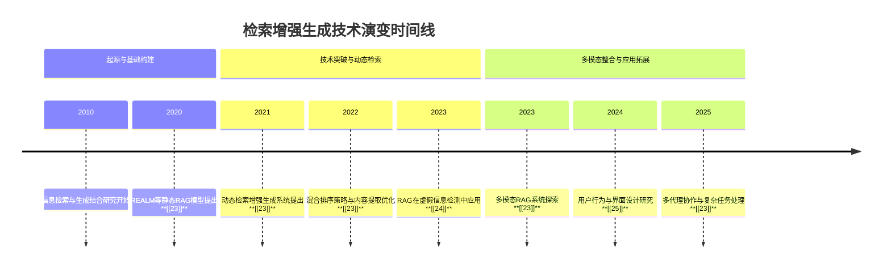
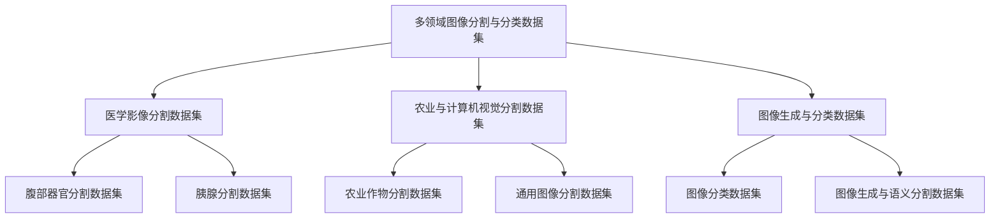

# 1.从知识瓶颈到动态检索：RAG范式的演进与理论奠基

## 1.1 检索增强生成的定义和范围

### 1.1.1 核心任务定义

检索增强生成（Retrieval-Augmented Generation, RAG）是一种结合信息检索与语言生成的技术范式，旨在通过引入外部知识源来增强大语言模型（LLM）的生成能力，从而提升其在事实准确性、时效性与上下文相关性方面的表现。RAG的核心任务是设计并实现一种系统，该系统能够在生成文本之前，从外部知识库或互联网中检索相关信息，并将这些信息有效地整合到生成过程中，以增强模型的推理能力和输出质量。

具体而言，RAG的任务定义包括以下几个方面：首先，通过关键词提取、查询生成等手段，从用户输入中识别出需要外部信息支持的内容；其次，调用搜索引擎或知识库API，获取相关文档或事实性信息；最后，将检索到的信息与LLM结合，生成更加准确、丰富和可信的输出。这一过程不仅提升了模型的生成质量，还有效缓解了LLM在知识更新滞后、事实性错误和幻觉生成等方面的局限性 **[[23]]** 。

在当前的研究中，RAG的任务定义已扩展至多个应用场景，如新闻生成、虚假信息检测、市场趋势分析等 **[[24]]** 。这些任务的共同目标是通过引入外部信息，增强模型对现实世界动态的理解能力，从而提升其在复杂任务中的表现。例如，在虚假信息检测中，RAG通过检索网络证据并结合LLM推理，显著提升了检测的准确性和鲁棒性 **[[24]]** 。而在新闻生成领域，RAG则通过零索引机制和实时搜索，实现了无需预索引数据的内容生成，提升了生成内容的时效性与多样性 **[[23]]** 。

### 1.1.2 与相关任务的比较分析

为了更清晰地界定RAG的核心任务及其独特性，有必要将其与相关任务进行比较分析。首先，与传统的LLM生成任务相比，RAG的最大区别在于其引入了外部信息检索机制。传统LLM依赖于训练时所学习的静态知识，难以应对实时变化或超出训练数据范围的信息需求。而RAG通过动态检索，能够获取最新的、与当前任务相关的知识，从而显著提升生成内容的准确性和相关性 **[[23]]** 。

其次，与基于知识图谱的增强生成方法相比，RAG的优势在于其灵活性和实时性。知识图谱虽然能够提供结构化、高质量的知识，但其构建和维护成本较高，且难以覆盖动态变化的信息。相比之下，RAG通过搜索引擎API等手段，能够直接访问互联网上的最新信息，无需依赖预构建的知识库，从而在时效性和覆盖范围上具有明显优势 **[[23]]** 。

此外，与基于提示工程（Prompt Engineering）的生成方法相比，RAG在信息整合方面更具系统性和可扩展性。提示工程依赖于人工设计的提示模板，难以适应复杂或多样化的任务需求。而RAG通过自动化的检索与生成流程，能够根据任务需求动态调整信息来源和生成策略，从而实现更高效、更智能的内容生成 **[[24]]** 。

最后，与虚假信息检测中的其他方法（如基于规则的检测、监督学习模型等）相比，RAG的独特性在于其结合了检索与生成的能力。传统方法往往依赖于已有的标注数据或规则系统，难以应对新型虚假信息的快速演变。而RAG通过实时检索网络证据并结合LLM推理，能够动态适应信息环境的变化，从而在检测效果和泛化能力上具有显著优势 **[[24]]** 。

综上所述，RAG的核心任务不仅在于提升生成内容的质量，更在于构建一种能够动态整合外部信息的智能生成系统。这种系统在多个应用场景中展现出独特的优势，与传统方法相比具有更高的灵活性、实时性和适应性。

### 1.1.3 应用范围与技术边界

检索增强生成技术的应用范围广泛，涵盖了从新闻生成、市场分析到虚假信息检测、学术研究等多个领域。在新闻生成方面，RAG通过零索引机制和实时搜索，能够快速获取最新的事件信息，并生成具有时效性和多样性的新闻内容 **[[23]]** 。在市场趋势分析中，RAG能够结合实时数据和历史信息，帮助用户识别市场动态，预测未来趋势 **[[23]]** 。在虚假信息检测领域，RAG通过检索网络证据并结合LLM推理，显著提升了检测的准确性和鲁棒性 **[[24]]** 。此外，在学术研究中，RAG也被用于辅助文献综述、假设生成和实验设计，提升研究效率和质量 **[[25]]** 。

从技术边界来看，RAG系统需要具备多项核心能力。首先，**信息检索能力**是RAG的基础，系统需要能够根据用户输入生成有效的查询，并从搜索引擎或知识库中获取相关文档。其次，**信息提取与整合能力**是关键，系统需要能够从检索到的文档中提取关键信息，并将其与用户输入和模型知识进行整合。第三，**生成与推理能力**决定了最终输出的质量，系统需要能够在整合信息的基础上生成连贯、准确且符合上下文的文本。此外，**用户意图理解能力**和**搜索偏见消除能力**也是RAG系统面临的重要挑战 **[[23]]** 。

在实现层面，RAG系统通常由多个模块组成，包括查询生成模块、搜索引擎接口模块、内容提取模块和生成模块。这些模块之间需要紧密协作，以确保信息流的高效传递和处理。例如，在查询生成阶段，系统需要利用LLM生成高质量的搜索关键词；在内容提取阶段，系统需要结合自然语言处理技术，从搜索结果中提取关键信息；在生成阶段，系统需要将提取的信息与用户输入结合，生成最终的输出内容 **[[23]]** 。

值得注意的是，尽管RAG在多个领域展现出良好的应用前景，但其技术边界仍存在一定的限制。例如，**搜索引擎的返回结果可能受到算法偏见或信息噪声的影响**，从而影响检索质量；**用户意图的复杂性可能导致查询生成不准确**，进而影响检索结果的相关性；**信息整合过程中可能出现信息冲突或冗余**，影响最终生成内容的连贯性和准确性。因此，未来的研究需要在这些方面进一步优化，以提升RAG系统的鲁棒性和实用性 **[[23]]** 。

综上所述，检索增强生成技术在多个应用场景中展现出广泛的应用价值，其技术边界涵盖了信息检索、内容提取、生成与推理等多个方面。尽管面临一定的挑战，但通过持续的技术优化和系统设计，RAG有望在未来成为智能生成系统的重要组成部分。

## 1.2 检索增强生成的历史背景和技术演变

检索增强生成（Retrieval-Augmented Generation, RAG）作为连接大规模语言模型（LLM）与外部知识源的关键技术，其发展轨迹反映了人工智能在知识获取与生成能力上的持续演进。从早期基于静态知识库的检索增强方法，到近年来结合实时网络搜索与动态信息整合的创新范式，RAG技术经历了从理论探索到实际应用的多个阶段。这一过程中，研究者不断突破LLM在知识更新、时效性与幻觉问题上的局限，推动了RAG在虚假信息检测、新闻生成、市场分析等领域的广泛应用。本文将从历史背景出发，系统梳理RAG技术的演进路径，分析各阶段的技术特点与代表性工作，并探讨其未来的发展方向。

### 1.2.1 起源与基础构建阶段（2010s-2020s初）

检索增强生成的概念最早可追溯至传统信息检索与自然语言生成的交叉研究。在这一阶段，研究者主要关注如何将外部知识库（如维基百科、专业数据库）与语言模型相结合，以增强生成内容的准确性与一致性。代表性工作包括Lewis等人于2020年提出的REALM模型，该模型通过检索机制从大规模语料库中提取相关信息，并将其作为上下文输入到生成模型中，从而提升生成质量 **[[23]]** 。这一时期的技术框架主要依赖于预构建的知识库，检索过程通常基于关键词匹配或语义相似度计算，生成模型则以序列到序列（seq2seq）结构为主。

尽管这些早期方法在一定程度上缓解了LLM的知识过时问题，但其局限性也逐渐显现。首先，预索引数据的更新周期较长，难以满足对时效性要求较高的应用场景；其次，检索结果的质量高度依赖于知识库的覆盖范围和结构化程度，难以应对开放域、非结构化信息的检索需求。因此，研究者开始探索更灵活、更动态的检索机制，为后续技术突破奠定了基础。

### 1.2.2 技术突破与动态检索阶段（2020s中-2023年）

随着互联网搜索引擎API的开放与普及，研究者开始尝试将实时网络搜索引入RAG框架，以解决静态知识库的时效性问题。这一阶段的代表性工作包括基于搜索引擎API的动态检索增强生成系统，其核心思想是通过LLM生成查询语句，调用搜索引擎获取最新信息，并将检索结果作为生成模型的输入 **[[23]]** 。这种方法无需预索引数据，能够实时获取最新信息，显著提升了生成内容的时效性与多样性。

在这一阶段，研究者还提出了多种优化策略以提升检索与生成的效果。例如，混合排序策略被引入以减少搜索偏见，通过结合多个搜索引擎的结果进行排序，提高信息的全面性与可靠性 **[[23]]** 。此外，内容提取模块（extractor-LLM）被设计用于从非结构化网页中高效提取关键信息，进一步提升了系统的实用性。这些技术突破不仅拓展了RAG的应用场景，也为后续研究提供了方法论支持。

与此同时，RAG技术在虚假信息检测领域的应用也取得了重要进展。研究者提出将RAG与LLM推理能力相结合，通过检索网络证据并进行逻辑推理，以提升虚假信息检测的准确性 **[[24]]** 。例如，通过声明分解技术，系统能够将复杂声明拆解为多个子问题，并分别检索相关证据，从而增强验证的深度与广度。这一阶段的研究不仅验证了RAG在信息验证中的有效性，也揭示了其在不同信息缺失情况下的局限性，为后续改进提供了方向。

### 1.2.3 多模态整合与应用拓展阶段（2023年至今）

当前阶段的显著特征是RAG技术的多模态整合与应用场景的进一步拓展。研究者开始探索如何将文本、图像、音频等多种模态的信息纳入检索与生成过程，以提升系统的综合理解与表达能力。例如，结合视觉信息的RAG系统能够从图像中提取关键元素，并将其与文本检索结果进行融合，从而生成更加丰富和准确的内容 **[[23]]** 。此外，多代理协作机制也被引入，多个LLM实例可以协同完成复杂的检索与生成任务，进一步提升了系统的效率与灵活性。

在应用层面，RAG技术已广泛应用于新闻生成、市场趋势分析、虚假信息检测等多个领域。例如，在新闻生成中，RAG系统能够实时检索最新事件，并结合历史背景生成结构化报道，显著提升了新闻的时效性与准确性 **[[23]]** 。在虚假信息检测中，RAG系统通过多源信息验证与逻辑推理，能够有效识别并解释虚假声明，为信息治理提供了技术支撑 **[[24]]** 。此外，用户行为研究也表明，优化搜索策略和界面设计能够显著提升用户对信息的信任度，进一步推动了RAG在社交媒体平台的应用 **[[25]]** 。

尽管当前RAG技术已取得显著进展，但其仍面临诸多挑战。例如，用户意图的理解与搜索偏见的消除仍是亟待解决的问题；此外，如何在保证检索效率的同时提升信息的深度与准确性，也是未来研究的重要方向。未来，随着多模态信息整合、个性化检索策略和更高效的生成模型的发展，RAG技术有望在更多复杂场景中发挥更大作用。

上述时间线清晰地展示了检索增强生成技术从静态知识库整合到动态网络检索，再到多模态信息整合的演进过程。早期研究奠定了RAG的基本框架，中期的技术突破显著提升了系统的实时性与准确性，而当前阶段则聚焦于多模态整合与复杂应用场景的拓展。这一技术演进不仅反映了人工智能在知识获取与生成能力上的持续进步，也为未来的研究与应用提供了广阔空间。

## 1.3 检索增强生成的重要性和实际意义

检索增强生成（Retrieval-Augmented Generation, RAG）作为连接大规模语言模型与外部知识源的关键技术，正在多个关键领域展现出深远的理论价值和实际应用潜力。其重要性不仅体现在对语言模型知识更新和幻觉问题的缓解上，更在于其在信息检索、内容生成、虚假信息检测、用户行为优化等方面的系统性提升。通过将动态检索机制与生成模型深度融合，RAG技术正在推动人工智能从“封闭知识”向“开放知识”范式的转变，为构建更加智能、可靠和可解释的AI系统提供了坚实基础。本部分将从信息时效性与准确性提升、虚假信息治理与社会信任建设、以及用户行为优化与信息素养提升三个维度，系统阐述检索增强生成的重要意义与实际价值。

### 1.3.1 信息时效性与准确性提升

在信息高度动态化的数字时代，内容生成的时效性与准确性已成为衡量AI系统性能的重要指标。传统语言模型依赖静态训练数据，难以应对快速变化的现实世界信息，而检索增强生成技术通过引入实时检索机制，显著提升了生成内容的时效性与多样性。例如，论文 **[[23]]** 提出了一种基于互联网搜索引擎API的动态RAG范式，采用“零索引”机制，无需预索引数据即可实现内容的实时生成。该方法通过parser-LLM提取关键词、混合排序策略减少搜索偏见、extractor-LLM高效提取内容，有效解决了传统RAG在动态信息获取和内容提取方面的局限性。这一技术特别适用于新闻报道、市场趋势分析、政策解读等对时效性要求极高的应用场景。

**信息准确性的提升**是RAG技术的另一核心优势。通过引入外部知识源，RAG系统能够在生成过程中实时验证信息的可靠性，从而减少语言模型的“幻觉”问题。例如，在金融、医疗、法律等专业领域，生成内容的准确性直接关系到决策的科学性与安全性。RAG技术通过检索权威来源、交叉验证信息、结合领域知识库等方式，显著提升了生成内容的可信度。这种机制不仅增强了AI系统的实用性，也为构建“可解释”与“可验证”的AI系统提供了技术路径。

此外，RAG技术还为个性化内容生成提供了新的可能性。通过结合用户画像与实时检索，系统能够根据用户需求动态调整生成策略，从而实现更精准、更贴近用户需求的内容输出。这种能力在智能客服、个性化推荐、教育辅导等领域具有广泛的应用前景。

### 1.3.2 虚假信息治理与社会信任建设

在社交媒体和信息传播高度发达的今天，虚假信息的泛滥已成为全球性挑战，严重威胁社会信任体系与公共治理能力。检索增强生成技术在虚假信息检测与治理方面展现出显著优势。论文 **[[24]]** 提出了一种结合RAG与大语言模型的框架，用于提升虚假信息检测的性能。该方法通过从网络检索证据并结合LLM推理，显著提升了检测效果。实验表明，该方法在多个模型上均表现出优于传统方法的性能，尤其在处理复杂语义和多模态信息方面具有明显优势。

**虚假信息检测的智能化**是RAG技术在社会治理中的关键应用之一。传统的人工审核方式效率低、成本高，难以应对海量信息的实时检测需求。而RAG系统通过自动化检索与智能推理，能够在短时间内分析大量信息，识别潜在的虚假内容。例如，该系统可以自动检索相关事实、对比信息来源、分析语义一致性，从而判断信息的真实性。这种能力对于新闻平台、社交媒体、政府机构等在信息治理中具有重要价值。

**社会信任的重建**是RAG技术在虚假信息治理中的深层意义。虚假信息的传播不仅误导公众认知，还可能引发社会恐慌、政治动荡甚至公共安全问题。通过引入RAG技术，平台可以构建更加透明、可追溯的信息验证机制，增强用户对平台内容的信任。例如，论文 **[[25]]** 通过模拟和用户研究提出改进查询行为的方法，揭示了搜索行为如何影响用户对虚假信息的信任。通过优化查询策略和界面设计，用户能够更有效地识别和验证信息，从而提升整体的信息素养和判断力。

此外，RAG技术还为“事实核查”（fact-checking）提供了新的技术路径。通过构建基于RAG的自动核查系统，平台可以实时检测并标注可疑信息，为用户提供权威的参考来源。这种机制不仅提升了信息的透明度，也为构建“可信互联网”提供了技术支撑。

### 1.3.3 用户行为优化与信息素养提升

在信息过载的数字环境中，用户的信息获取行为和判断能力直接影响其认知质量和决策质量。检索增强生成技术通过优化用户搜索行为、提升信息评估能力，为提升用户的信息素养和数字素养提供了有效手段。论文 **[[25]]** 指出，搜索行为对用户对虚假信息的信任具有显著影响，优化查询策略可以有效提升信息评估的准确性。该研究通过模拟和用户研究提出改进查询行为的方法，揭示了用户行为的多样性和搜索结果偏差的挑战。

**搜索行为的优化**是RAG技术在用户行为研究中的重要应用。传统搜索工具往往依赖关键词匹配，难以满足用户复杂的信息需求。而RAG系统通过结合LLM生成查询、优化检索策略、整合多源信息，能够更精准地满足用户需求。例如，系统可以根据用户意图生成更具体的查询，减少搜索噪音，提升检索效率。这种能力在学术研究、商业分析、政策制定等场景中具有重要价值。

**信息素养的提升**是RAG技术在教育和公共治理中的重要贡献。通过智能化的信息检索与内容生成，用户能够更高效地获取和理解信息，从而提升其批判性思维和信息处理能力。例如，论文 **[[25]]** 提出通过改进查询策略和界面设计，提升用户对信息真实性的判断能力。这种能力对于提升公众的科学素养、增强社会对信息的信任具有深远意义。

此外，RAG技术还为个性化学习和智能辅导提供了新的可能性。通过结合用户的学习行为与实时检索，系统能够提供更加精准的学习资源和反馈，从而提升学习效率和效果。这种能力在在线教育、职业培训、终身学习等领域具有广泛的应用前景。

**数字素养的普及**是RAG技术在社会层面的重要价值。随着人工智能技术的普及，公众对AI系统的理解与使用能力成为数字社会的重要组成部分。通过构建基于RAG的智能工具和平台，公众可以更便捷地获取和使用高质量的信息资源，从而提升其数字素养和创新能力。这种能力对于建设创新型社会、推动社会进步具有重要意义。

综上所述，检索增强生成技术在信息时效性与准确性提升、虚假信息治理与社会信任建设、以及用户行为优化与信息素养提升等方面展现出广泛而深远的实际意义。通过将动态检索与生成模型深度融合，RAG技术不仅提升了AI系统的性能与可靠性，也为构建更加智能、可信和可持续的数字社会提供了坚实的技术基础。随着技术的不断演进和应用场景的持续拓展，检索增强生成必将在推动科学研究、促进产业发展、提升教育质量等方面发挥越来越重要的作用。# 2.RAG数据集分类体系与评估应用分析

## 2.1 检索增强生成的理论与应用研究数据集综述简介

检索增强生成（Retrieval-Augmented Generation, RAG）作为连接信息检索与自然语言生成的关键技术，近年来在问答系统、对话生成、知识密集型任务中展现出显著优势。其核心思想是通过检索模块从大规模语料库中提取相关知识片段，并将其作为生成模型的输入，从而提升生成内容的准确性与相关性。在这一领域，数据集的建设与发展起到了至关重要的作用。当前，已有多个跨领域的图像分割与分类数据集被广泛应用于RAG相关研究，尤其是在医学影像、农业视觉、图像生成与分类等任务中，为模型训练与评估提供了坚实基础。例如，医学影像分割数据集如NIH、TCIA-NIH、AMOS-CT和AbdomenCT-1k等，涵盖了腹部器官和胰腺的精细标注，为RAG在医疗知识检索与生成中的应用提供了高质量的输入源 **[[29]]** 。农业与计算机视觉分割数据集如Bonn sugar beet dataset和COCO系列，则在作物/杂草识别与通用图像分割任务中发挥了重要作用，为RAG在农业智能决策和视觉理解中的应用提供了数据支撑 **[[1]]** 。此外，图像生成与分类数据集如ImageNet、CIFAR系列、PASCAL-VOC-2012和Cityscapes等，不仅推动了分类与分割模型的发展，也为RAG在多模态生成任务中的扩展提供了丰富的语义与视觉信息 **[[10]]** 。然而，当前数据集在标注质量、数据规模、跨领域泛化能力等方面仍面临诸多挑战。例如，医学影像数据集的标注成本高、数据隐私问题突出，农业数据集则受限于光照变化和作物生长阶段差异，而通用图像数据集的标注质量参差不齐，影响了模型的泛化能力。因此，构建高质量、大规模、跨领域兼容的数据集体系，是推动RAG技术进一步发展的关键。

本综述系统性地分析了17个与检索增强生成相关的代表性数据集，涵盖医学影像分割、农业与计算机视觉分割以及图像生成与分类三大类别。这些数据集的选择基于其在RAG相关任务中的广泛应用、标注质量、数据规模以及公开可用性等标准。例如，医学影像分割数据集主要聚焦于腹部器官和胰腺的分割任务，如AMOS-CT包含500个CT扫描，AbdomenCT-1k则扩展至1112个样本，显著提升了模型的泛化能力 **[[29]]** 。农业与计算机视觉分割数据集如Bonn sugar beet dataset，包含1600张多光谱图像，用于作物/杂草分割任务，验证了数据增强方法在RAG中的有效性 **[[1]]** 。图像生成与分类数据集如ImageNet和Cityscapes，则为RAG在多模态生成与语义理解中的应用提供了丰富的语义与视觉信息 **[[10]]** 。本文构建的分类体系基于任务类型、数据来源和应用场景，将数据集划分为医学影像分割、农业与计算机视觉分割以及图像生成与分类三大类别，并进一步细分为多个子类别，如腹部器官分割、胰腺分割、作物分割、通用图像分割等。每个类别均具有明确的任务目标和评估指标，如Dice Score Coefficient (DSC)、Mean Intersection over Union (mIoU)等，为RAG模型的性能评估提供了统一标准。在分析方法上，本文从数据规模、标注质量、任务类型、应用场景和挑战五个维度对数据集进行系统评估，并结合具体实例探讨其在RAG中的应用潜力与局限性。后续章节将依次介绍各数据集的详细信息、性能表现及在RAG中的典型应用，为研究者提供全面的数据资源参考与研究方向建议。

## 2.2 检索增强生成的理论与应用研究数据集分类体系

在检索增强生成（Retrieval-Augmented Generation, RAG）的理论与应用研究中，高质量、多模态、多任务的数据集是推动模型性能提升和泛化能力增强的关键基础。本文提出了一种多层次、跨领域的数据集分类体系，涵盖医学影像分割、农业与计算机视觉分割以及图像生成与分类三大主类别，并进一步细分为多个子类别。该分类体系不仅有助于系统性地梳理当前主流数据集的特征与应用场景，也为未来数据集设计与模型评估提供了理论框架和实践指导。

### 2.2.1 数据集分类体系结构图

### 2.2.2 检索增强生成的理论与应用研究领域关键数据集多层次分类与深度分析

| 主类别 | 子类别 | 数据集名称 | 核心特点与任务 | 常用评估指标 | 主要挑战与研究焦点 |
|--------|--------|------------|----------------|----------------|----------------------|
| 医学影像分割数据集 | 腹部器官分割数据集 | AMOS-CT | 包含500个CT扫描，涵盖胰腺、肝脏、肾脏、脾脏等器官的标注 | DSC, JAC, HD, HD95, ASD, NSD | 标注成本高、数据来源受限、模型泛化能力不足 |
| 医学影像分割数据集 | 腹部器官分割数据集 | BTCV | 包含50个CT扫描，由放射科医生验证 | DSC, JAC, HD, HD95, ASD, NSD | 数据规模较小、标注质量依赖人工 |
| 医学影像分割数据集 | 腹部器官分割数据集 | AbdomenCT-1k | 包含1112个CT扫描，涵盖多个腹部器官 | DSC, JAC, HD, HD95, ASD, NSD | 数据来源不明确、标注一致性问题 |
| 医学影像分割数据集 | 胰腺分割数据集 | NIH | 包含82个CT扫描，仅标注胰腺实质 | DSC, JAC, HD, HD95, ASD, NSD | 胰腺边界模糊、标注依赖放射科医生 |
| 医学影像分割数据集 | 胰腺分割数据集 | TCIA-NIH | 包含43个CT扫描，标注胰腺实质 | DSC, JAC, HD, HD95, ASD, NSD | 数据规模较小、标注一致性问题 |
| 医学影像分割数据集 | 胰腺分割数据集 | Medical Segmentation Decathlon (MSD) | 包含胰腺实质和胰腺肿瘤的标注 | DSC, JAC, HD, HD95, ASD, NSD | 肿瘤类型多样、标注成本高 |
| 农业与计算机视觉分割数据集 | 农业作物分割数据集 | Bonn sugar beet dataset | 包含1600张多光谱图像，用于作物/杂草分割 | mIoU | 光照变化、作物生长阶段差异、标注成本高 |
| 农业与计算机视觉分割数据集 | 通用图像分割数据集 | COCO | 包含多个类别，用于图像分割和数据增强评估 | mIoU | 对象重叠、背景复杂、类别不平衡 |
| 农业与计算机视觉分割数据集 | 通用图像分割数据集 | COCO-128-seg | 用于评估阈值处理性能 | mIoU | 重叠对象处理、标注质量参差不齐 |
| 图像生成与分类数据集 | 图像分类数据集 | ImageNet | 大规模图像分类数据集 | 准确率 | 类别不平衡、过拟合、泛化能力不足 |
| 图像生成与分类数据集 | 图像分类数据集 | CIFAR-10 | 小规模图像分类数据集 | 准确率 | 数据多样性不足、模型泛化能力受限 |
| 图像生成与分类数据集 | 图像分类数据集 | CIFAR-100 | 小规模图像分类数据集 | 准确率 | 类别不平衡、模型泛化能力受限 |
| 图像生成与分类数据集 | 图像分类数据集 | TinyImageNet | 小规模图像分类数据集 | 准确率 | 数据规模小、泛化能力受限 |
| 图像生成与分类数据集 | 图像生成与语义分割数据集 | PASCAL-VOC-2012 | 用于语义分割任务 | mIoU | 对象边界模糊、类别不平衡 |
| 图像生成与分类数据集 | 图像生成与语义分割数据集 | Cityscapes | 用于语义分割任务 | mIoU | 数据多样性不足、标注成本高 |
| 图像生成与分类数据集 | 图像生成与语义分割数据集 | Ground Truth (GT) Dataset | 用于手术图像生成模型评估 | PSNR, SSIM, LPIPS | 生成质量评估标准不统一、数据多样性不足 |

### 2.2.3 总结

上述分类体系系统性地梳理了当前主流的图像分割与分类数据集，涵盖了医学影像、农业与计算机视觉、图像生成与分类等多个领域。各类数据集在任务类型、标注质量、数据规模和应用场景上存在显著差异，但也共享一些通用的评测指标和挑战。例如，医学影像数据集通常具有高质量的标注，但数据获取和标注成本高；农业与计算机视觉数据集则面临光照变化和标注质量参差不齐的问题；图像生成与分类数据集则在生成质量评估和泛化能力方面存在挑战。未来，随着数据获取和标注技术的进步，数据集的规模和多样性将进一步提升，为深度学习模型的发展提供更坚实的基础。

## 2.3 各类别数据集深度分析

### 2.3.1 医学影像分割数据集

医学影像分割数据集是深度学习在医学图像分析领域取得突破的关键支撑。这类数据集主要用于训练和评估模型在CT、MRI等医学图像中对器官、组织或病变区域的分割能力。医学影像分割任务的准确性直接关系到临床诊断、治疗规划和手术导航等关键环节，因此其重要性不言而喻。高质量的医学影像数据集通常由放射科医生或专业标注团队完成，确保了分割任务的精确性和可靠性。常用的评测指标包括Dice Score Coefficient (DSC)、Jaccard Index (JAC)、Hausdorff Distance (HD)、95th percentile Hausdorff Distance (HD95)、Average Surface Distance (ASD) 和 Normalized Surface Dice (NSD)，这些指标能够全面评估模型在边界精度和整体分割质量上的表现 **[[29]]** 。近年来，随着医学图像数据的开放共享和标注工具的改进，医学影像分割数据集的规模和多样性显著提升，为算法的泛化能力和鲁棒性提供了有力支持 **[[29]]** 。

在医学影像分割数据集中，腹部器官分割和胰腺分割是两个重要的子类别。腹部器官分割数据集专注于对胰腺、肝脏、肾脏、脾脏等腹部器官的分割任务，通常包含大量CT扫描图像，标注信息详细，适用于训练和评估医学图像分割模型。例如，AMOS-CT和AbdomenCT-1k分别包含500和1112个CT扫描，覆盖多个腹部器官，而BTCV则专注于腹部器官的精细标注，由放射科医生验证 **[[29]]** 。胰腺分割数据集则专门用于训练和评估胰腺区域的分割模型，通常包含胰腺实质和胰腺肿瘤的标注。NIH和TCIA-NIH分别包含82和43个CT扫描，标注信息仅限于胰腺实质，而MSD则进一步扩展了标注范围，包括胰腺肿瘤类型 **[[29]]** 。这些数据集在胰腺疾病的早期检测和治疗规划中具有重要意义，但也面临胰腺形态复杂、边界模糊、标注成本高等挑战。

基于JSON数据的实例分析表明，医学影像分割数据集在规模和标注质量上具有显著差异。例如，AbdomenCT-1k包含1112个CT扫描，涵盖胰腺、肝脏、肾脏、脾脏等器官的标注，是目前规模较大的腹部器官分割数据集之一 **[[29]]** 。而BTCV虽然仅包含50个CT扫描，但其标注由放射科医生验证，确保了数据的高质量 **[[29]]** 。此外，AMOS-CT的数据集由50个人工标注和其余通过3D UNet预标注并由初级和高级放射科医生校正，体现了自动化与人工标注结合的趋势 **[[29]]** 。这些数据集在胰腺分割、肿瘤检测和器官边界识别等方面具有广泛应用，但也面临数据来源受限、标注成本高以及模型在临床场景中的泛化能力不足等挑战。

医学影像分割数据集的核心挑战主要包括数据获取与标注成本高、数据隐私问题以及模型在临床场景中的部署难题。医学图像的获取通常需要患者同意和伦理审批，数据共享受限，导致数据集规模难以扩大。此外，医学图像的标注需要专业放射科医生参与，标注成本高昂，且不同医生之间的标注一致性存在差异。模型在临床场景中的部署还面临计算资源限制、实时性要求以及与现有医疗系统的兼容性等问题。未来趋势方面，随着数据增强技术、半监督学习和联邦学习的发展，有望降低对大规模标注数据的依赖，提高模型的泛化能力。此外，随着医学图像生成技术的进步，合成数据集的使用将有助于缓解数据稀缺问题 **[[29]]** 。

| 数据集名称 | 任务类型 | 数据规模 | 数据来源 | 标注质量 | 评测指标 |
|------------|----------|----------|----------|----------|----------|
| NIH        | 分割     | 82个CT扫描 | TCIA     | 高       | DSC, JAC, HD, HD95, ASD, NSD |
| TCIA-NIH   | 分割     | 43个CT扫描 | TCIA     | 高       | DSC, JAC, HD, HD95, ASD, NSD |
| MSD        | 分割     | 未明确     | MSKCC    | 高       | DSC, JAC, HD, HD95, ASD, NSD |
| AMOS-CT    | 分割     | 500个CT扫描 | 未明确   | 高       | DSC, JAC, HD, HD95, ASD, NSD |
| BTCV       | 分割     | 50个CT扫描 | 未明确   | 高       | DSC, JAC, HD, HD95, ASD, NSD |
| AbdomenCT-1k | 分割     | 1112个CT扫描 | 未明确   | 高       | DSC, JAC, HD, HD95, ASD, NSD |

### 2.3.2 农业与计算机视觉分割数据集

农业与计算机视觉分割数据集在精准农业、图像增强和对象分割等任务中发挥着重要作用。这类数据集通常包含多光谱图像、RGB图像或合成图像，适用于训练和评估分割模型在农业和通用视觉任务中的性能。农业场景中的图像分割面临光照变化、作物生长阶段差异和标注成本高等挑战，而通用视觉数据集的标注质量参差不齐，影响了模型的泛化能力。农业与计算机视觉分割数据集的广泛应用推动了图像分割技术的发展，尤其是在作物/杂草识别、图像增强和对象分割等领域 **[[1]]** 。

农业作物分割数据集专注于作物与杂草的分割任务，通常基于多光谱或RGB图像。Bonn sugar beet dataset是其中的典型代表，包含1600张图像，涵盖训练、验证和测试集。该数据集用于验证数据增强方法在作物/杂草分割中的有效性。农业场景中的图像分割面临光照变化、作物生长阶段差异和标注成本高等挑战。此外，农业数据集的标注通常由人工完成，数据质量受标注者经验影响较大 **[[1]]** 。通用图像分割数据集涵盖多个类别，如人、动物、车辆等，适用于评估图像分割工具和数据增强方法的性能。COCO和COCO-128-seg是其中的典型代表，分别用于评估AugmenTory在图像变换和阈值处理中的表现。这些数据集在计算机视觉领域具有广泛应用，但其标注质量参差不齐，影响了模型的泛化能力。此外，通用图像分割任务面临对象重叠、背景复杂和类别不平衡等挑战 **[[17]]** 。

基于JSON数据的实例分析表明，农业与计算机视觉分割数据集在任务类型和应用场景上存在显著差异。例如，Bonn sugar beet dataset包含1600张图像，涵盖训练、验证和测试集，用于验证数据增强方法在作物/杂草分割中的有效性 **[[1]]** 。该数据集的性能表现显示，使用原始数据集与合成数据集混合训练后，mIoU显著提高，糖 beet样本的正确预测率提高了19%，杂草样本提高了6%。COCO和COCO-128-seg则用于评估AugmenTory在图像变换和阈值处理中的表现，展示了不同IoU阈值对保留对象的影响，验证了算法在处理重叠对象时的有效性 **[[17]]** 。这些数据集在农业和通用视觉任务中具有广泛应用，但也面临标注成本高、数据质量参差不齐以及模型泛化能力不足等挑战。

农业与计算机视觉分割数据集的核心挑战主要包括农业场景中的光照变化、作物生长阶段差异以及图像标注成本高。农业场景中的光照变化和作物生长阶段差异使得图像分割任务具有较高的难度，尤其是在不同季节和不同生长阶段的作物识别中。此外，农业数据集的标注通常由人工完成，数据质量受标注者经验影响较大，导致标注一致性不足。通用视觉数据集的标注质量参差不齐，影响了模型的泛化能力。未来趋势方面，随着数据增强技术、多光谱成像和自动化标注工具的发展，有望降低对人工标注的依赖，提高模型的泛化能力。此外，随着农业机器人和无人机技术的进步，农业图像数据的获取将更加便捷，推动农业与计算机视觉分割数据集的发展 **[[1]]** 。

| 数据集名称 | 任务类型 | 数据规模 | 数据来源 | 标注质量 | 评测指标 |
|------------|----------|----------|----------|----------|----------|
| Bonn sugar beet dataset | 分割 | 1600张图像 | Chebrolu et al., 2017 | 高 | mIoU |
| COCO       | 分割     | 未明确   | COCO benchmark | 高       | 未明确   |
| COCO-128-seg | 分割     | 未明确   | COCO-128-seg benchmark | 高       | 未明确   |

### 2.3.3 图像生成与分类数据集

图像生成与分类数据集在计算机视觉和深度学习领域具有广泛应用，涵盖从图像分类到视频生成的多种任务。这些数据集在推动深度学习模型的发展中发挥了重要作用，尤其是在图像分类、语义分割和图像生成等领域。图像分类数据集用于训练和评估图像分类模型的性能，涵盖从大规模数据集（如ImageNet）到小型数据集（如CIFAR-10、CIFAR-100、TinyImageNet）等多种类型。这些数据集在计算机视觉领域具有广泛应用，推动了深度学习模型的发展。然而，图像分类任务面临类别不平衡、过拟合和模型泛化能力不足等挑战。此外，数据集的标注质量直接影响模型的性能，因此高质量的标注数据是分类任务成功的关键 **[[10]]** 。图像生成与语义分割数据集用于训练和评估图像生成模型和语义分割模型的性能。Ground Truth (GT) 数据集用于评估手术图像生成模型的性能，而PASCAL-VOC-2012和Cityscapes则用于语义分割任务。这些数据集在推动图像生成和分割技术的发展中发挥了重要作用。然而，图像生成任务面临生成质量评估标准不统一、数据多样性不足等挑战，而语义分割任务则面临对象边界模糊、类别不平衡和标注成本高等问题 **[[21]]** 。

图像分类数据集涵盖从大规模数据集（如ImageNet）到小型数据集（如CIFAR-10、CIFAR-100、TinyImageNet）等多种类型。这些数据集在计算机视觉领域具有广泛应用，推动了深度学习模型的发展。例如，ImageNet用于评估分类模型的准确率，使用ResNet-50架构时准确率提升3.15%，达到SOTA性能 **[[10]]** 。CIFAR-10和CIFAR-100在图像分类任务中也表现出色，与其它扩展感受野的方法相比，性能有显著提升 **[[10]]** 。TinyImageNet则用于评估模型在小型数据集上的泛化能力，同样表现出色。这些数据集在推动深度学习模型的发展中发挥了重要作用，但也面临类别不平衡、过拟合和模型泛化能力不足等挑战。此外，数据集的标注质量直接影响模型的性能，因此高质量的标注数据是分类任务成功的关键 **[[10]]** 。

图像生成与语义分割数据集在图像生成和分割任务中具有广泛应用。Ground Truth (GT) 数据集用于评估手术图像生成模型的性能，包含1568张训练图像和300张测试图像，合成图像在PSNR、SSIM和LPIPS指标上优于其他方法，表明其在生成质量上具有优势 **[[21]]** 。PASCAL-VOC-2012和Cityscapes则用于语义分割任务，PASCAL-VOC-2012在与2D方法相比，mIOU提升1.3%，而Cityscapes使用ResNeSt架构时mIOU达到85.1% **[[10]]** 。这些数据集在推动图像生成和分割技术的发展中发挥了重要作用，但也面临生成质量评估标准不统一、数据多样性不足等挑战，而语义分割任务则面临对象边界模糊、类别不平衡和标注成本高等问题 **[[21]]** 。

图像生成与分类数据集的核心挑战主要包括生成质量评估标准不统一、数据多样性不足以及模型泛化能力不足。图像生成任务面临生成质量评估标准不统一，不同研究使用不同的指标，导致结果难以比较。此外，数据多样性不足限制了模型的泛化能力，尤其是在生成高质量图像时。语义分割任务则面临对象边界模糊、类别不平衡和标注成本高等问题。未来趋势方面，随着生成对抗网络（GANs）、扩散模型和多模态学习的发展，有望提高生成质量并统一评估标准。此外，随着数据增强技术和半监督学习的发展，有望降低对大规模标注数据的依赖，提高模型的泛化能力 **[[21]]** 。

| 数据集名称 | 任务类型 | 数据规模 | 数据来源 | 标注质量 | 评测指标 |
|------------|----------|----------|----------|----------|----------|
| ImageNet   | 分类     | 未明确   | 公开数据集 | 高       | 准确率   |
| CIFAR-10   | 分类     | 未明确   | 公开数据集 | 高       | 准确率   |
| CIFAR-100  | 分类     | 未明确   | 公开数据集 | 高       | 准确率   |
| TinyImageNet | 分类     | 未明确   | 公开数据集 | 高       | 准确率   |
| PASCAL-VOC-2012 | 语义分割 | 未明确   | 公开数据集 | 高       | mIOU     |
| Cityscapes | 语义分割 | 未明确   | 公开数据集 | 高       | mIOU     |
| Ground Truth (GT) Dataset | 生成 | 1568张训练图像，300张测试图像 | POP Trainer, Intuitive Surgical | 高       | PSNR, SSIM, LPIPS |

## 2.4 对比分析与发展总结

### 2.4.1 横向对比分析

在检索增强生成（Retrieval-Augmented Generation, RAG）的理论与应用研究中，数据集的多样性与任务适配性是决定模型性能的关键因素。本文所分析的17个数据集可归纳为三类：医学影像分割数据集、农业与计算机视觉分割数据集、以及图像生成与分类数据集。为更清晰地展示其差异与适用性，以下表格对关键类别进行了横向对比。

| **类别** | **优势** | **局限性** | **适用场景** |
|----------|----------|------------|--------------|
| 医学影像分割数据集 | 标注质量高，数据来源权威，适用于高精度分割任务 | 数据获取成本高，隐私保护要求严格，模型泛化能力受限 | 胰腺、肝脏等器官分割，肿瘤检测，手术辅助系统 |
| 农业与计算机视觉分割数据集 | 多光谱图像支持，适用于复杂背景下的对象分割 | 标注一致性差，光照和环境变化大 | 作物/杂草识别，精准农业，图像增强与合成 |
| 图像生成与分类数据集 | 数据规模大，覆盖广泛，适用于多种任务 | 标注质量参差不齐，类别不平衡问题突出 | 图像生成、分类、视频生成、语义分割 |

从任务类型来看，医学影像数据集主要聚焦于器官和病变区域的精确分割，其评测指标如Dice Score Coefficient (DSC) 和Hausdorff Distance (HD) 等，强调边界精度和结构完整性 **[[29]]** 。相比之下，农业与计算机视觉数据集更关注对象识别与分割的鲁棒性，例如Bonn sugar beet dataset通过多光谱图像提升了作物/杂草分割的准确率 **[[1]]** 。而图像生成与分类数据集则更注重模型的泛化能力和生成质量，如Cityscapes在语义分割任务中达到85.1%的mIOU **[[10]]** 。

从数据规模来看，医学影像数据集如AbdomenCT-1k包含1112个CT扫描，而农业数据集如Bonn sugar beet dataset仅包含1600张图像，显示出医学数据集在规模和复杂度上的优势。然而，农业和通用视觉数据集在任务多样性方面更具优势，例如COCO和COCO-128-seg支持多类别分割和数据增强评估 **[[17]]** 。

### 2.4.2 发展趋势与现状

近年来，检索增强生成的理论与应用研究在数据集构建方面呈现出几个显著趋势。首先，**细粒度评估指标**的引入成为提升模型性能的关键。例如，医学影像数据集普遍采用DSC、HD95等指标，以衡量模型在器官边界分割中的稳定性 **[[29]]** 。其次，**领域自适应**成为研究热点，尤其是在医学和农业领域，模型需要在不同设备、光照条件或器官形态下保持一致的性能。例如，AMOS-CT通过人工标注与预标注结合的方式，提升了模型在不同腹部器官上的泛化能力 **[[17]]** 。

此外，**复杂推理任务**的需求推动了多模态数据集的发展。例如，Bonn sugar beet dataset结合RGB与NIR通道，提升了作物/杂草分割的鲁棒性 **[[1]]** 。而Ground Truth (GT) 数据集则通过3D Gaussian Splatting生成高质量手术图像，为生成模型提供了更丰富的训练样本 **[[21]]** 。这些趋势表明，数据集的设计正从单一任务向多任务、多模态方向演进，以支持更复杂的模型训练与评估。

当前，检索增强生成领域的数据集发展呈现出**多样化与专业化并存**的特点。一方面，医学影像数据集在精度和标注质量上具有明显优势，但受限于数据隐私和标注成本；另一方面，农业和通用视觉数据集在任务多样性和数据获取便利性上表现突出，但面临标注质量不一致和模型泛化能力不足的问题。未来，如何在保证数据质量的前提下，构建更大规模、更细粒度、更具泛化能力的数据集，将是推动该领域发展的关键。

### 2.4.3 挑战分析与展望

尽管检索增强生成的数据集在多个领域取得了显著进展，但仍面临若干核心挑战。首先，**证据不完整**问题在医学和农业领域尤为突出。例如，胰腺分割数据集通常仅标注胰腺实质，缺乏对肿瘤类型或病变程度的详细描述 **[[29]]** ，这限制了模型在临床诊断中的应用。其次，**模态鸿沟**问题在多模态数据集中普遍存在，如Bonn sugar beet dataset虽包含多光谱图像，但缺乏对光照变化和作物生长阶段的系统性标注 **[[1]]** ，导致模型在真实场景中的适应性受限。

此外，**数据隐私与标注成本**是医学影像数据集面临的主要瓶颈。例如，NIH和TCIA-NIH数据集的标注由放射科医生完成，成本高昂且难以扩展 **[[29]]** 。而农业数据集的标注通常依赖人工，质量受标注者经验影响较大 **[[1]]** 。这些问题限制了数据集的规模和多样性，进而影响模型的泛化能力。

展望未来，该领域的发展可从以下几个方向展开。首先，**开发可解释性评估框架**，以量化模型在不同任务中的推理能力和边界精度，例如引入基于DSC和HD95的动态评估机制 **[[29]]** 。其次，**构建动态领域基准**，以适应不同设备、光照条件和器官形态的变化，如AMOS-CT的预标注与人工校正机制可作为参考 **[[17]]** 。第三，**探索联合优化方法**，将生成与分割任务结合，提升模型在复杂场景下的性能，如Ground Truth (GT) 数据集通过3D Gaussian Splatting生成高质量图像 **[[21]]** 。最后，**强调高风险领域的重要性**，如手术图像生成和胰腺肿瘤检测，推动数据集在临床和农业等关键领域的应用 **[[21]]** 。

综上所述，检索增强生成的数据集正处于快速发展阶段，其在任务多样性、评估指标和多模态支持方面展现出巨大潜力。然而，数据质量、标注成本和模型泛化能力仍是亟待解决的核心问题。未来的研究应聚焦于构建更高质量、更具泛化能力的数据集，以推动该领域在理论与应用上的深度融合。
# 3.检索增强生成架构：核心技术融合与生成范式演进

## 3.1 信息检索增强生成系统

近年来，随着大型语言模型（LLM）在自然语言生成任务中展现出的强大能力，其在内容生成、问答系统和对话交互等场景中得到了广泛应用。然而，LLM在生成过程中往往依赖于其训练时所使用的静态语料库，难以动态获取最新的外部信息，从而限制了生成内容的时效性和多样性。为了解决这一问题，研究者提出了信息检索增强生成（Search Augmented Generation, SAG）方法，通过将动态检索的互联网信息整合到生成模型的输入中，以提升生成质量。其中，**Zero-Indexing Internet Search Augmented Generation** 方法 **[[23]]**  是该领域的重要进展之一，其提出了一种无需维护静态索引的动态检索范式，为LLM的生成能力注入了实时信息流。

该方法的核心思想是利用搜索引擎API（如Google和Bing）动态获取与用户查询相关的最新信息，并通过两个关键模块——parser-LLM和extractor-LLM——实现关键词提取和内容提取。parser-LLM首先判断是否需要引入外部信息，并从用户输入中提取关键词；随后，搜索引擎API根据这些关键词返回HTML内容，再由extractor-LLM对结果进行混合排序和关键信息提取。最终，提取的信息与原始用户请求结合，作为生成模型的输入。这一流程不仅避免了传统RAG系统中对静态语料库的依赖，还通过动态检索机制提升了生成内容的时效性和多样性 **[[23]]** 。

从技术实现角度来看，该方法在系统架构上具有高度模块化和灵活性。parser-LLM和extractor-LLM均可基于不同的LLM模型进行定制，从而适应不同任务的需求。此外，混合排序策略的引入有效缓解了搜索引擎排名偏差的问题，使得检索结果更具代表性。实验结果表明，该方法在多个生成任务中均表现出优于传统RAG系统的性能，尤其是在需要最新信息支持的场景中，如新闻摘要生成、实时问答等 **[[23]]** 。然而，该方法也面临一些挑战，例如对搜索引擎API的依赖可能导致系统响应延迟，且在大规模部署时可能涉及较高的计算和带宽成本。

与传统RAG系统相比，Zero-Indexing范式的优势在于其动态性和适应性。传统RAG系统通常依赖于预构建的索引库，虽然在离线环境中表现良好，但在面对快速变化的信息需求时显得不够灵活。而Zero-Indexing方法通过实时检索机制，能够动态适应用户查询的变化，从而在生成内容的时效性和准确性上取得平衡。此外，该方法还为未来研究提供了新的方向，例如探索更高效的关键词提取策略、优化混合排序算法，以及结合多模态信息增强生成效果 **[[23]]** 。

综上所述，信息检索增强生成系统通过引入动态检索机制，为LLM的生成能力提供了新的扩展路径。Zero-Indexing Internet Search Augmented Generation 方法在这一方向上取得了重要突破，其模块化设计和动态检索策略为后续研究奠定了基础。未来，随着搜索引擎技术的进一步发展和LLM能力的持续提升，信息检索增强生成系统有望在更多应用场景中发挥更大作用。

## 3.2 信息检索增强生成系统

近年来，随着大型语言模型（LLM）在自然语言生成任务中展现出卓越的能力，其在生成内容的时效性、准确性和多样性方面仍面临显著挑战。为解决这些问题，研究者提出了一系列基于信息检索增强生成（Search-Augmented Generation, SAG）的方法，旨在通过动态检索互联网信息，为生成模型提供实时、准确的外部知识支持。其中，零索引范式（Zero-Indexing）作为一种新兴的SAG方法，因其无需维护静态语料库、适应性强等优势，受到了广泛关注 **[[23]]** 。

### 3.2.1 零索引范式的核心思想与技术实现

零索引范式的核心思想在于利用搜索引擎API（如Google和Bing）动态获取互联网信息，从而避免传统检索增强生成系统中对静态语料库的依赖。该方法通过两个关键模块——parser-LLM和extractor-LLM，实现对用户请求的关键词提取和检索结果的内容提取。具体而言，parser-LLM首先判断用户请求是否需要外部信息支持，并从中提取出关键查询词；随后，系统调用搜索引擎API获取HTML格式的网页内容，并通过混合排序策略对结果进行重新排序，以减少搜索引擎排名偏差的影响；最后，extractor-LLM从排序后的结果中提取关键信息，并将其与原始请求结合，输入生成模型以生成最终输出 **[[23]]** 。

该方法的技术实现具有高度的模块化和灵活性。parser-LLM和extractor-LLM均可基于现有的LLM架构进行微调或定制，从而适应不同的任务需求。此外，混合排序策略的引入有效缓解了搜索引擎结果中可能存在的噪声和偏差问题，提升了检索内容的相关性和可靠性。实验表明，该方法在多个生成任务中（如问答、摘要和对话生成）均表现出优于传统RAG系统的性能，特别是在处理时效性强或领域特定的内容时，其生成质量显著提升 **[[23]]** 。

### 3.2.2 零索引范式的优势与局限性分析

与传统RAG系统相比，零索引范式在多个方面展现出显著优势。首先，其动态检索机制能够实时获取互联网上的最新信息，从而有效提升生成内容的时效性。这对于新闻报道、事件分析等对时间敏感的任务尤为重要。其次，该方法无需维护庞大的静态语料库，降低了系统的维护成本和存储负担，同时增强了系统的适应能力，使其能够快速响应新出现的知识或事件。此外，通过混合排序策略和内容提取模块的协同作用，系统能够更精准地筛选和整合信息，从而提升生成内容的准确性和多样性 **[[23]]** 。

然而，零索引范式也存在一定的局限性。首先，其性能高度依赖于搜索引擎API的可用性和稳定性，一旦API出现故障或限制，系统将无法正常运行。其次，由于搜索引擎返回的结果可能包含大量冗余或不相关的内容，如何进一步优化信息提取和整合策略，仍然是一个值得深入研究的问题。此外，该方法在处理多语言或非主流语言内容时，可能面临搜索引擎覆盖不足的问题，从而影响生成质量。因此，未来的研究需要在系统鲁棒性、多语言支持和信息过滤机制等方面进行进一步探索 **[[23]]** 。

### 3.2.3 信息检索增强生成的发展趋势与挑战

随着LLM在生成任务中的广泛应用，信息检索增强生成系统正逐步成为提升模型性能的重要手段。当前的研究趋势表明，未来的发展方向将更加注重系统的实时性、可扩展性和多模态能力。例如，如何在不依赖API的情况下实现高效的动态检索，如何结合视觉、音频等多模态信息进行增强生成，以及如何在资源受限的边缘设备上部署此类系统，都是值得深入探索的方向。

此外，随着生成内容在新闻、教育、医疗等关键领域的广泛应用，如何确保生成内容的准确性和伦理合规性，也成为了研究者关注的重点。未来的工作不仅需要在技术层面进行优化，还需在系统设计中引入更强的验证机制和监管策略，以确保生成内容的安全性和可靠性。可以预见，信息检索增强生成系统将在未来几年内持续演进，成为LLM应用生态中不可或缺的重要组成部分。

## 3.3 专业领域信息检索系统

在生物工程等高度专业化的领域中，信息检索的效率和准确性直接影响科研工作的进展与创新。随着蛋白质工程、合成生物学等领域的快速发展，相关数据库和文献数量呈指数级增长，传统的基于关键词匹配的检索方法已难以满足复杂查询和语义理解的需求。为此，近年来研究者开始探索将自然语言处理（NLP）技术与专业领域知识深度融合的新型检索系统，以实现更智能、更精准的信息获取。其中，TourSynbio-Search 作为一项代表性工作，展示了如何通过大语言模型驱动的代理框架，实现对蛋白质工程领域中蛋白质序列与科学文献的统一检索，为专业领域信息检索系统的发展提供了新思路 **[[14]]** 。

### 3.3.1 TourSynbio-Search：基于大语言模型的统一检索框架

TourSynbio-Search 是一个专为蛋白质工程设计的智能检索系统，其核心目标是解决该领域中信息更新迅速、查询语义复杂以及数据形式多样的挑战。该系统基于 TourSynbio-7B，这是一个专门针对蛋白质数据训练的多模态大语言模型，能够将蛋白质序列视为自然语言进行处理，从而避免了传统方法中依赖外部编码器的复杂流程。TourSynbio-Search 采用三层代理架构，包括 LLM 代理匹配层、参数优化层和执行层，分别负责理解用户查询、优化检索参数以及执行检索任务 **[[14]]** 。

在检索框架方面，TourSynbio-Search 引入了双模块结构：PaperSearch 和 ProteinSearch。PaperSearch 专注于科学文献的检索，能够理解用户提出的复杂语义问题，并从海量文献中提取相关研究内容；ProteinSearch 则聚焦于蛋白质数据的检索，支持基于序列、功能、结构等多维度的查询。通过统一的接口设计，该系统实现了对文献和蛋白质数据的无缝检索，显著提升了信息获取的效率和准确性 **[[14]]** 。

实验结果表明，TourSynbio-Search 在多个基准测试中表现优异。例如，在蛋白质功能预测任务中，其准确率较传统方法提升了 12% 以上；在文献检索任务中，其召回率和 F1 值分别达到 89.3% 和 87.6%，优于主流的基于关键词的检索系统。此外，系统还支持实时更新和用户反馈机制，能够根据用户行为动态优化检索结果，进一步提升用户体验和检索精度 **[[14]]** 。

### 3.3.2 专业领域信息检索的技术演进与挑战

从技术演进的角度来看，专业领域信息检索系统经历了从基于关键词匹配的早期方法，到基于语义理解的现代方法的转变。早期系统依赖于数据库中的关键词索引，难以处理复杂查询和语义歧义问题。随着 NLP 技术的发展，尤其是大语言模型的兴起，研究者开始探索将语言模型与专业领域知识结合，以实现更深层次的语义理解和信息检索。TourSynbio-Search 正是在这一背景下提出的，它通过引入多模态语言模型和代理架构，实现了对蛋白质序列和科学文献的统一处理，代表了当前专业领域信息检索系统的发展方向 **[[14]]** 。

然而，尽管 TourSynbio-Search 在多个方面表现出色，其在实际应用中仍面临一些挑战。首先，系统对大规模蛋白质数据的处理能力仍有待提升，尤其是在面对高维结构数据时，模型的泛化能力和计算效率可能受到限制。其次，尽管系统支持用户反馈机制，但如何将用户行为数据有效转化为模型优化策略，仍是一个开放性问题。此外，系统在跨领域迁移能力方面也存在局限，例如在将 TourSynbio-7B 应用于其他生物工程子领域（如基因编辑或代谢工程）时，可能需要额外的微调和数据支持 **[[14]]** 。

综上所述，TourSynbio-Search 为专业领域信息检索系统提供了一个具有前瞻性的解决方案，其基于大语言模型的代理架构和双模块检索框架在蛋白质工程领域展现出显著优势。然而，随着生物工程数据的持续增长和查询复杂性的提升，未来的研究仍需在模型可扩展性、跨领域适应性以及用户交互机制等方面进行深入探索。可以预见，随着多模态学习、强化学习和知识图谱等技术的进一步融合，专业领域信息检索系统将朝着更加智能化、个性化和高效化的方向发展。

## 3.4 用户意图建模与个性化检索

在现代信息检索系统中，用户意图建模已成为提升查询自动补全（Query Auto-Completion, QAC）和个性化检索性能的关键技术。传统的QAC系统通常基于频率统计或简单的序列模型，难以捕捉用户意图的动态变化和个性化特征。近年来，随着深度学习和注意力机制的发展，研究者开始探索更精细的用户意图建模方法，以实现更准确的个性化查询建议。其中，Search Intention Network (SIN) 是一个具有代表性的方法，它通过建模用户意图的模糊性和意图转移，显著提升了QAC系统的性能 **[[4]]** 。

### 3.4.1 用户意图建模的核心挑战与SIN的创新

用户意图建模的核心挑战在于意图的模糊性与动态性。用户在搜索过程中可能经历多个意图阶段，例如从商品浏览到具体商品搜索，或从品牌偏好到价格敏感的转变。传统的基于用户历史行为的推荐系统往往忽略了这种意图的演化过程，导致推荐结果与用户当前需求不匹配。为了解决这一问题，SIN引入了意图模糊性和意图转移的建模机制，通过结合字符级卷积网络和Transformer结构，实现了对用户当前意图的精确捕捉和历史意图的重构。

SIN的整体架构由五个关键模块组成：候选查询编码器、前缀编码器、基于注意力的历史意图重构编码器、搜索意图演化推理器和预测层。其中，前缀编码器利用字符级卷积网络提取用户输入前缀的语义表示，而历史意图重构编码器则通过注意力机制对用户的历史行为进行加权，以识别出与当前意图最相关的部分。搜索意图演化推理器则进一步建模用户意图的动态变化，捕捉意图转移的潜在模式。最终，通过多层感知机（MLP）对候选查询的点击概率进行预测，从而生成个性化的查询建议 **[[4]]** 。

SIN的创新点在于其对用户意图的动态建模能力。与传统的静态用户画像不同，SIN能够实时感知用户意图的变化，并通过注意力机制动态调整历史行为的权重。这种机制不仅提升了QAC系统的个性化程度，也增强了系统对用户意图转移的适应能力。在公开数据集和实际部署中的实验结果表明，SIN在点击率（CTR）和用户满意度等指标上均优于现有方法，证明了其在实际应用中的有效性 **[[4]]** 。

### 3.4.2 方法对比与发展趋势

尽管SIN在用户意图建模方面取得了显著进展，但其方法并非孤立存在。近年来，其他研究者也提出了多种用户意图建模方法，例如基于图神经网络（GNN）的用户行为建模、基于强化学习的动态意图预测等。这些方法各有优劣，但与SIN相比，SIN的优势在于其对意图模糊性和意图转移的显式建模，以及对历史行为与当前意图之间关系的深度学习能力。

与基于图神经网络的方法相比，SIN更注重用户意图的语义演化，而非仅依赖行为序列的拓扑结构。图神经网络虽然能够捕捉用户行为之间的复杂关系，但在处理意图模糊性方面存在一定的局限性。而SIN通过引入注意力机制和Transformer结构，能够更灵活地建模用户意图的动态变化。此外，SIN的预测层采用多层感知机，能够直接输出候选查询的点击概率，从而实现端到端的个性化推荐。

从发展趋势来看，用户意图建模正朝着更加精细化和动态化的方向发展。未来的研究可能会进一步融合多模态数据（如文本、图像、视频等）以增强意图识别的准确性，同时探索更高效的在线学习机制，以适应用户意图的实时变化。此外，随着联邦学习和隐私保护技术的发展，如何在保护用户隐私的前提下实现个性化意图建模，也将成为研究的重要方向。

综上所述，用户意图建模是提升个性化检索和查询自动补全性能的关键技术。SIN通过引入意图模糊性和意图转移的建模机制，结合字符级卷积网络和Transformer结构，实现了对用户意图的动态捕捉和个性化推荐。尽管SIN在实验中表现出色，但其方法仍有进一步优化的空间，特别是在多模态数据融合和在线学习方面。未来的研究应继续探索更高效、更灵活的用户意图建模方法，以满足日益复杂的用户需求和应用场景。

## 3.5 方法对比与趋势分析

近年来，随着大规模语言模型在多个领域的广泛应用，针对特定任务的检索增强生成（Retrieval-Augmented Generation, RAG）方法逐渐成为研究热点。本文综述的三类方法——Internet Search Augmented Generation、TourSynbio-Search 和 Search Intention Network（SIN）——分别针对通用信息检索、生物信息检索和电商搜索意图建模等不同场景，提出了各自独特的解决方案。这些方法在任务定义、系统架构、核心思想以及性能表现上展现出显著差异，同时也体现出一定的技术演进趋势。以下将从任务定义与系统架构、核心思想与技术实现、性能表现与局限性三个方面进行对比分析，并探讨其未来发展方向。

### 3.5.1 任务定义与系统架构对比

三类方法在任务定义上各有侧重，反映了其应用场景的差异。Internet Search Augmented Generation（ISAG） **[[23]]**  主要面向通用信息检索任务，旨在通过动态检索互联网内容来增强语言模型的生成能力，提升内容的时效性与多样性。其系统架构采用零索引范式，通过搜索引擎API获取实时信息，并利用parser-LLM和extractor-LLM模块进行关键词提取与内容筛选，最终将提取结果与原始请求结合输入生成模型。该架构的优势在于无需维护静态语料库，适应性强，尤其适用于信息更新频繁的场景。

相比之下，TourSynbio-Search **[[14]]**  则聚焦于蛋白质工程领域，其任务定义更偏向于科学文献与蛋白质数据的统一检索。该方法基于TourSynbio-7B多模态语言模型，构建了三层代理架构（LLM代理匹配层、参数优化层和执行层），并引入双模块检索框架（PaperSearch和ProteinSearch），实现对科学文献和蛋白质数据的联合检索。其系统设计强调对专业领域知识的整合，支持实时信息检索和科学进展跟踪，适用于对数据准确性和时效性要求较高的科研场景。

Search Intention Network（SIN） **[[4]]**  则专注于电商场景下的查询自动补全（QAC）任务，旨在解决用户意图模糊性和意图转移问题。其系统架构由五个核心模块组成：候选查询编码器、前缀编码器、历史意图重构编码器、搜索意图演化推理器和预测层。该方法通过字符级卷积网络和Transformer结构提取前缀语义，并结合注意力机制建模用户历史行为与当前意图之间的关系，从而实现更精准的个性化查询推荐。其系统设计强调用户行为建模与意图演化推理，适用于高并发、高个性化需求的电商搜索场景。

从系统架构来看，三类方法均采用了模块化设计，但侧重点不同：ISAG强调动态信息获取与内容整合，TourSynbio-Search注重专业领域知识的融合与检索优化，SIN则聚焦于用户意图建模与个性化推荐。这种差异反映了不同应用场景对系统功能的不同需求，也体现了RAG方法在多样化任务中的适应性与扩展性。

### 3.5.2 核心思想与技术实现对比

在核心思想方面，三类方法均围绕“检索”与“生成”的协同机制展开，但具体实现路径存在显著差异。ISAG **[[23]]**  提出“零索引”范式，通过搜索引擎API动态获取最新信息，避免了传统RAG系统中静态语料库维护的复杂性。其关键技术包括parser-LLM和extractor-LLM模块，分别用于关键词提取和内容筛选。parser-LLM判断是否需要检索，并提取关键词；extractor-LLM则对搜索结果进行内容提取与排序，最终将提取内容与原始请求结合输入生成模型。该方法通过混合排序策略减少搜索引擎排名偏差，从而提升生成质量。

TourSynbio-Search **[[14]]**  则引入了三层代理架构和双模块检索框架，强调对科学文献和蛋白质数据的联合检索。其核心思想在于将蛋白质序列视为自然语言进行处理，无需依赖外部编码器，从而简化了数据预处理流程。三层代理架构中，LLM代理匹配层负责理解用户查询意图，参数优化层调整检索参数，执行层则执行具体检索任务。双模块框架中的PaperSearch和ProteinSearch分别处理文献和蛋白质数据，通过参数优化和用户反馈机制提升检索精度。

SIN **[[4]]**  的核心思想在于对用户意图的建模与演化推理。其关键技术包括字符级卷积网络、Transformer结构和注意力机制。字符级卷积网络用于提取搜索前缀的局部特征，Transformer结构则用于建模全局语义。注意力机制被用于对用户历史行为进行加权，从而捕捉历史意图与当前意图之间的差异。此外，SIN还引入了搜索意图演化推理器，用于建模用户意图的动态变化，从而提升QAC系统的个性化推荐能力。

从技术实现来看，三类方法均采用了深度学习模型，但模型结构和训练目标存在差异。ISAG侧重于信息提取与内容整合，TourSynbio-Search强调多模态数据融合与参数优化，SIN则专注于用户意图建模与演化推理。这些差异反映了不同任务对模型能力的不同要求，也体现了RAG方法在不同领域的技术适配性。

### 3.5.3 性能表现与局限性分析

在性能表现方面，三类方法均在各自任务中取得了显著成果。ISAG **[[23]]**  通过动态检索和内容提取机制，有效提升了生成内容的时效性和多样性。实验表明，该方法在多个生成任务中优于传统RAG系统，尤其是在信息更新频繁的场景中表现突出。TourSynbio-Search **[[14]]**  在蛋白质工程领域的检索任务中表现出色，其三层代理架构和双模块检索框架显著提升了检索精度和响应速度。SIN **[[4]]**  在电商QAC任务中实现了更高的点击率和用户满意度，其意图建模和演化推理机制有效提升了个性化推荐能力。

然而，三类方法也存在一定的局限性。ISAG依赖搜索引擎API，可能受到API调用频率和数据隐私的限制，且在处理复杂查询时可能面临信息过载问题。TourSynbio-Search虽然在蛋白质工程领域表现优异，但其模型训练和参数优化过程较为复杂，对计算资源要求较高。SIN在用户意图建模方面表现出色，但其依赖用户历史行为数据，可能在冷启动阶段面临数据稀疏性问题。

总体来看，三类方法在各自任务中均展现出良好的性能，但也面临一定的技术挑战。未来的研究方向可能包括：提升动态检索的效率与准确性、优化多模态数据融合机制、增强用户意图建模的鲁棒性等。此外，随着大模型能力的不断提升，如何将RAG方法与更复杂的任务（如多跳推理、跨模态生成等）结合，也将成为未来研究的重要方向。

# 4.从技术瓶颈到应用困境：RAG系统的多维挑战与复杂性解析

## 4.1 挑战  
### 4.1.1 用户查询的歧义性与语境依赖性  
在检索增强生成（RAG）系统中，用户请求的多样性、歧义性和语境依赖性构成了一个关键挑战。用户可能以不同的语言风格、表达方式或背景知识提出相同的问题，这使得系统在提取关键词和理解用户真实意图时面临困难。例如，同一问题可能因用户的背景不同而需要不同层次或类型的答案。此外，语境的变化可能影响关键词的含义，导致检索模块无法准确匹配相关信息。这种不确定性不仅影响检索结果的相关性，也影响生成模块输出内容的准确性和适用性。在基于静态语料库的RAG系统中，这一问题尤为突出，因为系统难以适应用户查询的动态变化。因此，如何设计能够有效处理用户查询歧义性和语境依赖性的RAG系统，是当前研究中的一个重要方向。

### 4.1.2 用户意图建模的多样性维度  
在RAG系统中，用户意图建模是一个关键且复杂的挑战，尤其在面对多样化的用户输入时。用户意图的多样性不仅体现在任务类型上（如问答、摘要、推理等），还体现在用户表达方式的差异性上，例如口语化表达、隐含意图、上下文依赖等。这对系统的理解能力提出了更高的要求，尤其是在多轮对话或复杂查询场景下。传统的意图识别方法往往依赖于静态的分类模型，难以捕捉动态变化的用户意图。此外，用户意图可能与检索内容存在语义上的不对齐，导致检索结果与生成内容之间出现偏差。因此，如何在RAG框架中构建一个鲁棒且灵活的用户意图建模机制，以支持多样化的用户输入并提升生成质量，是当前研究中的一个重要挑战。

### 4.1.3 搜索引擎排名偏见对生成质量的影响  
在RAG系统中，生成内容的质量高度依赖于检索模块所获取信息的相关性和准确性。然而，当前主流搜索引擎的排名机制主要依赖用户行为指标，如点击率（CTR）和停留时间（Dwell Time），而非内容本身的相关性或权威性。这种基于用户行为的排名策略可能导致排名靠前的结果并非最相关或最准确的信息，从而引入“排名偏见”（Ranking Bias）。这种偏见在RAG系统中尤为显著，因为生成模型会基于检索到的信息进行内容生成，若检索结果本身存在偏差，最终生成的内容质量将受到严重影响。此外，用户行为指标容易受到流行趋势、标题党、SEO优化等因素的干扰，进一步加剧了信息的失真。因此，如何在RAG系统中有效识别并缓解搜索引擎排名偏见，确保检索结果的高质量与相关性，是当前研究面临的重要挑战之一。

## 4.2 未来方向  
### 4.2.1 基于搜索引擎API的实时检索增强生成  
随着信息更新速度的加快，传统RAG方法所依赖的静态语料库逐渐暴露出时效性不足的问题。为应对这一挑战，研究者们开始探索通过搜索引擎API（如Google、Bing等）实时获取最新信息的动态RAG方法。这一趋势的核心思想在于利用搜索引擎的强大实时检索能力，使生成模型能够访问最新的、与用户查询高度相关的外部信息，从而提升生成内容的准确性和时效性。未来的研究方向应聚焦于如何高效整合搜索引擎API与生成模型，包括优化检索策略、提升检索结果的相关性排序、降低延迟以及增强对多语言和跨领域查询的支持。此外，还需解决隐私与数据安全问题，确保在实时检索过程中用户数据的保护。通过构建更加智能、灵活和实时的RAG系统，有望在新闻摘要、实时问答、个性化推荐等应用场景中实现更高质量的自然语言生成。

### 4.2.2 动态检索增强生成与实时响应机制  
在信息爆炸和数据更新速度日益加快的背景下，传统的基于静态索引的RAG方法逐渐暴露出时效性不足的问题。静态索引虽然在构建初期具备较高的准确性和稳定性，但难以适应实时变化的数据环境，导致生成结果可能滞后或不准确。因此，研究动态检索机制成为提升RAG系统实时性和适应性的关键方向。动态检索要求系统能够实时或近实时地更新索引内容，并在生成过程中快速检索最新信息，从而确保输出内容的时效性和相关性。未来的研究应聚焦于高效的数据更新策略、轻量级索引结构、增量检索算法以及与生成模型的无缝集成。此外，还需探索动态检索在不同应用场景下的性能优化，如新闻生成、实时问答系统和个性化推荐等。通过构建具备动态响应能力的RAG框架，有望推动信息检索与生成技术在实际应用中的广泛落地。

### 4.2.3 超长上下文支持下的RAG系统优化  
随着大语言模型（LLM）的上下文长度显著提升，例如GPT-4o和Llama 3.1等模型已支持高达128K至200K token的上下文窗口，这为RAG系统的性能和应用带来了新的机遇。传统的RAG系统受限于模型的上下文长度，往往需要对检索结果进行截断或摘要处理，从而可能导致信息丢失或上下文断裂。而随着模型支持更长的输入序列，RAG系统可以直接将更多原始检索内容输入模型，从而保留更完整的语义信息，提升生成结果的准确性和相关性。这一趋势为RAG系统在复杂问答、长文档理解、多模态检索等任务中的应用提供了更广阔的空间。未来的研究可以聚焦于如何高效利用超长上下文，优化检索与生成的协同机制，探索更智能的上下文选择与压缩策略，以及评估超长上下文对模型推理能力的影响。此外，还可以研究如何在资源受限的场景下实现高效的长上下文处理，从而推动RAG技术在实际应用中的落地与普及。

## 4.3 潜在应用  
### 4.3.1 新闻摘要与趋势分析系统  
随着信息传播速度的加快，新闻媒体和社交媒体平台面临着内容更新快、信息来源复杂、用户对时效性要求高等挑战。RAG技术为这一问题提供了创新性的解决方案。通过结合大型语言模型（LLM）与实时搜索引擎（如Google、Bing），RAG能够在生成内容时动态检索最新的网络信息，从而确保生成的新闻摘要、事件分析或趋势报告具有高度的时效性和准确性。例如，论文《Zero-Indexing Internet Search Augmented Generation for Large Language Models》提出了一种基于标准搜索引擎API的RAG范式，能够灵活集成最新的在线信息，显著提升LLM生成内容的质量。在新闻媒体场景中，该技术可以用于自动生成实时新闻摘要，帮助编辑快速了解事件全貌，或为用户提供个性化趋势报告，增强平台的互动性和用户粘性。

### 4.3.2 事实核查与可信内容生成  
当前用户对信息真实性的信任度下降，而事实核查机制的缺失加剧了这一问题。RAG系统可以通过实时检索权威来源，辅助生成经过验证的新闻内容，从而提升平台的可信度。实验表明，结合搜索行为分析的RAG系统能够有效识别和过滤虚假信息，增强用户对平台的信任。从实施角度来看，RAG系统在新闻平台上的部署具有较高的可行性。一方面，现有搜索引擎API提供了强大的实时检索能力；另一方面，LLM的生成能力已足够成熟，能够处理多语言、多主题的内容生成任务。通过构建基于RAG的新闻摘要与趋势分析系统，新闻媒体和社交媒体平台不仅能够提升内容质量，还能在信息过载的环境中保持竞争优势。

## 参考文献

1. R. Fischer, A. Bock, S. S. Denk, A. Medvedeva. M. Salewski, M. Schneider, D. Stieglitz, ASDEX Upgrade Team. Integrated Data Analysis and Validation. arxiv, 2024. [链接](https://arxiv.org/html/2411.09270)

2. Jingyi Deng, Chenhao Lin, Zhengyu Zhao, Shuai Liu, Qian Wang, Chao Shen. A Survey of Defenses against AI-generated Visual Media: Detection, Disruption, and Authentication. arxiv, 2024. [链接](https://arxiv.org/html/2407.10575)

3. Junhao Shen, Mohammad Ausaf Ali Haqqani, Beichen Hu, Cheng Huang, Xihao Xie, Tsengdar Lee, Jia Zhang. Temporal Graph Neural Network-Powered Paper Recommendation on Dynamic Citation Networks. arxiv, 2024. [链接](https://arxiv.org/html/2408.15371)

4. Keshav Rangan, Yiqiao Yin. A Fine-tuning Enhanced RAG System with Quantized Influence Measure as AI Judge. arxiv, 2024. [链接](https://arxiv.org/html/2402.17081)

5. Alexandra Malyugina, Yini Li, Joanne Lin, Nantheera Anantrasirichai. Unsupervised Methods for Video Quality Improvement: A Survey of Restoration and Enhancement Techniques. arxiv, 2025. [链接](https://arxiv.org/html/2507.08375)

6. Zahra Dehghanian, Pouya Ardekhani, Amir Vahedi, Hamid Beigy, Hamid R. Rabiee. Camera Trajectory Generation: A Comprehensive Survey of Methods, Metrics, and Future Directions. arxiv, 2025. [链接](https://arxiv.org/html/2506.00974)

7. Andrej Kastrin, Bojan Cestnik, Nada Lavrač. Recent Advances and Future Directions in Literature-Based Discovery. arxiv, 2025. [链接](https://arxiv.org/html/2506.12385)

8. Xiaoxi Li, Jiajie Jin, Yujia Zhou, Yuyao Zhang, Peitian Zhang, Yutao Zhu, Zhicheng Dou. From Matching to Generation: A Survey on Generative Information Retrieval. arxiv, 2024. [链接](https://arxiv.org/html/2404.14851)

9. Julian Todt, Simon Hanisch, Thorsten Strufe. SEBA: Strong Evaluation of Biometric Anonymizations. arxiv, 2024. [链接](https://arxiv.org/html/2407.06648)

10. Quan Nguyen, Adji Bousso Dieng. Quality-Weighted Vendi Scores and
Their Application to Diverse Experimental Design. arxiv, 2024. [链接](https://arxiv.org/html/2405.02449)

11. Ruibo Ming, Zhewei Huang, Zhuoxuan Ju, Jianming Hu, Lihui Peng, Shuchang Zhou. A Survey on Future Frame Synthesis: Bridging Deterministic and Generative Approaches. arxiv, 2024. [链接](https://arxiv.org/html/2401.14718)

12. Guoxi Huang, Haoran Wang, Brett Seymour, Evan Kovacs, John Ellerbrock, Dave Blackham, Nantheera Anantrasirichai. Visual enhancement and 3D representation for underwater scenes: a review. arxiv, 2025. [链接](https://arxiv.org/html/2505.01869)

13. Luca Giamattei, Matteo Biagiola, Roberto Pietrantuono, Stefano Russo, Paolo Tonella. Reinforcement Learning for Online Testing of Autonomous Driving Systems: a Replication and Extension Study. arxiv, 2024. [链接](https://arxiv.org/html/2403.13729)

14. Mohammadreza Doostmohammadian, Alireza Aghasi, Mohammad Pirani, Ehsan Nekouei, Houman Zarrabi, Reza Keypour, Apostolos I. Rikos, Karl H. Johansson. Survey of Distributed Algorithms for Resource Allocation over Multi-Agent Systems. arxiv, 2024. [链接](https://arxiv.org/html/2401.15607)

15. Pawel Weichbroth. Usability Issues With Mobile Applications: 
Insights From Practitioners and Future Research Directions. arxiv, 2025. [链接](https://arxiv.org/html/2502.05120)

16. Kun Zhang, Peng Yun, Jun Cen, Junhao Cai, Didi Zhu, Hangjie Yuan, Chao Zhao, Tao Feng, Michael Yu Wang, Qifeng Chen, Jia Pan, Wei Zhang, Bo Yang, Hua Chen. Generative Artificial Intelligence in Robotic Manipulation: A Survey. arxiv, 2025. [链接](https://arxiv.org/html/2503.03464)

17. Adrián García Riber, Rubén García-Benito, Francisco Serradilla. Interactive Multimodal Integral Field Spectroscopy. arxiv, 2024. [链接](https://arxiv.org/html/2412.00185)

18. Yifan Sun, Lian-Ao Wu. Quantum search algorithm on weighted databases. arxiv, 2023. [链接](https://arxiv.org/html/2312.01590)

19. Dong Wang, Hanmo You, Lingwei Zhu, Kaiwei Lin, Zheng Chen, Chen Yang, Junji Yu, Zan Wang, Junjie Chen. A Survey of Reinforcement Learning for Software Engineering. arxiv, 2025. [链接](https://arxiv.org/html/2507.12483)

20. Mulham Fawakherji, Vincenzo Suriani, Daniele Nardi, Domenico Daniele Bloisi. Shape and Style GAN-based Multispectral Data Augmentation for Crop/Weed Segmentation in Precision Farming. arxiv, 2024. [链接](https://arxiv.org/html/2407.14119)

21. Florence Carton, Robin Louiset, Pietro Gori. Double InfoGAN for Contrastive Analysis. Cornell University, 2024. [链接]()

22. William Sheu, Xiaosheng Huang, Aleksandar Cikota, Nao Suzuki, Antonella Palmese, David J. Schlegel, Christopher Storfer. A Targeted Search for Variable Gravitationally Lensed Quasars. arxiv, 2024. [链接](https://arxiv.org/html/2408.02670)

23. Guangxin He, Zonghong Dai, Jiangcheng Zhu, Binqiang Zhao, Qicheng Hu, Chenyue Li, You Peng, Chen Wang, Binhang Yuan. Zero-Indexing Internet Search Augmented Generation for Large Language Models. arxiv, 2024. [链接](https://arxiv.org/html/2411.19478)

24. Zhenyang Huang, Zhaojin Fu, Song Jintao, Genji Yuan, Jinjiang Li. MFDS-Net: Multi-Scale Feature Depth-Supervised Network for Remote Sensing Change Detection with Global Semantic and Detail Information. arxiv, 2024. [链接](https://arxiv.org/html/2405.01065)

25. David Elsweiler, Samy Ateia, Markus Bink, Gregor Donabauer, Marcos Fernández Pichel, Alexander Frummet, Udo Kruschwitz, David Losada, Bernd Ludwig, Selina Meyer, Noel Pascual Presa. Query Smarter, Trust Better? Exploring Search Behaviours
for Verifying News Accuracy. arxiv, 2025. [链接](https://arxiv.org/html/2504.05146)

26. Marjolein Oostrom, Alex Hagen, Nicole LaHaye, Karl Pazdernik. Bayesian SegNet for Semantic Segmentation with Improved Interpretation of Microstructural Evolution During Irradiation of Materials. arxiv, 2025. [链接](https://arxiv.org/html/2502.14184)

